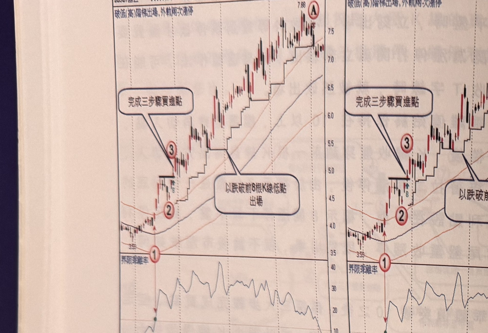
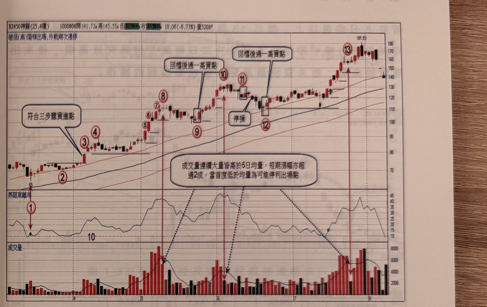

## p.34

**圖 1-30**（本圖由詮茂資訊股靈神選提供）

> 圖說：國巨(B2327國巨)日線圖，同一檔股票以兩張並排子圖呈現不同停利策略，兩圖皆時間戳
> 980606，開 7.17、高 7.27、低 7.17、收 7.24，量 6351。左圖標題「破漲(高)階梯出場,外軌兩次漲停」，
> 標示①②③（文字框「完成三步驟買進點」指向③），末端標示 A，文字框「以跌破前 8 根 K 線低點
> 出場」。右圖標題「破低(高)階梯出場,外軌兩次漲停」，同樣標示①②③，末端標示 B，文字框「以
> 跌破前 4 根 K 線低點出場」，兩圖下方皆有 60 日乖離率副圖。

圖 1-30 是國巨(2327)日線圖，在 98 年 2 月中旬 60 日乖離值突破 10，且一直保持在 10 之上，明顯
轉強，當三大步驟完成，在標示 3 位置進場買股票，一開始設置 7% 的停損位置，並使用根數區間最
低點做為停利點，當行情推升進位置後，啟動停利策略，在圖左邊以 8 根 K 線區間低點為停利位置，
右邊以 4 根 K 線區間低點為停利位置，由於這檔股票的推升呈現快速上漲三天左右即進入拉回整理，
必須要耐性的跟隨，不同根數區間低點停利策略，將影響出場位置，8 根 K 線區間，直到標示 A 位置
停利出場，而 4 根 K 線區間提早在 B 位置即跌破出場，表示取樣的 K 線根數愈多，波段看得較長。

## p.35

第一章　從乖離率捕捉強勢股

**圖 1-31**（本圖由詮茂資訊股靈神選提供）

> 圖說：神腦(B2450神腦(25.4億))日線圖，時間戳 1000808，開 141.72、高 145.55、低 139.32、收
> 139.32，10.06(-6.73%)，量 5208，標題「破低(高)階梯出場,外軌兩次漲停」，含 K 線、60 日乖離率
> 與成交量副圖。標示①③為乖離率突破 10 及「符合三步驟買進點」，隨後標示④創新高，標示⑤⑥⑦⑧
> （文字框「成交量連續大量皆高於 5 日均量，短期漲幅亦超過 2 成，當首度低於均量為可能停利出場
> 點」，箭頭指向⑧附近），標示⑨，接著標示⑩「回檔後過一高買點」，標示⑪⑫（方框標示 K 棒，
> 文字框「停損」），標示⑬「回檔後過一高買點」（高點 181.93）。

圖 1-31 為神腦(2450)日線圖，在標示 3 位置完成三步驟的買進點，本例將透過大漲 K 線控制停利點，
並在特殊狀況下，彈性調整出場位置；原始停損點設在標示 3 的 K 線最低點，標示 4 創新高之後，
價格呈現拉回整理，結束後在標示 5 及標示 6 連二根漲停 K 線，成交量增幅漸大，突然在標示 8 出現
創最高，量跟不上去的價量背離；連續 5 根量皆大於 5 日均量，且均量線的角度大，由於行情突破整理
後，推升達 2 成以上，突見成交量慣性改變，低於 5 日均量，形成回檔先兆，可以先行出場；後市在
標示 9 出現過一高的再切入買點，黑色水平線為推升過程的停利點控制位置，到了標示 10 再次出現
成交量低於 5 日均量，形成另一次的回檔預告，標示 11 位置的過一高買點，由於 K 線品質不佳，造成
停損情形，但標示 12 位置的過一高買點，順利往上推升超過 2 成以上，成交量連續 6 天
