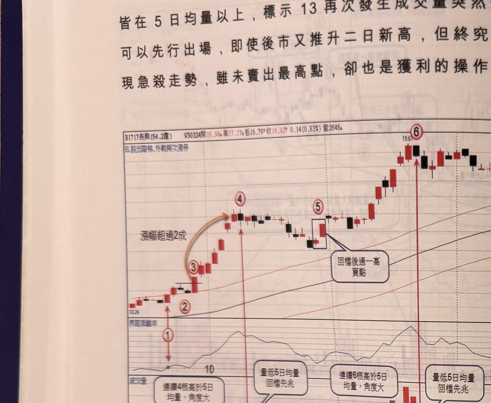
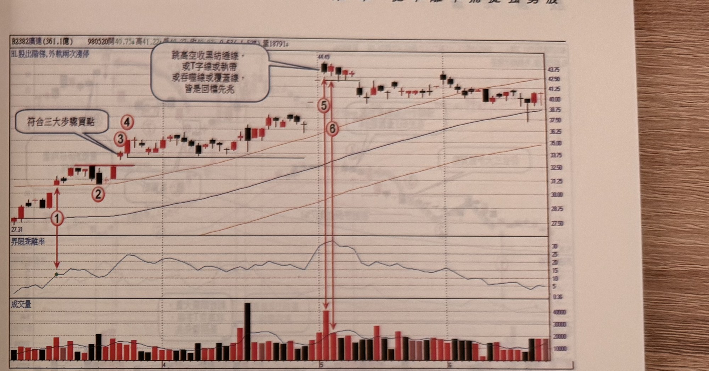

## p.36

皆在 5 日均量以上，標示 13 再次發生成交量突然低於 5 日均量，可以先行出場，即使後市又推升二日
新高，但終究近高檔，後來出現急殺走勢，雖未賣出最高點，卻也是獲利的操作。

**圖 1-32**（本圖由詮茂資訊股靈神選提供）

> 圖說：長興(B1717長興(64.2億))日線圖，時間戳 950324，開 16.98、高 17.17、低 16.79、收 16.93，
> 0.14(0.83%)，量 2646，標題「HL股出階梯,外軌兩次漲停」，含 K 線、60 日乖離率與成交量副圖。
> 標示①②③（橙色弧形箭頭「漲幅超過 2 成」指向④），標示④，隨後方框標示⑤（文字框「回檔後
> 過一高買點」），末端標示⑥（高點 19.67），下方成交量副圖以文字框標示「連續 4 根高於 5 日均量，
> 角度大」、「量低 5 日均量 回檔先兆」、「連續 6 根高於 5 日均量，角度大」、「量低 5 日均量
> 回檔先兆」對應各時段。

請注意用成交量低於 5 日均量，來做為停利策略，務必在漲幅夠大夠快速的行情中使用，5 日均量線
仰升角度要大，且成交量高於 5 日均量線要連續性，才能使可靠度提升。圖 1-32 是另一個透過成交量
慣性改變，低於 5 日均量做為停利點的例子，請看圖上說明。

## p.37

第一章　從乖離率捕捉強勢股

**圖 1-33**（本圖由詮茂資訊股靈神選提供）

> 圖說：廣達(B2382廣達(361.1億))日線圖，時間戳 980520，開 40.75、高 41.22、低 40.27、收 40.02，
> 0.53(1.32%)，量 18791，標題「HL股出階梯,外軌兩次漲停」，含 K 線、60 日乖離率與成交量副圖。
> 標示①③為乖離率突破 10 及「符合三大步驟買點」，隨後標示②④，末端標示⑤⑥附近文字框「跳高
> 空收黑紡錘線，或T字線或執帶，或吞噬線或覆蓋線，皆是回檔先兆」（高點 44.65 附近的黑紡錘線）。

特殊 K 線反轉訊號也是停損停利策略中，必須做彈性調整停利位置，如圖 1-33 為廣達(2382)日線圖，
在出現符合三大步驟買點進場後，標示 4 位置拉一根大漲紅 K 線，停利點移動至 K 線最低點位置，由於
廣達的股本超大，除非有重大利多，不容易連續飆大漲 K 線，因此，自標示 4 後進入近一個月的整理
盤，但 60 日乖離值一直保持在 10 以上，仍屬強勢股，整理盤結束後，出現重大利多，連續二根一價
到底漲停板 K 線，但第三天在標示 5 位置跳高開盤，引來強大獲利回吐賣壓，形成一根懸空黑紡錘，
同時爆大量，這是危險的回檔先兆，宜停利出場；凡推升一段漲幅後，遇到爆量，K 線為跳高空之 T
字線、紡錘線、黑執帶或吞噬線或覆蓋線，都是危險的回檔先兆，通常這些特殊 K 線的前一天走勢出現
長紅 K 線居多，遇到就先行停利，不必等到破各種停利策略位置。

圖 1-34 ~ 圖 1-37 皆為特殊 K 線提供回檔先兆，請仔細參閱。
