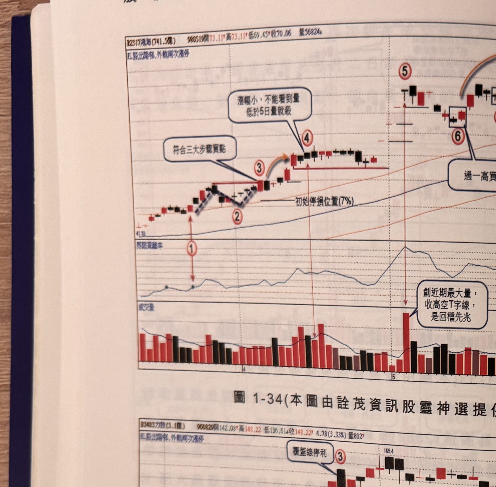
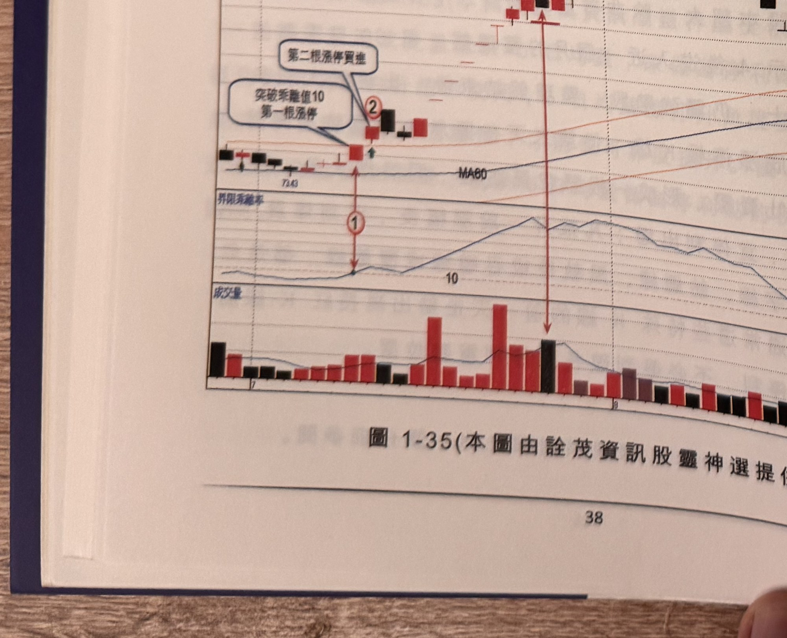
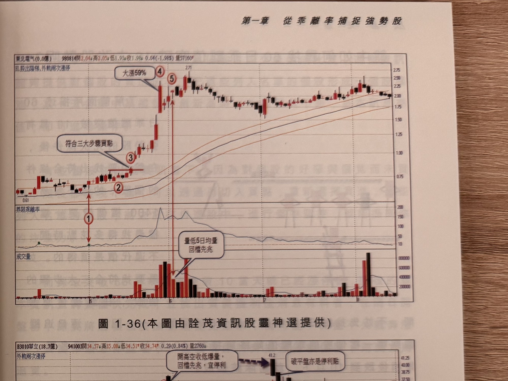
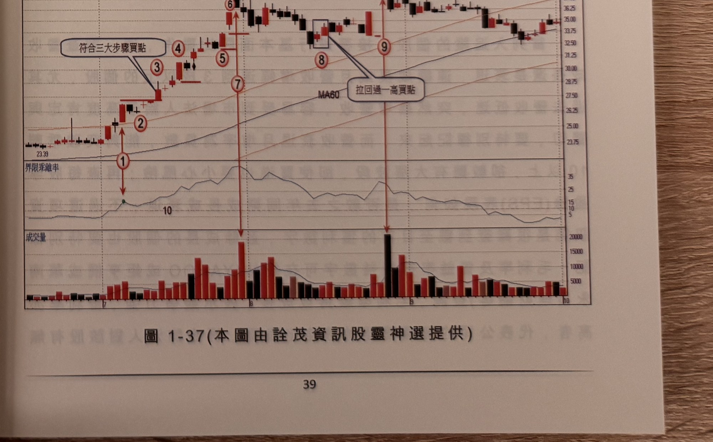

## p.38

（頁面僅有圖與圖說，無獨立段落正文）

**圖 1-34**（本圖由詮茂資訊股靈神選提供）

> 圖說：鴻海(B2317鴻海(741.5億))日線圖，時間戳 980519，開 73.11、高 73.11、低 69.45、收 70.06，
> 量 5682，標題「HL股出階梯,外軌兩次漲停」，含 K 線、60 日乖離率與成交量副圖。標示①②③（文字
> 框「符合三大步驟買點」指向③），標示④（文字框「漲幅小，不能看到量低於 5 日量就殺」），末端
> 標示⑤附近文字框「創近期最大量，收高空T字線，是回檔先兆」（成交量副圖同步爆出大量長紅棒）。

**圖 1-35**（本圖由詮茂資訊股靈神選提供）

> 圖說：力致(B3483力致(3.1億))日線圖，時間戳 960829，開 142.08、高 148.22、低 136.61、收 148.22，
> 4.78(3.33%)，量 802，標題「HL股出階梯,外軌兩次漲停」，含 K 線、60 日乖離率與成交量副圖。低點
> 73.43 起漲，標示①「突破乖離值 10 第一根漲停」，標示②「第二根漲停買進」，末端標示③（高點
> 169.4）文字框「覆蓋線停利」（一根黑色覆蓋線 K 棒）。

## p.39

第一章　從乖離率捕捉強勢股

**圖 1-36**（本圖由詮茂資訊股靈神選提供）

> 圖說：東北電気(0.0億)日線圖，時間戳 980814，開 2.04、高 2.05、低 1.93、收 1.98，0.04(-1.98%)，
> 量 57160，標題「HL股出階梯,外軌兩次漲停」，含 K 線、60 日乖離率與成交量副圖。低點 0.61 起漲，
> 標示①③為乖離率突破 10 及「符合三大步驟買點」，標示④「大漲 59%」，標示⑤附近文字框「量低
> 5 日均量 回檔先兆」（高點 2.71）。

**圖 1-37**（本圖由詮茂資訊股靈神選提供）

> 圖說：華立(B3010華立(18.7億))日線圖，時間戳 941003，開 34.57、高 35.08、低 34.51、收 34.74，
> 0.29(0.84%)，量 2760，含外軌兩次漲停標示、K 線、MA60、60 日乖離率與成交量副圖。低點 23.39
> 起漲，標示①③為乖離率突破 10 及「符合三大步驟買點」，標示④⑤⑥（文字框「開高空收低爆量，
> 回檔先兆，宜停利」指向⑥附近，高點 41.2），標示⑦，方框標示⑧（文字框「拉回過一高買點」
> 指向⑨），末端標示⑨，另有文字框「破平盤亦是停利點」。
