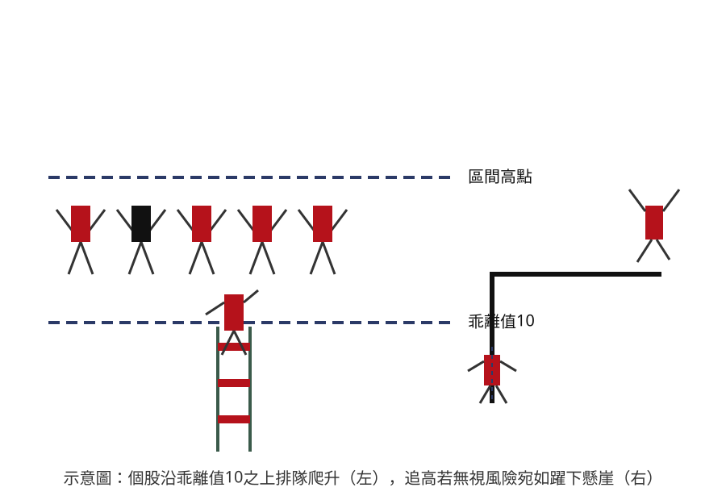

## p.40

盤中如何尋找 60 日乖離值突破 10 之強股勢呢？

**示意圖**（無圖號，原始照片見 `股勝先選-p40-1.orig.jpg`）

> 圖說：概念示意圖，非真實 K 線截圖。左側畫出五個簡筆人形（四紅一黑）並排站在一條「乖離值10」
> 虛線之上、朝向更高一條「區間高點」虛線前進，其中一人腳下搭著一座紅色梯子從「乖離值10」線向
> 上攀爬，象徵個股乖離值站上 10 之後持續追蹤、逐步墊高的過程；右側畫出一道階梯／懸崖狀折線，
> 一個人形站在懸崖頂端雙臂高舉躍下，另一人形已墜落至崖邊下方（以垂直虛線標示墜落軌跡），
> 對應正文「盤中尋找強勢股不容易，但代價值得」及後文對追高風險的提醒。

了解前面所描述 60 日乖離值突破 10 具有強勢股的先決條件後，在盤中要找出符合條件的個股，的確
不容易，1400 檔個股要一檔一檔尋找得多花點時間，不過代價是值得的。如果要找符合三大步驟的
個股，在盤後休息期間，不妨先找出 60 日乖離大於 10 的個股，一一記錄，逐日追蹤，觀察哪一檔個股
的乖離值始終維持在 10 以上，果稍後跌到 10 以下，就剔除該個股。

當列入追蹤的個股，接著進行基本面評比動作，逐一調查營收成長還是衰退，連續成長或月營收增幅
達到 3 成以上的個股，尤其關切，要特別標記起來，而營收衰退月增率為負數，能夠突破乖離波段，
即使買進也要小心風險；再查每股季訊總是很難查到截至目前的獲利數字，不過這項資記；毛利率及
營益率等損益數字可在網站(YAHOO 或鉅亨網或華南永昌理財網等)查詢，毛利率維持或成長，表示
競爭力強，營利率亦高者，代表公司的營運管理做最佳化表現，再查詢法人對該股有無

## p.41

第一章　從乖離率捕捉強勢股

買進，如果有買入，日買超張數佔該日成交量幾成比重，這些資訊能夠提供對個股的買進信心；把
這些列入名單的個股形成一個股票池，某一天名單中某檔個股創新高時，K 線品質不錯，基本訊息亦
佳，即可進場操作。

有些個股在出現買訊當下，因為對個股的好惡與偏見而未買進，隨後卻表現不錯，可以透過再切入
買點，重新選擇買進，這些列入名單的個股，將之放在自選股中，進行盤中監控，就能提高你的注意
力。

而採取突破 60 日乖離值突破 10 當天就已經漲停板，盤後的基本資訊查詢要儘快完成，並挑出質優
獲利佳消息有料者，在隔日開盤前，即要將這種個股放在最優先觀察，極可能一開盤不久就奔漲停，
要當作最急件處理，一旦發現即將奔抵漲停板位置，則要立馬追買。

（本頁右側另有淡淡背面透印殘影與跨頁裝訂處重疊文字，模糊不可辨，略過不轉錄）
