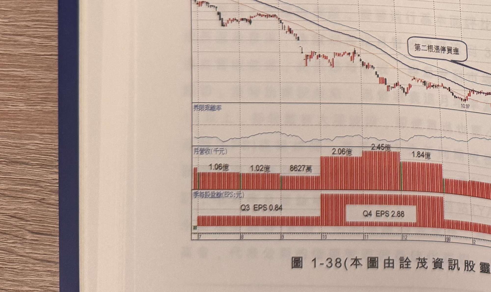
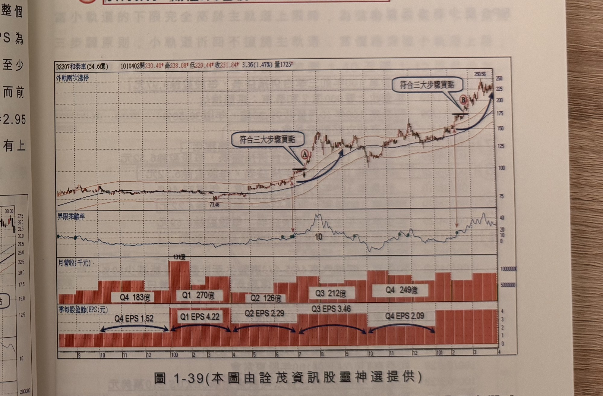

## p.42

我們以圖 1-38 陽程(3498)為例，在 98 年 2 月 25 日突破 60 日乖離值 10，但是突破前它已經出現一價
到底漲停板 2 根，因此，突破 10 後第 2 根漲停板，其實已經一價到底漲停第 4 根，不宜進場買進，
必須等到標示 2 位置符合三大步驟，才買進操作；為什麼陽程能夠突然間連拉 4 根漲停，而且即使在
標示 2 位置已經漲幅一倍，還能做買進動作，這得從它 97 年第四季營收大幅成長說起，9 月營收為
8627 萬，10 月營收 2.06 億，突然成長一倍以上，11 月營收再創掛牌以來最高營收 2.45 億，12 月稍
降為 1.84 億，整個 Q4 營收達 6.35 億超過 Q3 營收 2.92 億一倍以上，而 Q3 的 EPS 為 0.84 元，Q4 的
EPS 即使無法在 98 年首季公布，但是用估計至少是 Q3 增幅一倍以上，約在 1.8 元以上(實際數字為
2.88 元)，而前三季 EPS 為 1.15 元，換言之，97 年 EPS 估計至少 1.15+1.8=2.95 元，因此標示 2 位置
在 20 元附近，本益比不到 7 倍，當然仍有上漲空間。

**圖 1-38**（本圖由詮茂資訊股靈神選提供）

> 圖說：陽程(B3498陽程(5.3億))日線圖，時間戳 980609，開 33.69、高 34.16、低 31.41、收 31.41，
> 2.28(-6.77%)，量 651，含 K 線、60 日乖離率、月營收(千元)與季每股盈餘(EPS:元)三個副圖。標示①
> 為低點（10.97 附近），「第二根漲停買進」，標示②「買點2」，標示③④「過一高買點」（末端高點
> 38.08）。月營收副圖依序標示 1.06億、1.02億、8627萬、2.06億、2.45億、1.84億；季每股盈餘副圖
> 標示 Q3 EPS 0.84、Q4 EPS 2.88（雙箭頭連接兩期）。

## p.43

第一章　從乖離率捕捉強勢股

（右上為續前頁的財務資訊列表，逐條列出）
4　98/01/09　陽程12月營收1.84億、年增9.99%
　　97/12/29　陽程獲准投資陽程光電(上海)，金額約151萬美元
　　97/12/10　陽程11月營收2.45億元，創掛牌以來新高
3　97/12/10　陽程11月營收2.45億元、年增27.38%
2　97/11/10　陽程10月營收2.06億元、年增17.31%
　　97/11/06　陽程：YAMCHEN(B.V.I)增資上海陽程科技200萬美元
　　97/11/06　陽程轉投資設立陽程光電(上海)，金額156萬美元
　　97/10/21　10/20上櫃公司持股轉讓明細
　　97/10/17　陽程庫藏股屆滿、共買回484張，均價21.79元
1　97/10/09　陽程9月營收8627萬、年減61.35%

**圖 1-39**（本圖由詮茂資訊股靈神選提供）

> 圖說：和泰車(B2207和泰車(54.6億))日線圖，時間戳 1010402，開 230.40、高 238.08、低 229.44、收
> 231.84，3.36(1.47%)，量 1725，含外軌兩次漲停標示、K 線、60 日乖離率、月營收(千元)與季每股
> 盈餘(EPS:元)三個副圖。標示Ⓐ「符合三大步驟買點」（低點 73.48），標示Ⓑ「符合三大步驟買點」，
> 末端高點 250.56。月營收副圖標示 Q4 183億、Q1 270億(131億高峰)、Q2 126億、Q3 212億、Q4
> 249億；EPS 副圖標示 Q4 EPS 1.52、Q1 EPS 4.22、Q2 EPS 2.29、Q3 EPS 3.46、Q4 EPS 2.09（雙箭頭
> 連接各期）。

當一檔股票的 60 日乖離值突破 10 向上，前面提過這是大漲或折回的關鍵，能夠保持在 10 以上，必有
背景因素支撐它形成強勢股，基本面或消息面上定有硬底子，以圖 1-39 和泰汽車(2207)為例，在 7 月
15 日標示 A 位置出現符合三大步驟的買進訊號，依還
