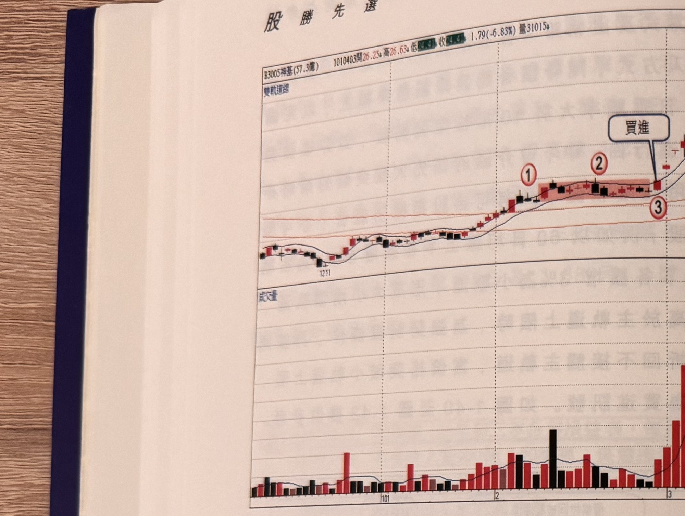
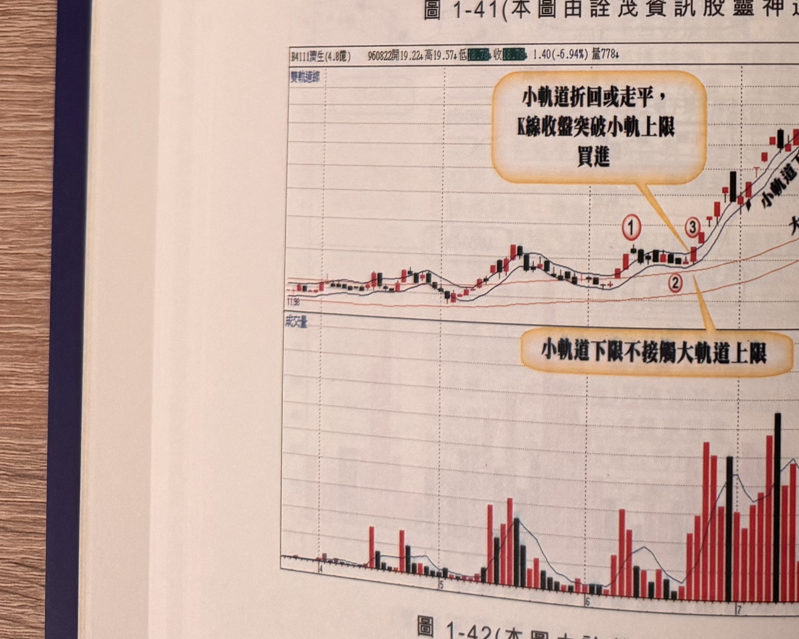

## p.46

**圖 1-41**（本圖由詮茂資訊股靈神選提供）

> 圖說：祥碁(B3005祥碁(57.3億))日線圖，時間戳 1010403，開 26.25、高 26.63、低（框選遮蔽）、收
> （框選遮蔽），1.79(-6.83%)，量 31015，含雙軌道線與成交量副圖。低點 12.11 起漲，標示①，紅色
> 網底區間標示②，標示③附近文字框「買進」（箭頭指向）。

**圖 1-42**（本圖由詮茂資訊股靈神選提供）

> 圖說：（B4111，票面數字部分模糊不可辨，暫記為 [?]，股本 4.8億）日線圖，時間戳 960822，開
> 19.22、高 19.57、低（框選遮蔽）、收（框選遮蔽），1.40(-6.94%)，量 778，含雙軌道線與成交量
> 副圖，標題文字「小軌道折回或走平，K線收盤突破小軌上限買進」（指向標示③附近）及「小軌道
> 下限不接觸大軌道上限」（指向標示②附近）。標示①②③依序沿雙軌道排列。

## p.47

第一章　從乖離率捕捉強勢股

利用 60 日乖離率尋找放空弱勢股

當個股的 60 日乖離值突破 10 代表一種強勢象徵，反之，60 日乖離值若跌破 -10，代表在跌勢發展
過程，跌速較快的期間；有強勢飆漲股，強勢飆跌股卻不多見，除非有禿鷹集團，利用內線消息，
掌握公司財務即將出問題，才會造成股價直線崩跌；多頭市場各方主力分據山頭，展開養套殺技倆，
企圖賺到倍數暴利，靠的是籌碼算計，主力做多，吸籌碼可以無限吸納，但是空頭市場放空，籌碼卻
是來自借券，再怎麼能耐追券，籌碼只有股本 2 成的限制，萬一有多金勇士與其對作反多，那空頭
主力勢必輸在籌碼戰上，尤其一般群眾總是站在多頭一方等著買股票，少有等著放空股票。

市場的頂點一定是發生在多頭趨勢的尾端，也正是行情最熱時刻，通常想在多頭頂點放空的空軍，
往往來不及開降落傘，就被軋個半死，因為頂點絕對不會公開出告示，沒那麼容易判定頂點絕對到來，
況且多頭頂點到形成頭部，再到型態跌破確認反轉，時間還得拖個把月，甚至半年皆有；就操作效率
來說，不如找其它個股做多，反轉開始總是多空拉鋸，必須套牢愈多籌碼，時間就必須拖久一些，不
肯認賠認輸的交易者，開始意氣用事，想打長期抗戰，日日看盤日日跌，承認空頭真的不可逆時，股票
已經砍不下手，套牢的故事總是像輪迴般一再重演。

放空者通常會以反轉型態(M 頭、頭肩頂、三尊頭或上升楔形)的頸線有效跌破來尋找放空點，或者
利用均線死叉來判斷趨勢轉空，也有以週月線技術指標的高檔死亡交叉來認定反轉，也有以波浪理論
升浪計數走到終頂來判定；當趨勢轉空，順勢而為，操作以
