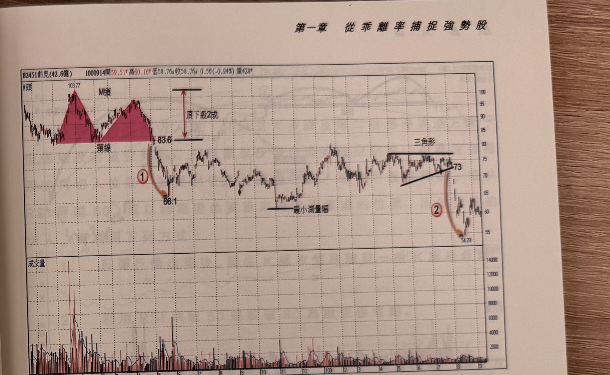

## p.48

放空為主，空頭在進行過程，初期大多緩步小跌下行，接著擴大成中跌走法，但是到末跌，開始以
大跌壓盤，靠的是人性的恐慌無助及理性喪失，手中有股票，日受煎熬夜難眠，砍股形成催眠式的
共識，因此放空比做多更需要耐性與毅力，得熬到末跌段，才能開花結果。

使用 60 日乖離率來檢定弱勢股，是一個較為取巧的方式，方便去尋找快速下跌的弱勢股進行放空
操作，乖離值 -10 位置通常具有跌破拉升的效果，代表正常股票的下檔支撐約略在 -10 左右形成，
而那些跌到 -10 以下，雖見回彈出現，但乖離值卻站不上 -10 之上，表示這檔股票買氣極虛，空方
的力量將開始反撲，要放空就找此種個股；快速下跌的股票，通常出現營收衰退幅度很大，或由盈
轉虧，如果消息面不利的個股，再觀察它股價的乖離率跌破 -10，又沒有任何彈回 -10 以上的買氣來
支撐，大跌的機會就大了，要把握破 -10 後的反彈行情尾聲，出現各種切入空點的訊號。

前面提過放空使用的方法很多種，像拙作系列書中的空頭豬陽變色(見交易訊號下冊)或爆量低點破
跌(見操作進行曲第一章量縮買點)，或者利用河流圖配合其它指標工具產生空訊(見操作進行曲第四章
說明)，也可利用 DIF 與 MACD 呈現死叉後的高轉折空點(見股技期招第三章說明)，但是要檢定跌勢中
速度最快的區段，卻以乖離率跌破 -10 最能掌握。

## p.49

第一章　從乖離率捕捉強勢股

**圖 1-43**（本圖由詮茂資訊股靈神選提供）

> 圖說：創見(B2451創見(42.6億))日線圖，時間戳 1000914，開 59.51、高 60.16、低 58.76、收 58.76，
> 0.56(-0.94%)，量 428，圖上以紅色區塊標出「M頭」型態（兩個高峰，峰值分別為 103.77 與次高峰，
> 頸線標示「頸線」，跌破頸線後標示①，箭頭指向低點 66.1，並標示「頂下殺2成」水平雙箭頭區間
> 83.6），隨後於低點附近整理，右側標示「三角形」整理區（頸線值 73），標示②箭頭指向低點
> 54.28，含成交量副圖。

反轉型態的頂點到頸線長度，通常從多頭頂點下殺 2 成至 3 成的距離，而一般空頭低點約在多頭頂點
打 3 折或 4 折的位置，質優獲利佳的股票，空頭修正低點大部份發生在頂點打 5 折的位置附近，而虧
損連連或營收大衰退的個股，在空頭修正的低點，可能只有頂點的 10% 或 5%；換言之，從型態的跌破
後開始放空，利潤最大眾數約在 40% 左右，當你放空獲取的利潤達到 40%，代表應該收手，等反彈再
做或選擇休息；像圖 1-43 為標準的 M 頭反轉型態，它在空頭走勢中，跌速反應最快的區段在標示 1
及標示 2，跌破頸線後即急速下跌，這是相當罕見的，一般股價跌破頸線後，習慣會回抽一波逃命
行情，再進行空頭跌勢。
