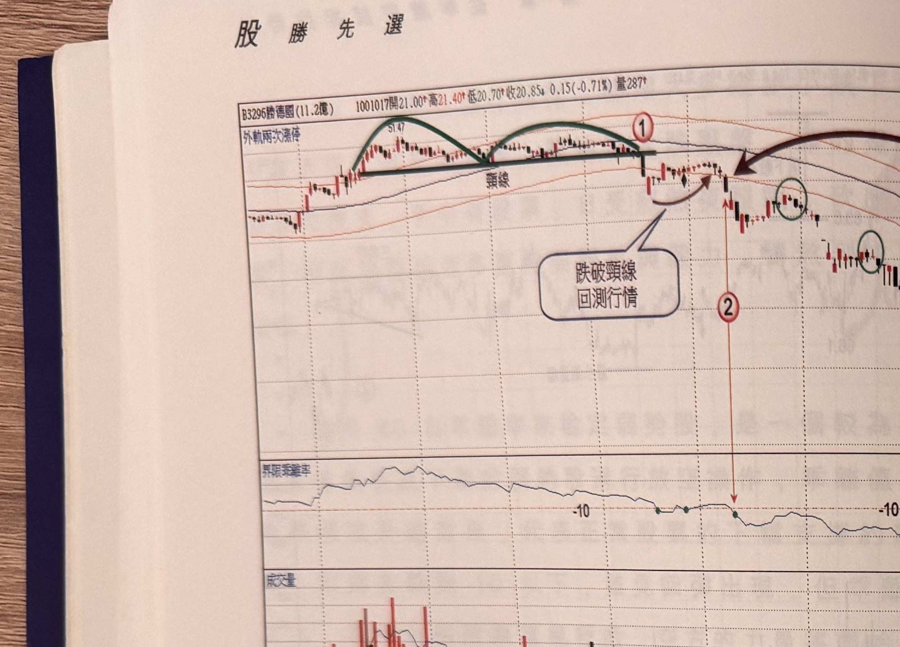

## p.50

**圖 1-44**（本圖由詮茂資訊股靈神選提供）

> 圖說：德勝國(B3296勝德國(11.2億))日線圖，時間戳 1001017，開 21.00、高 21.40、低 20.70、收
> 20.85，0.15(-0.71%)，量 287，圖上以綠色弧線畫出雙頭型態（左峰 51.47），標示「頸線」水平線，
> 標示①（頸線跌破點），文字框「跌破頸線 回測行情」（箭頭指向跌破後的反彈 K 棒），標示②
> （紅色垂直箭頭向下指向乖離率副圖的 -10 位置），右側以綠色圓圈標出兩處反彈後的放空位置，
> 並標註「放空最適合區域」（大黑色弧形箭頭），下方另有乖離率副圖（標示 -10 兩處）與成交量
> 副圖。

放空必須挑選比較會跌的個股，我們會用 60 日乖離值進行檢測，保持在 -10 以下的股票，有較大的
機會發展成超跌情形，因為乖離值低於 -10 的區間，往往是跌勢發展過程速度最快，放空最容易獲利。
以圖 1-44 德勝(3296)為例，頭部蘊釀將近 3 個月，在標示 1 跌破頸線後，乖離值跌破 -10 以下，隨即
出現反彈回測頸線逃命行情，乖離值又縮回 -10 以上，這樣的走勢並不足以傳達型態反轉會呈現急跌，
直到標示 2 位置乖離值再度跌破 -10 後，但這次即使反彈行情出現，但乖離值始終沒有返回 -10 之上，
代表買氣虛弱，這才是操作想要的獵物目標，開始尋找 K 線收盤破前一根 K 線低點，即可進行放空
動作，綠色圈選位置表示反彈後的放空位置，這種快跌下跌一直到乖離值返回 -10 以上才結束，因此，
選擇放空位置，以乖離值跌破 -10 的區間最適合進行放空操作。

## p.51

第一章　從乖離率捕捉強勢股

放空的切入方法

觀察強勢股的切入點，介紹三大步驟及第二根漲停買進方式，但弱勢股的放空動作，只須觀察反彈
出現的放空訊號，在尋找強勢股的再切入位置，曾提到使用拉回過一高，或利用量縮買點，或以 RSI
穿越 50，或以豬陽變色買點來確定再買進的位置，而放空點的切入，可利用下列方式：

1、　反彈行情出現後，發生 K 線收盤跌破前一根 K 線最低點。

2、　利用 RSI 跌破 50 或跌破 80 為放空參考點。

3、　以黑 K 線收盤跌破最接近的一根紅 K 線最低點，即空方的豬陽變色空訊。

4、　觀察 K 線收盤跌破反彈最大量 K 線最低點，做為放空參考。

當放空訊號出現時，訊號 K 線距離反彈最高點最好在 2 根範圍內，如果發生在離反彈峰位超過 3 根
以上，除非峰點之後的 K 線都在峰點 K 線高低範圍內震盪，這種情形的跌破如同區間整理結束，
進行新一波跌勢，就不用計較距離根數的濾網；再者放空訊號出現必定在盤下，如果無法在平盤下
進行放空，隔天可以掛平盤價等待放空。

放空操作，不在於能在高點放到券，最重要是放券後，股價會跌才是重點，多頭市場，個股常出現
暴衝漲停的興奮情緒，但下跌過程
