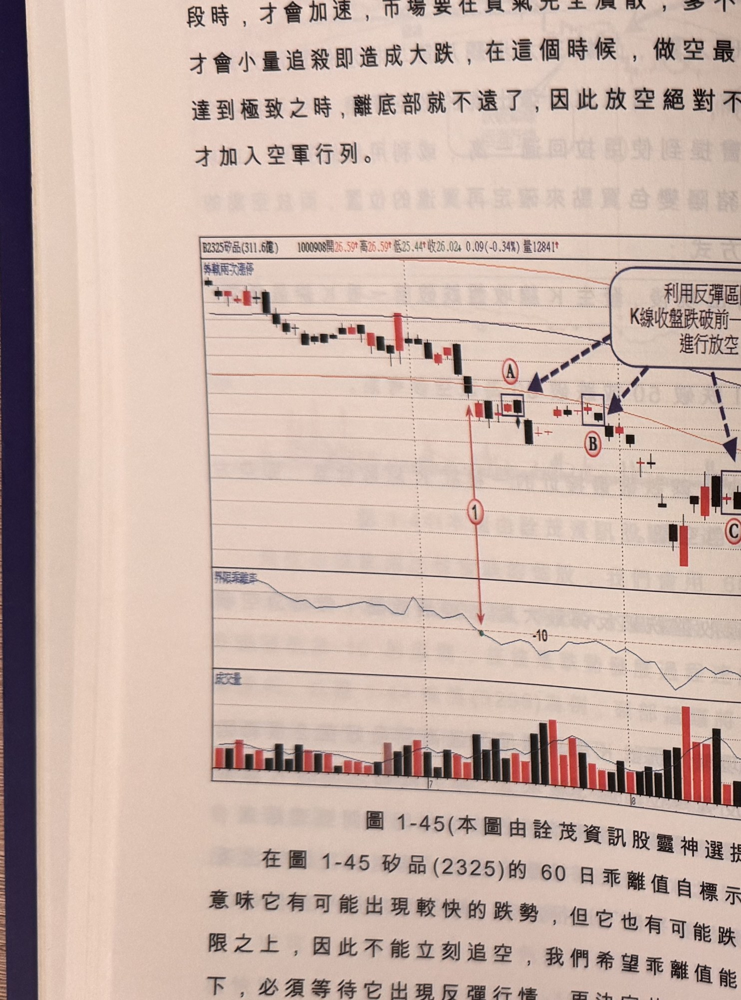
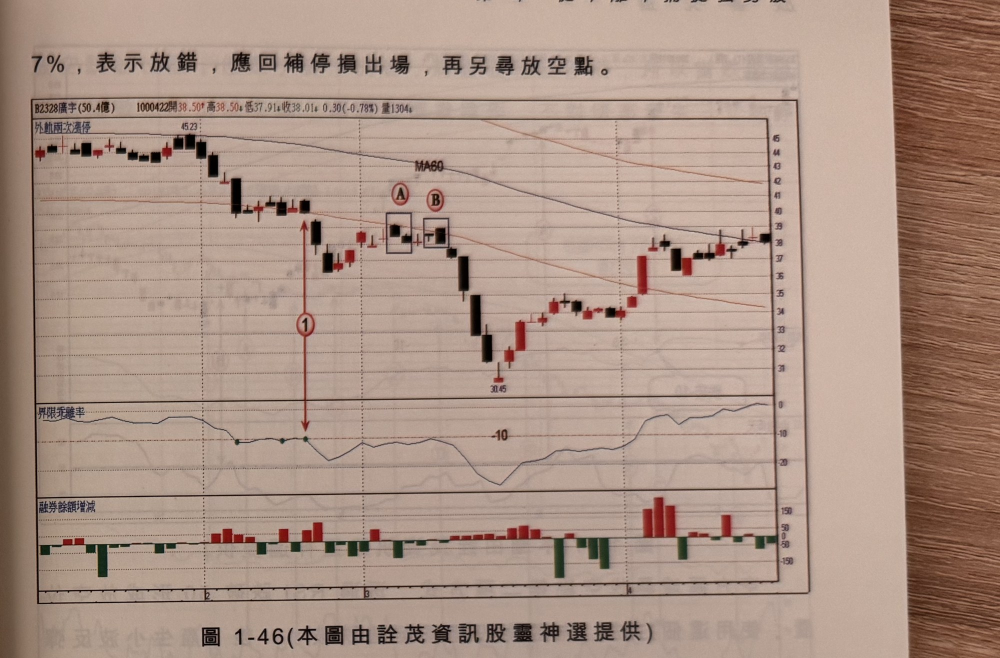

## p.52

不會天天有 3% 以上的跌幅，最會跌的時刻，往往股價發展到未跌段時，才會加速，市場要在買氣
完全潰散，爹不疼娘不愛時，股價才會小量追殺即造成大跌，在這個時候，做空最好作，但空頭氣焰
達到極致之時，離底部就不遠了，因此放空絕對不要到了最後階段，才加入空軍行列。

**圖 1-45**（本圖由詮茂資訊股靈神選提供）

> 圖說：矽品(B2325矽品(311.6億))日線圖，時間戳 1000908，開 26.59、高 26.59、低 25.44、收
> 26.02，0.09(-0.34%)，量 12841，含 K 線、60 日乖離率與成交量副圖，另有文字框「利用反彈區間
> K線收盤跌破前一根低點進行放空」（多個虛線箭頭指向後續反彈高點）。標示①（乖離率跌破 -10），
> 隨後方框標示Ⓐ、Ⓑ、Ⓒ 依序為反彈後 K 線收盤跌破前低的放空點。

在圖 1-45 矽品(2325)的 60 日乖離值自標示 1 位置跌破 -10，意味它有可能出現較快的跌勢，但它也
有可能跌破後又重回 -10 界限之上，因此不能立刻追空，我們希望乖離值能一直保持在 -10 以下，
必須等待它出現反彈行情，再決定放空與否，標示 A、B 及 C 均為反彈後出現 K 線收盤跌破前一根
K 線最低點，可以進行放空動作，而每次放空必須設停損來執行風險控管，通常放空的價位被軋

## p.53

第一章　從乖離率捕捉強勢股

7%，表示放錯，應回補停損出場，再另尋放空點。

**圖 1-46**（本圖由詮茂資訊股靈神選提供）

> 圖說：廣宇(B2328廣宇(50.4億))日線圖，時間戳 1000422，開 38.50、高 38.50、低 37.91、收 38.01，
> 0.30(-0.78%)，量 1304，含 K 線、MA60、60 日乖離率與融券餘額增減副圖。高點 45.23 起跌，標示①
> （乖離率跌破 -10），隨後方框標示Ⓐ、Ⓑ 為反彈後跌破前低的放空點，低點 30.45 後反彈回升。

打高爾夫球或打棒球，擊球要又長又遠的秘訣，在於對準桿面或球棒的甜蜜點擊球，就能創造長打的
效果，甜蜜點宛如一個高效率的最佳位置；放空操作亦是如此，找出最佳的放空點，就能擊出跌幅
最大又最快的獲利成果；當乖離值跌破 -10 後，價格出現反彈掙扎行情，企圖力挽頹勢，但乖離值卻
站不上 -10，即重新出現急殺走勢，因此在乖離值站不上 -10，首次出現空訊時，稱為做空的甜蜜點
位置，如圖 1-46 廣宇(2328)在標示 1 位置，乖離值跌破 -10，接著價格反彈，乖離值企圖返回 -10 之上，
卻在標示 A 及 B 出現 K 線收盤破前一根 K 線最低點的空訊，其中標示 A 就是整段放空的第一空點，
就是放空的甜蜜點。
