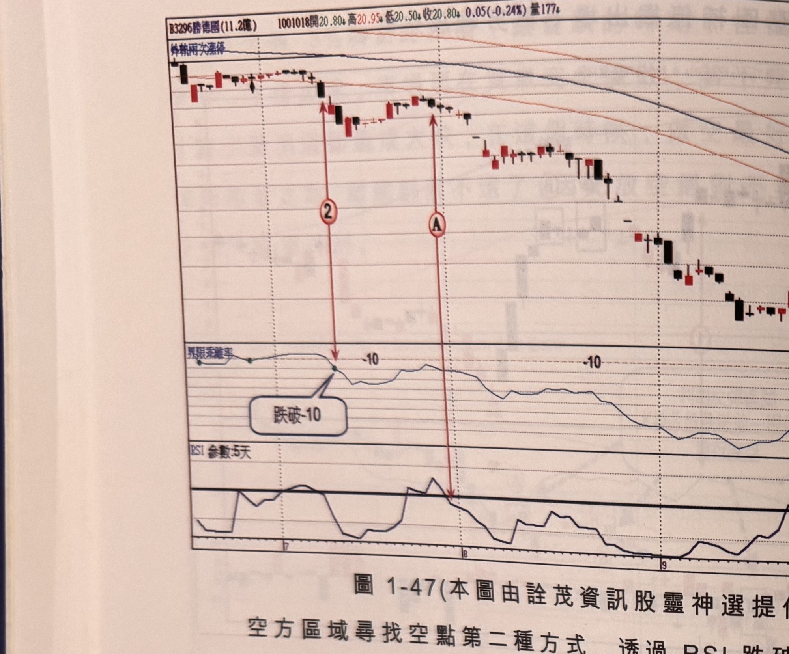
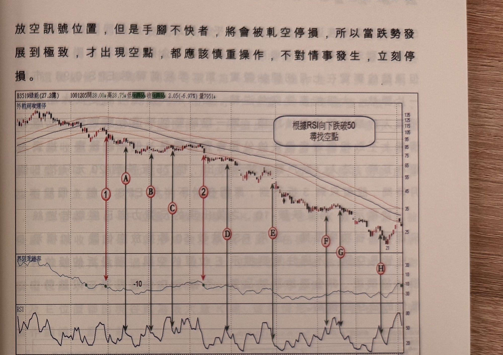

## p.54

空方區域尋找空點第二種方式，透過 RSI 跌破 50 形成放空位置，使用這個方法，先觀察股價乖離值
跌破 -10 後，產生小波反彈行情，在反彈接近尾聲，且乖離值沒辦法向 -10 以上推進，當 RSI 向下
跌破 50 時，馬上進行放空動作，如果盤下禁止放空之個股，則利用隔日掛平盤放空；如果反彈行情
使 RSI 指標值觸及 80 以上，不再採取 50 為關鍵濾網，改採 80 為濾網，當 RSI 跌破 80 即進行放空；

一般弱勢股反彈，其 RSI 值不容易觸及 80 以上，甚至連觸及 50 以上都存在難度，如圖 1-47 勝德
(3296)在標示 2 跌破 -10 後，不久出現反彈走勢，RSI 值站在 50 之上，但乖離值拉不上 -10，並在
標示 A 位置出現 RSI 跌破 50，形成一個乖離值拉不上 -10 的放空位置，這是跌勢放空操作的甜蜜點，
同時也是空在一個半月內暴跌 50% 以上，在這段期間的小反彈走勢，RSI 彈超過 50 以上，顯然弱到
無以復加，標示 B 位置雖是另一個

**圖 1-47**（本圖由詮茂資訊股靈神選提供）

> 圖說：勝德國(B3296勝德國(11.2億))日線圖，時間戳 1001018，開 20.80、高 20.95、低 20.50、收
> 20.80，0.05(-0.24%)，量 177，含 K 線、60 日乖離率（標示「跌破-10」）與 RSI(參數:5天) 副圖。
> 標示②（乖離率跌破 -10），標示Ⓐ（乖離率二次貼近 -10 附近、RSI 對應點，高點 157 附近）。

## p.55

第一章　從乖離率捕捉強勢股

放空訊號位置，但是手腳不快者，將會被軋空停損，所以當跌勢發展到極致，才出現空點，都應該
慎重操作，不對情事發生，立刻停損。

**圖 1-48**（本圖由詮茂資訊股靈神選提供）

> 圖說：綠能(B3519綠能(27.2億))日線圖，時間戳 1001205，開 28.00、高 28.75、低 27.35、收 27.35，
> 2.05(-6.97%)，量 7951，含外軌兩次漲停標示、K 線、60 日乖離率與 RSI 副圖，文字框「根據RSI向下
> 跌破50 尋找空點」。標示①（乖離率跌破 -10），隨後Ⓐ Ⓑ Ⓒ 標示②Ⓓ Ⓔ Ⓕ Ⓖ Ⓗ 依序為多次
> RSI 跌破 50 的放空點（黑色垂直箭頭連接 K 線圖與 RSI 副圖對應位置）。

弱勢股在空頭的運行，其 60 日乖離值有時先跌第一段後，出現中級反彈，乖離值返回 -10 之上，
形成股價在某個價格區間盤整後，再重啟另一波跌勢；當發生折返 -10 以上的情形，尋找空點的
步驟須重來，這點務必遵守，沒得商量。

以圖 1-48 綠能為例子，原本 100 年初公司表示年度 EPS 有 15 元水準，首季稅前 EPS 達 3.3 元，較
99 年同期成長一倍，這是多麼令市場振奮的消息，股價非但沒有回應，反而像利多出盡似的往下破
軌道下限，之後出現快速彈回軌道內。

乖離值重新在標示 1 位置跌破 -10，且反彈已無力返回 -10 之上，表示它已變成弱勢股，標示 ABC
是三個 RSI 跌破 50 的放空點；
