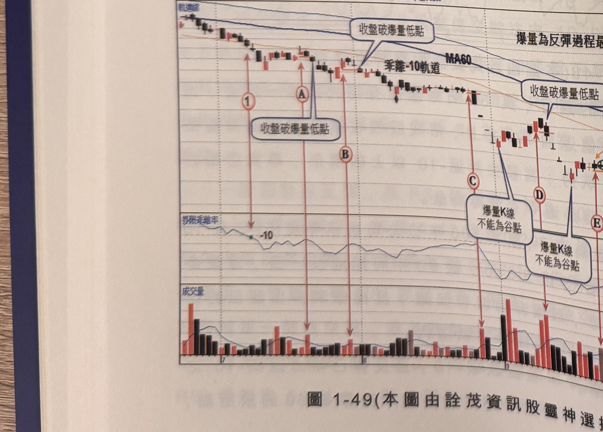

## p.56

5 月營收突然衰退 4 成，法人似乎耳聞風聲，5 月即開始砍股，第二季獲利未公布前，市場尚存一絲
希望，企圖在標示 B 附近打底；但殘酷的事實在七月初開始證實，第二季稅前轉虧 EPS-0.96，市場
一片譁然，太陽能產業突然逆轉，由原來大賺極可能變成大虧損，投資人的感受簡直像被詐騙；第
一段跌勢似乎還有點猶豫，反應著情感上不敢相信這樣優質的公司會突然轉虧，但一經證實，投資人
信心瓦解，法人、散戶籌碼蜂湧而出，從 75 元跌到 20 元只花 5 個月時間，股價只剩 3 折不到，原因
在於下半年 EPS 大虧 1 個股本。

當標示 2 再度跌破 -10，之後出現的反彈力道已經氣若游絲，只能橫盤在狹窄區間，運用 RSI 跌破 50
尋找放空位置，如標示 D~H 皆是空訊，不過注意到標示 E 位置的空訊，離最近的峰位有 4 根 K 線
間距，非合適的訊號品質，而標示 D 位置是第二段跌勢中，最佳的放空甜蜜點。

**圖 1-49**（本圖由詮茂資訊股靈神選提供）

> 圖說：台達(B1309台達(26.3億))日線圖，時間戳 891025，開 7.90、高 7.95、低 7.75、收 7.90，
> 0.10(-1.25%)，量 3120，含軌道線、K 線、乖離-10 軌道、60 日乖離率與成交量副圖，多處文字框
> 「收盤破爆量低點」及「爆量K線不能為谷點」。標示①Ⓐ Ⓑ Ⓒ Ⓓ Ⓔ Ⓕ 依序沿下跌趨勢排列，
> 圖上另標註「爆量為反彈過程最大量，而非絕對大量」及「K線群受制於最高K線上下震幅內，不受
> 訊號K線在高點2根的限制」。

## p.57

第一章　從乖離率捕捉強勢股

空方區域的第三種切入方式，觀察反彈過程，逐步標記最大量，且當價格進行整理後，出現新的
創高收盤價，則最大量重新檢定，這種細節請參考「期跡奇績」第一章爆量操作法，有詳細說明；
以圖 1-49 台達(1309)為例，在標示 1 位置 60 日乖離值跌破 -10，傳達它變成弱勢股的可能性極高，
隨後出現小反彈走勢，標示 A 位置 K 線收盤為區間的最高收盤價，因此最大量重新檢定，二天後 K
線收盤跌破 A 真實低點位置，形成放空訊號，亦是整段跌勢的放空甜蜜點，並設下被軋 7% 的停損
位置。

其它標示 B~F 位置，皆為爆量 K 線，當它的 K 線真實低點被後續 K 線收盤跌破，就形成放空訊號
位置，在標示 E 及 F 位置，訊號 K 線離最高點超過峰位 2 根以上，但數個 K 線皆被最高 K 線上影幅
包圍，因此不受根數限制，放空訊號仍符合條件，另外在標示 D 及 E 位置都出現谷點為最大量 K 線，
這種情形不適合把谷點 K 線當作關鍵大量 K 線。
