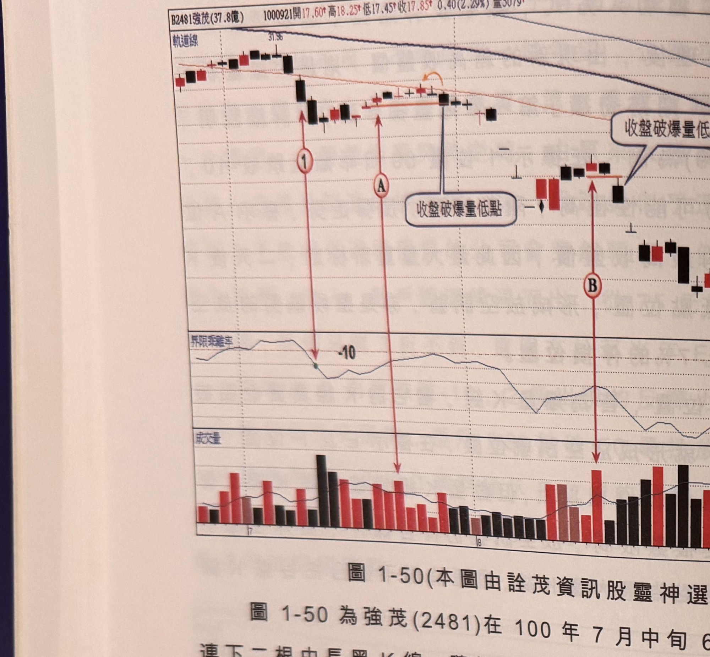
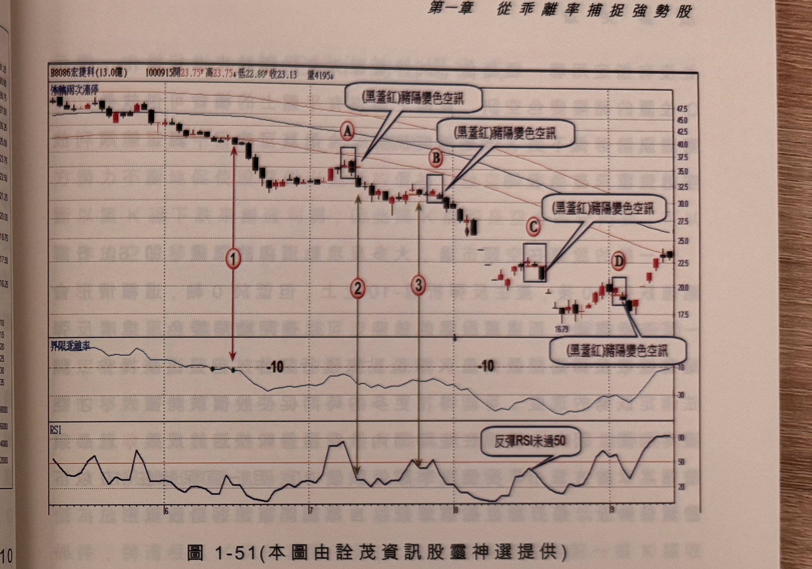

## p.58

**圖 1-50**（本圖由詮茂資訊股靈神選提供）

> 圖說：強茂(B2481強茂(37.8億))日線圖，時間戳 1000921，開 17.60、高 18.25、低 17.45、收
> 17.85，0.40(2.29%)，量 3079，含軌道線、K 線、60 日乖離率與成交量副圖，多處文字框「收盤破
> 爆量低點」。高點 31.96 起跌，標示①Ⓐ Ⓑ 依序為爆量低點跌破的放空點。

圖 1-50 為強茂(2481)在 100 年 7 月中旬 60 日乖離值跌破 -10 連下二根中長黑 K 線，隨後短底做出
反彈行情，標示 A 位置為反彈出現的最大量，以這根 K 線最低點為放空濾網，當後續 K 線收盤跌破
濾網，即可操作放空，其後走勢出現 3 根跌停，算是具有高效益 K 線；注意放空點離反彈最高 K 線
在二根內為宜，而最大量 K 線不一定出現在反彈最高點 K 線，標示 A 即是一例，其它標示 B 現實上
是空不到的，因為平盤上放空的限制，是能透過隔天掛平盤放空。

## p.59

第一章　從乖離率捕捉強勢股

**圖 1-51**（本圖由詮茂資訊股靈神選提供）

> 圖說：宏捷科(B8086宏捷科(13.0億))日線圖，時間戳 1000915，開 23.75、高 23.75、低 22.80、收
> 23.13，量 4195，含 K 線、60 日乖離率與 RSI 副圖，多處文字框「(黑蓋紅)豬陽變色空訊」及
> 「反彈RSI未過50」。標示①（乖離率跌破 -10），Ⓐ標示②Ⓑ標示③Ⓒ Ⓓ 依序為豬陽變色空訊的
> 放空點（方框標示 K 棒）。

豬陽變色訊號也是合適的切入工具，在交易訊號之直覺操作下冊介紹的內容中，提到價格必須接觸
均線後產生紅 K 線蓋過最接近黑 K 線高點或黑 K 線跌破最接近一根紅 K 低點，形成買賣訊號，而
在本章豬陽變色只須觀察反彈行情過程，任何出現黑 K 線收盤跌破最接近的紅 K 線低點，即是豬陽
變色空訊，以圖 1-51 宏捷科(8086)為例，在 100 年 6 月中旬，60 日乖離值跌破 -10，價格連出 6 根黑
K 線後，出現反彈走勢，並且在標示 A 位置出現黑 K 線收盤跌破最接近一根紅 K 線低點，形成豬陽
變色空訊，但真正能放空平盤上的位置，卻是在隔二天才成功放券(即標示 2 隔天)，另一次反彈行情
在標示 B 位置出現豬陽變色空訊，但訊號 K 線離反彈最高點超出 2 根 K 線距離，不為合適空點，其實
在標示 3 位置發生 RSI 跌破 50 的空訊，可以先使用 RSI 先出現的訊號，進行放空，各種切入工具
