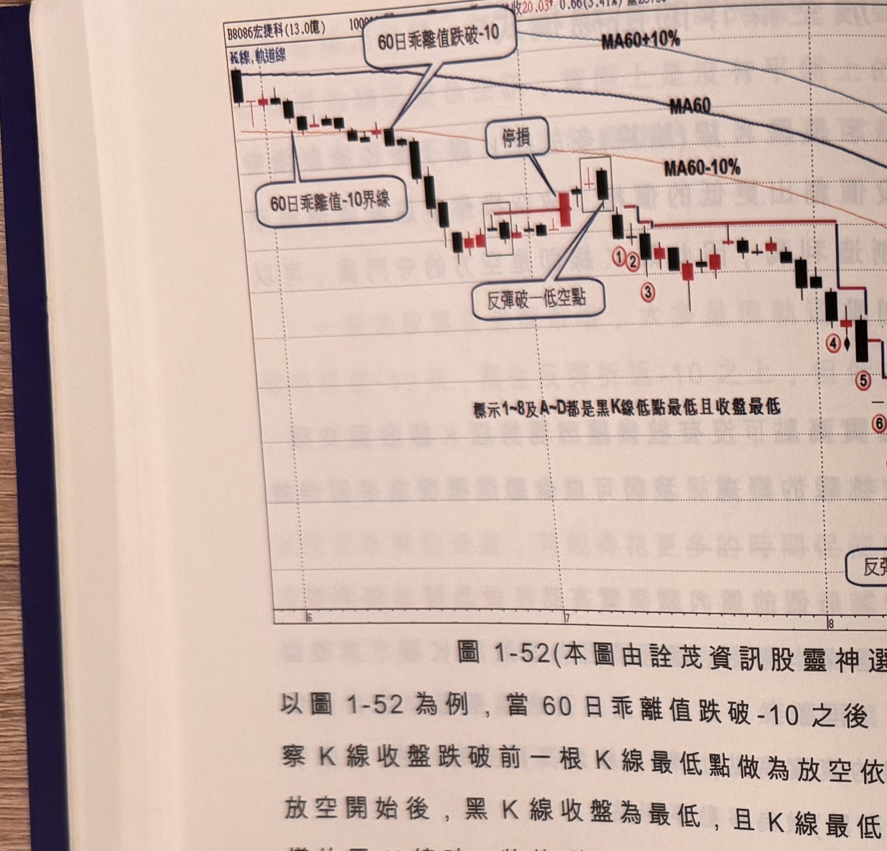
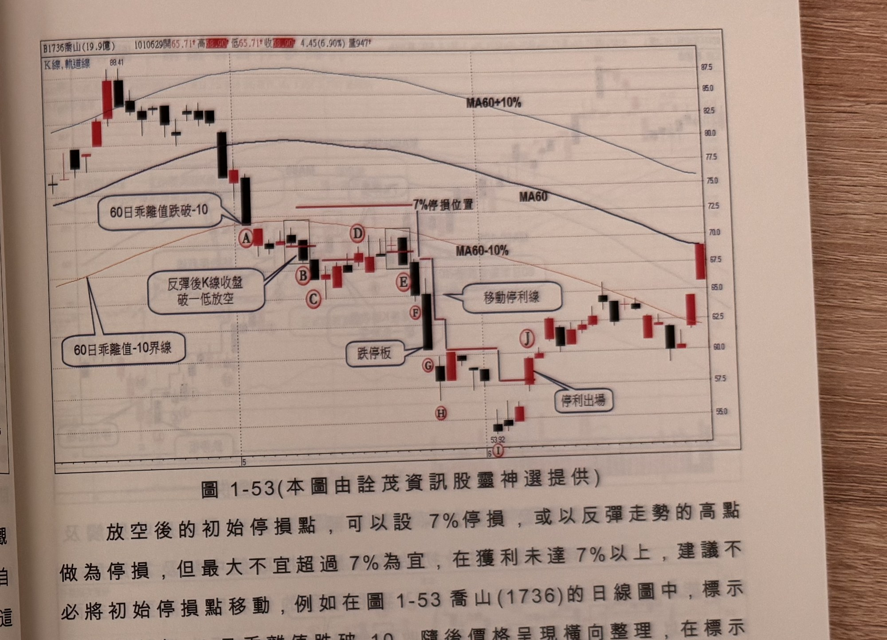

## p.62

**圖 1-52**（本圖由詮茂資訊股靈神選提供）

> 圖說：宏捷科(B8086宏捷科(13.0億))日線圖，含 K 線、軌道線、MA60、MA60±10% 副圖，文字框
> 「60日乖離值跌破-10」「60日乖離值-10界線」「停損」「反彈破一低空點」，並標註「標示1~8及A~D
> 都是黑K線低點最低且收盤最低」。標示①②③④⑤⑥⑦⑧與Ⓐ Ⓑ Ⓒ Ⓓ 依序沿下跌趨勢排列，為反覆
> 出現的反彈破一低放空點及移動停利點。

以圖 1-52 為例，當 60 日乖離值跌破 -10 之後，出現反彈走勢，觀察 K 線收盤跌破前一根 K 線最低點
做為放空依據，標示 1~8 為自放空開始後，黑 K 線收盤為最低，且 K 線最低點亦為最低，出現這樣的
黑 K 線時，將停利點移動至該黑 K 線的真實高點，從標示 3 之後，雖然有些黑 K 線比標示 3 黑 K 線的
位置低，但並無符合收盤最低且最低點最低兩個條件，直到標示 4 位置，黑 K 線收盤創新低，最低點
亦創新低，停利點重新移動至其高點，標示 5 是一根跌停收盤 K 線，因此停利點移動到半根停板位置
做為隔天參考，標示 7 及 8 位置已經連續第三根及第四根跌停板，停利點將移動至收盤位置提供隔天
參考使用，當標示 9 收盤高於平盤時，停利出場，完成放空操作整個過程。

## p.63

第一章　從乖離率捕捉強勢股

**圖 1-53**（本圖由詮茂資訊股靈神選提供）

> 圖說：喬山(B1736喬山(19.9億))日線圖，時間戳 1010629，開 65.71、高 68.90、低 65.71、收
> 68.90，4.45(6.90%)，量 947，含 K 線、軌道線、MA60、MA60±10% 副圖，文字框「60日乖離值
> 跌破-10」「60日乖離值-10界線」「反彈後K線收盤破一低放空」「7%停損位置」「跌停板」「移動
> 停利線」「停利出場」。高點 88.41 起跌，標示Ⓐ~Ⓙ 依序為放空後的移動停利過程，低點 53.92。

放空後的初始停損點，可以設 7% 停損，或以反彈走勢的高點做為停損，但最大不宜超過 7% 為宜，
在獲利未達 7% 以上，建議不必將初始停損點移動，例如在圖 1-53 喬山(1736)的日線圖中，標示 A
位置代表 60 日乖離值跌破 -10，隨後價格呈現橫向整理，在標示 B 的 K 線收盤破一低，是為放空
訊號，此時初始停損點，設在收盤價向上推 7% 位置，或者設在橫向整理的最高點亦可，標示 C 的
K 線收盤繼續創新低，最低點亦是新低，本應將停利點移動至 C 的 K 線最高點，但是放空獲利未達
7% 以前，建議將停損停利點仍維持在 7% 位置，這樣避掉標示 D 收盤突破停利點，造成出場，如果
堅持在 D 出場的話，則必須在標示 E 位置 K 線收盤破一低出現時，再度進行放空動作，標示 G~I 位置
皆為創新低之 K 線收盤，同時 K 線最低點亦是放空之後的最低點，將停利點依次移動至黑 K 線的真實
高點，最後在標示 J 位置觸及停利點出場。
