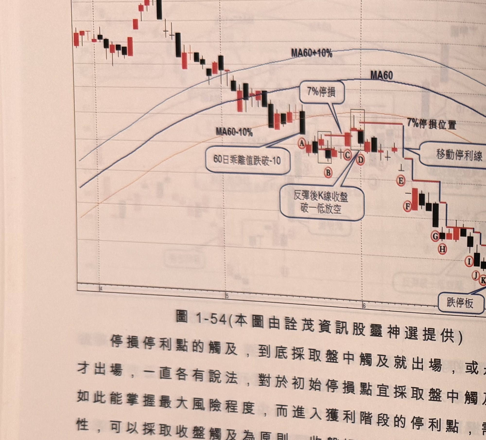
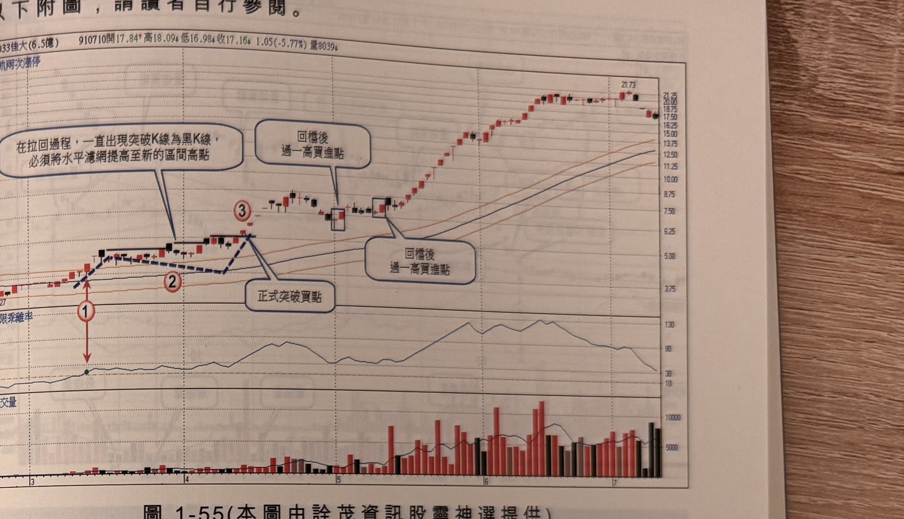
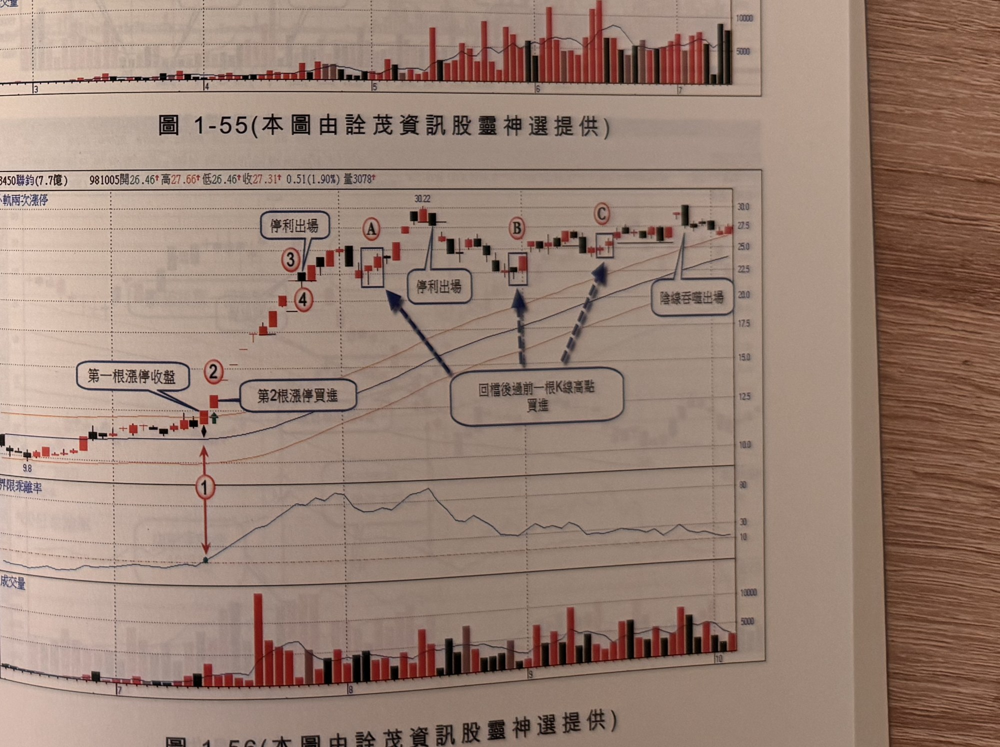

## p.64

**圖 1-54**（本圖由詮茂資訊股靈神選提供）

> 圖說：可成(B2474可成(10.2億))日線圖，時間戳 910711，開 77.00、高 77.50、低 74.00、收
> 74.04，5.50(-6.92%)，量 3944，含 K 線、軌道線、MA60、MA60±10% 副圖，文字框「60日乖離值
> 跌破-10」「7%停損」「反彈後K線收盤破一低放空」「移動停利線」「跌停板」「停利出場」。高點
> 165 起跌，標示Ⓐ~Ⓜ 依序為放空後的移動停利過程，低點約 70 附近。

停損停利點的觸及，到底採取盤中觸及就出場，或是收盤觸及才出場，一直各有說法，對於初始停損
點宜採取盤中觸及為原則，如此能掌握最大風險程度，而進入獲利階段的停利點，需要更多耐性，
可以採取收盤觸及為原則，收盤觸及也許會較原先規劃的停利點有些許出入，但是可以忍受；像連
三跌停板採取平盤為停利點，之後，盤中高點曾穿越停利點，這種狀況，難免造成心情忐忑，但後續
若未突破停利點，可獲取更大的利潤，必須按捺住衝動的情緒。

以下附圖，請讀者自行參閱。

## p.65

第一章　從乖離率捕捉強勢股

**圖 1-55**（本圖由詮茂資訊股靈神選提供）

> 圖說：佳大(B2033佳大(6.5億))日線圖，時間戳 910710，開 17.84、高 18.09、低 16.98、收
> 17.16，1.05(-5.77%)，量 8039，含外軌兩次漲停標示、K 線與 60 日乖離率、成交量副圖，文字框
> 「在拉回過程，一直出現突破K線為黑K線，必須將水平濾網提高至新的區間高點」「正式突破買點」
> 「回檔後過一高買進點」。低點 3.27 起漲，標示①（乖離率跌破 -10），標示②「正式突破買點」，
> 標示③後方框標示兩處「回檔後過一高買進點」，末端高點 21.73。

**圖 1-56**（本圖由詮茂資訊股靈神選提供）

> 圖說：聯鈞(B3450聯鈞(7.7億))日線圖，時間戳 981005，開 26.46、高 27.66、低 26.46、收
> 27.31，0.51(1.90%)，量 3078，含外軌兩次漲停標示、K 線與 60 日乖離率、成交量副圖，文字框
> 「第一根漲停收盤」「第2根漲停買進」「停利出場」「回檔後過前一根K線高點買進」「陰線吞噬
> 出場」。標示①（乖離率跌破 -10），標示②「第一根漲停收盤／第2根漲停買進」，標示③④，方框
> 標示Ⓐ「停利出場」，Ⓑ「回檔後過前一根K線高點買進」，Ⓒ「陰線吞噬出場」，高點 30.22。
