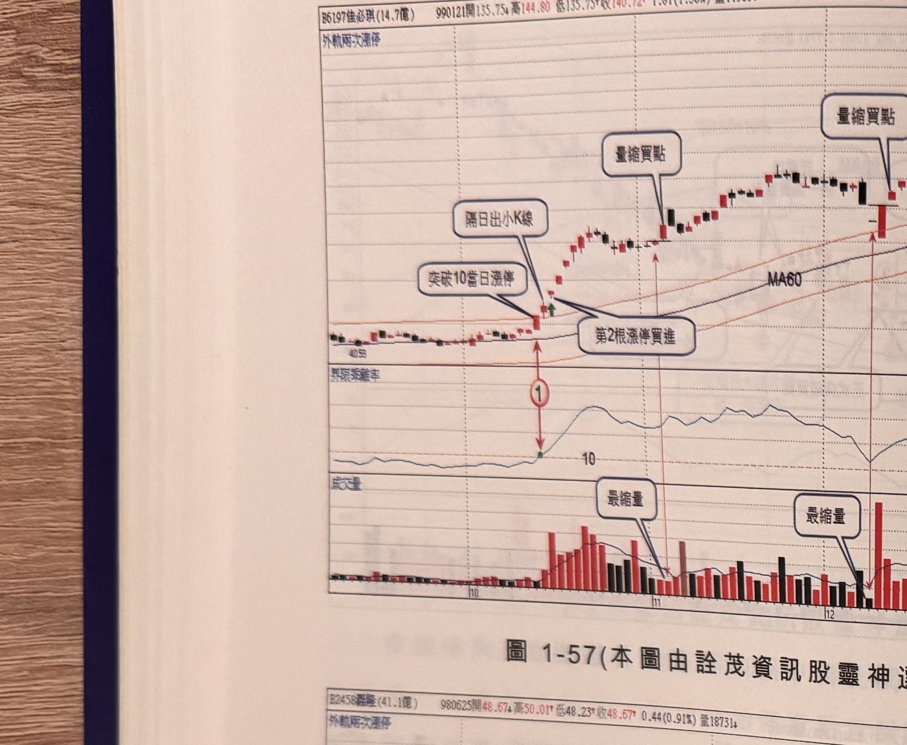
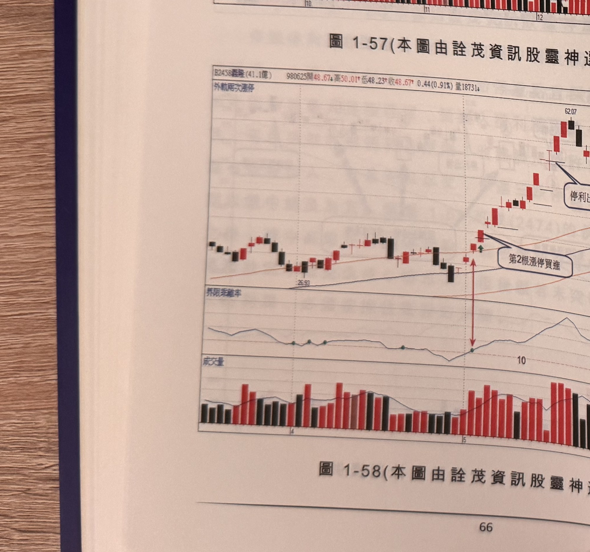
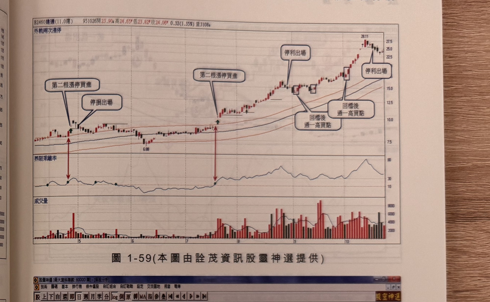
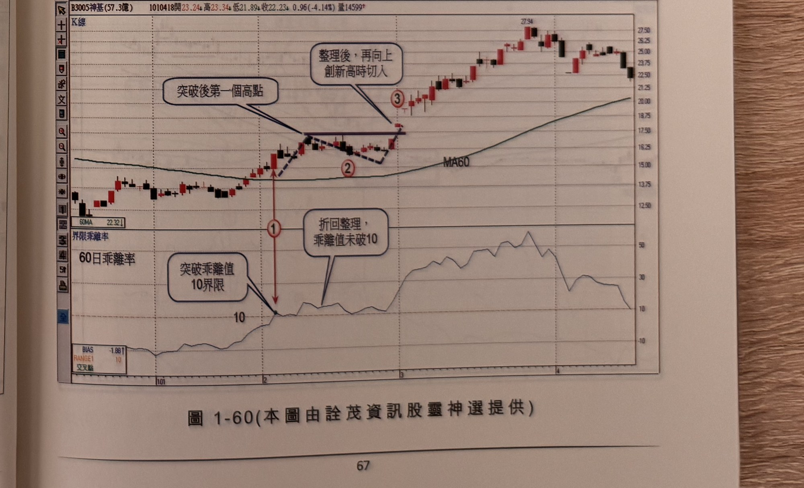

## p.66

**圖 1-57**（本圖由詮茂資訊股靈神選提供）

> 圖說：佳必琪(B6197佳必琪(14.7億))日線圖，時間戳 990121，開 135.75、高 144.80、低 135.75、收
> 140.72，1.31(1.30%)，含外軌兩次漲停標示、K 線、MA60 與 60 日乖離率、成交量副圖，文字框
> 「突破10當日漲停」「隔日出小K線」「第2根漲停買進」「量縮買點」（多處）「最縮量」（多處）。
> 低點 40.59 起漲，標示①（乖離率突破 10）。

**圖 1-58**（本圖由詮茂資訊股靈神選提供）

> 圖說：嘉隆(B2458嘉隆(41.1億))日線圖，時間戳 980625，開 48.67、高 50.01、低 48.23、收
> 48.67，0.44(0.91%)，量 18731，含外軌兩次漲停標示、K 線與 60 日乖離率、成交量副圖，文字框
> 「第2根漲停買進」「停利出場」。低點 26.93 起漲，隨後突破 60 日乖離值 10（副圖標示），末端
> 高點 62.07。

## p.67

第一章　從乖離率捕捉強勢股

**圖 1-59**（本圖由詮茂資訊股靈神選提供）

> 圖說：建通(B2460建通(11.0億))日線圖，時間戳 951026，開 23.90、高 24.65、低 23.82、收
> 24.06，0.32(1.35%)，量 3108，含外軌兩次漲停標示、K 線與 60 日乖離率、成交量副圖，文字框
> 「第二根漲停買進」「停損出場」「第二根漲停買進」「停利出場」「回檔後過一高買點」（兩處）
> 「停利出場」。低點 6.88 起漲，末端高點 28.11。

**圖 1-60**（本圖由詮茂資訊股靈神選提供，畫面含「股靈神選」看盤軟體視窗邊框）

> 圖說：神基(B3005神基(57.3億))日線圖，時間戳 1010418，開 23.24、高 23.34、低 21.89、收
> 22.23，0.96(-4.14%)，量 14599，含 K 線、MA60、60日乖離率(BIAS)、RANGE1:10 副圖，文字框
> 「突破乖離值10界限」「突破後第一個高點」「折回整理，乖離值未破10」「整理後，再向上創新高
> 時切入」。標示①（乖離率突破 10），標示②（折回整理），標示③（創新高切入），末端高點 27.34。
