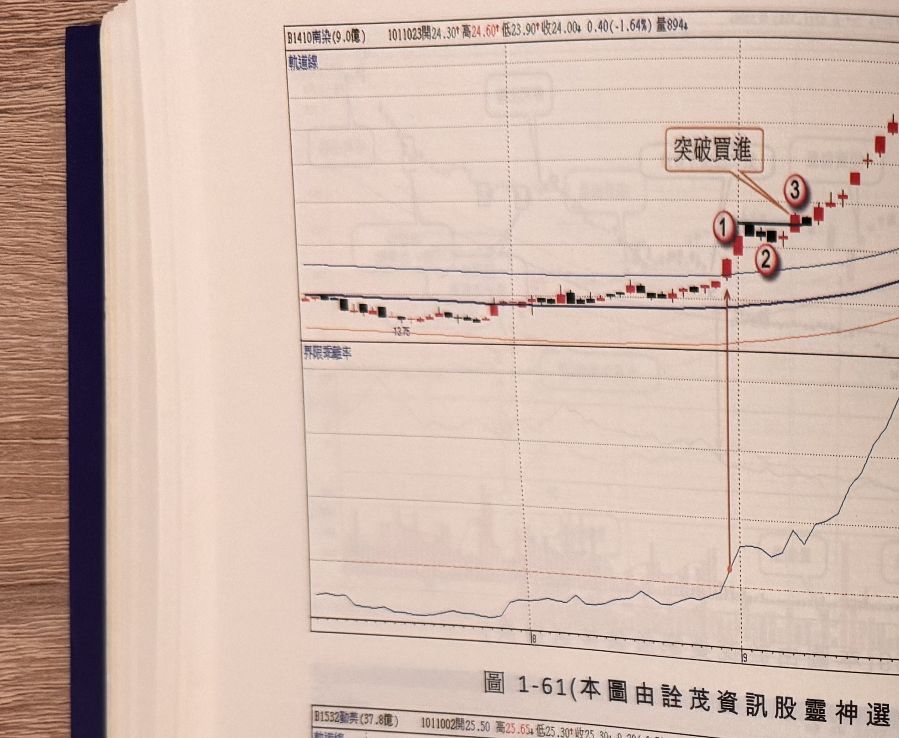
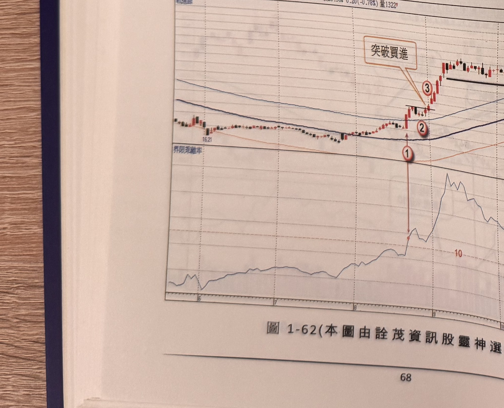
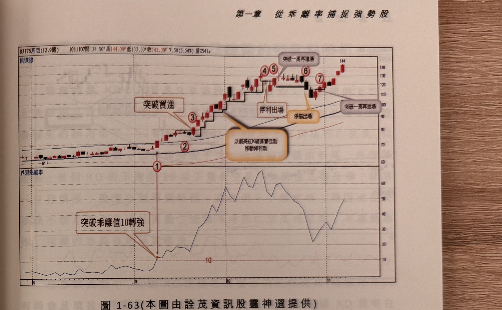
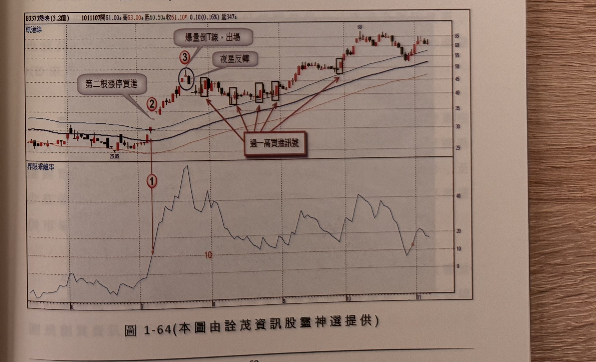

## p.68

**圖 1-61**（本圖由詮茂資訊股靈神選提供）

> 圖說：南染(B1410南染(9.0億))日線圖，時間戳 1011023，開 24.30、高 24.60、低 23.90、收
> 24.00，0.40(-1.64%)，量 894，含軌道線、K 線與 60 日乖離率副圖，文字框「突破買進」。低點
> 13.75 起漲，標示①②③依序為乖離率突破 10 及「突破買進」點。

**圖 1-62**（本圖由詮茂資訊股靈神選提供）

> 圖說：勵美(B1532勵美(37.8億))日線圖，時間戳 1011002，開 25.50、高 25.65、低 25.30、收
> 25.30，0.20(-0.78%)，量 1322，含軌道線、K 線與 60 日乖離率副圖，文字框「突破買進」「出場」。
> 低點 16.21 起漲，標示①②③依序為乖離率突破 10 及「突破買進」點，末端高點 30，標示⑤。

## p.69

第一章　從乖離率捕捉強勢股

**圖 1-63**（本圖由詮茂資訊股靈神選提供）

> 圖說：基亞(B3176基亞(12.9億))日線圖，時間戳 1011107，開 134.50、高 144.00、低 133.50、收
> 143.00，7.50(5.54%)，量 2541，含軌道線、K 線與 60 日乖離率副圖，文字框「突破乖離值10轉強」
> 「突破買進」「停利出場」「停損出場」「以創高紅K線真實低點移動停利點」「突破一高再進場」
> （兩處）。低點 61.7 起漲，標示①（乖離率突破 10），標示②③「突破買進」，標示④⑤「停利出場」
> 及「停損出場」，標示⑥⑦後方框標示「突破一高再進場」，末端高點 144。

**圖 1-64**（本圖由詮茂資訊股靈神選提供）

> 圖說：熱映(B3373熱映(3.2億))日線圖，時間戳 1011107，開 61.00、高 63.00、低 60.50、收
> 61.10，0.10(0.16%)，量 347，含軌道線、K 線與 60 日乖離率副圖，文字框「第二根漲停買進」
> 「夜星反轉」「爆量倒T線，出場」「過一高買進訊號」（四處）。低點 25.05 起漲，標示①（乖離率
> 突破 10），標示②「第二根漲停買進」，標示③（夜星反轉圈選）「爆量倒T線，出場」，隨後方框
> 標示四處「過一高買進訊號」，末端高點 68。
