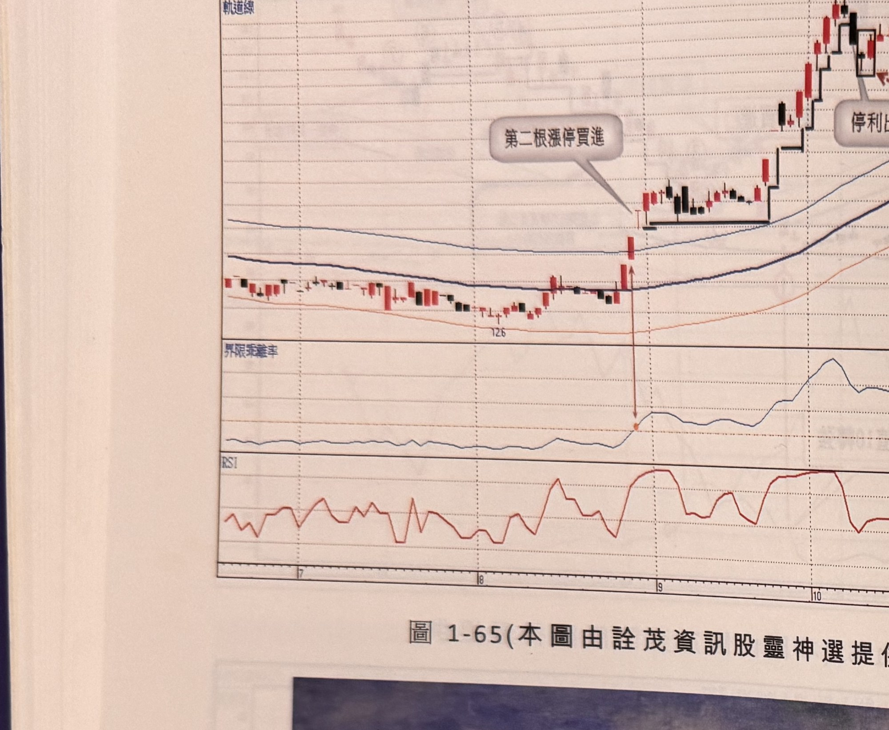

## p.70

**圖 1-65**（本圖由詮茂資訊股靈神選提供）

> 圖說：場程(B3498場程(6.8億))日線圖，時間戳 1011107，開 24.45、高 24.70、低 23.80、收
> 24.20，0.25(-1.02%)，量 158，含軌道線、K 線、60 日乖離率與 RSI 副圖，文字框「第二根漲停
> 買進」「停利出場」「RSI過50買點」。低點 12.6 起漲，標示位置對應「第二根漲停買進」箭頭，末端
> 高點 27.5。

**王沛文油畫作品----拱橋**（無圖號，書中插頁彩色油畫複製圖，非 K 線圖或示意圖，依原樣裁切
保留為 jpg）

> 圖說：一幅水彩／油畫風格的江南水鄉拱橋風景畫，畫面中央為一座石造拱橋橫跨河道，橋欄上有
> 文字（部分可辨似為「安平橋」或類似橋名，字跡因印刷模糊未能完全辨識，標記 [?]），橋後方為
> 白牆黑瓦的傳統建築群，天空為藍灰色調；此為作者王沛文（王慶津）的個人油畫作品插頁，與正文
> 技術分析內容無直接關聯。

## p.71

第二章　週 KD 運用在日線圖的買賣點解析

隨機指標 KD，只要是交易過股票或期貨的人都能朗朗上口，太過普遍以致認為騙線多，問題可能出在
誤用，多頭走勢裡，一般會發生的誤用情形——看到 KD 值攻到 80 以上超買區死亡交叉，似乎是一個
賣出訊號，但拋掉持股不久，股價卻繼續創新高；在空頭走勢，看到 KD 值下探到 20 以下黃金交叉，
就跳進去搶反彈，結果一日行情後，股價立刻再創新低；這些例子不勝枚舉，原因出在於多頭不使用
黃金交叉找買點，空頭不用死亡交叉找空點，不順勢操作，指標的功能自然地就喪失。

在多頭走勢中，日線 KD 指標在高檔形成死亡交叉(簡稱死叉)，有時會呈現拉回幅度極小，又重新
攻上，如果觀察週線 KD 就明白大部份日線回檔，週線 KD 指標仍然穩健朝上，既沒來到超買區，也
沒死亡交叉；不妨在操作過程，遇到日線 KD 死叉，再拿出週線 KD 來比對一下，可以避免過早出場。

顯然週線 KD 較能夠表現波段的轉折，日線 KD 則比較著重在切入位置的選擇上，在判斷多空過程，
除了用均線的多排或空排表達對市場的分界外，也可利用週線 KD 來做為多空轉折的參考，至少在
價格高檔做頭階段，運用週 KD 死叉來輔助均線，能夠更早提供市場轉空的訊息。

本章介紹的用法乃將週 KD 指標建構在日線圖上，一般軟體並無此種功能；在實務上，讀者可以先
觀察週 KD 的狀況，再以日線圖規劃買賣訊號，效果是一樣的。
