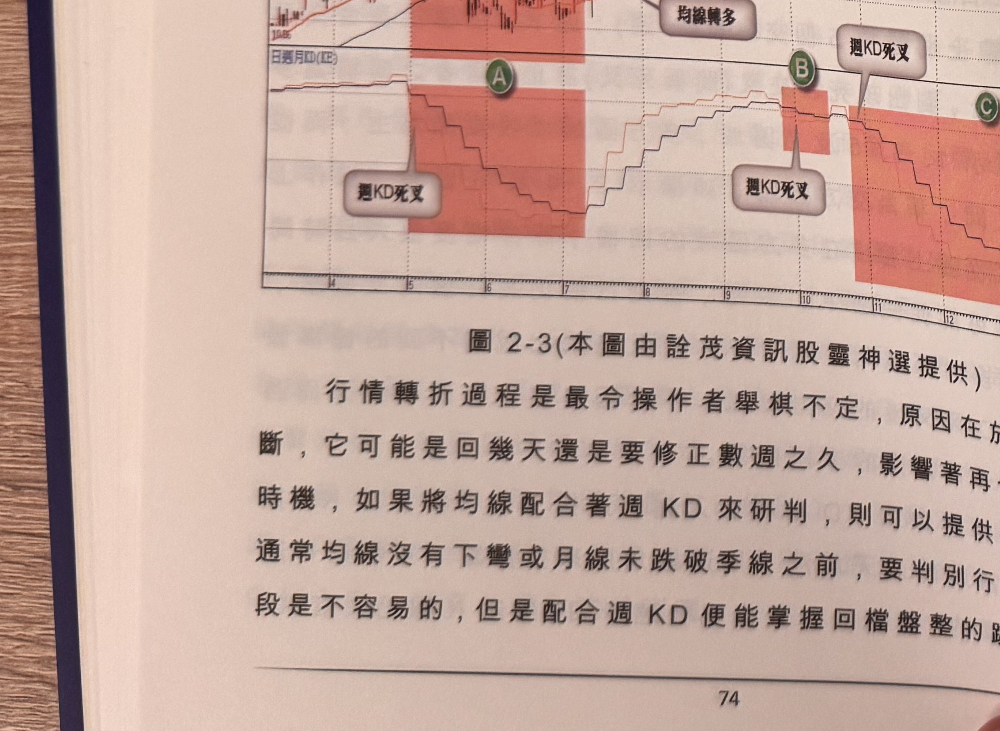

## p.74

但買在第三天急漲的高點，在當週收盤立刻虧損 10% 的話，那買點就不夠漂亮，而且忍耐力不夠者，
從此對使用週線判斷心生恐懼。多空大方向的區分，可以借助週 KD 指標的穩定性，讓操作者了解
波段行情不會只是幾天內就結束，而能增強在波段買進的持股信心；對一個操作者而言，了解什麼
期間該操作哪一個方向是極其重要，如果行情處在多方區域，透過其它日線指標或 K 線的轉折來切
入，而在空方區域，則不會恣意做多，能避開錯誤的操作，自然能大大提升操作的成果。

**圖 2-3**（本圖由詮茂資訊股靈神選提供）

> 圖說：亞化(B1715亞化(24.9億))日線圖，時間戳 1000225，開 15.61、高 15.69、低 15.324、收
> 15.44，0.12(-0.77%)，量 1059，含 K 線與「日週月KD(KE)」副圖，圖上以橙紅色網底標出三段區域
> Ⓐ、Ⓑ、Ⓒ，K 線圖上對應標註「均線轉空」（兩處）、「均線轉多」，KD 副圖上對應標註「週KD死叉」
> （三處）。

（本頁圖說明：此圖為後續段落「行情轉折過程...如圖 2-3」所引用之圖例，說明週 KD 死叉與均線
轉空／轉多的對應關係。）

## p.75

第二章　週 KD 運用在日線圖的買賣點解析

紅色區塊，在標示 A 及 C 區域，開始位置大致都在均線沒有明顯下彎，價格也沒有形成任何反轉
型態，往往此時仍有執意看多的情形出現，而隨後價格跌破季線，再到均線轉空排，觀念上又開始
憂慮多頭走勢是否就此結束，更不知要跌到哪裡才是支撐，當週 KD 呈現死叉時，要明白行情可能
休息整理或者反轉，至於為何種狀況，不急於立刻定調，像 A 區域價格橫走，即使均線轉空，依然
沒有進一步下挫，就有可能只是漲勢中途的盤整格局，由隨後週 KD 金叉，價格重新跳上季線，代表
多頭行情重啟的成份高；而標示 C 區域則沒有這般幸運，當週 KD 死叉後，價格不斷地橫走，但週
KD 卻等不到金叉出現，價格逐漸失去耐心，終於多殺多，轉為較長的空頭格局，殺到高點對折的
價位方止穩回升。至於 B 區域週 KD 轉空時間只有三週整理，當它再出現金叉時，價格快速大漲一週，
價格推升創新高，在隔週的週 KD 立刻出現死叉，此時很難接受剛重新出發的大漲行情立刻要退場，
事實證明在 B 區域後的一週快漲走勢，原來是最後誘殺散戶套牢的陰謀。

均線是操作者不可或缺的判斷趨勢方向的工具，但在關鍵位置，它又常常會出現判斷上的盲點，唯有
加入週線指標來輔助分析，才能避開致命的危機，週 KD 雖有鈍化的缺點，但做為多空操作的參考
價值，是不可等閒視之。
