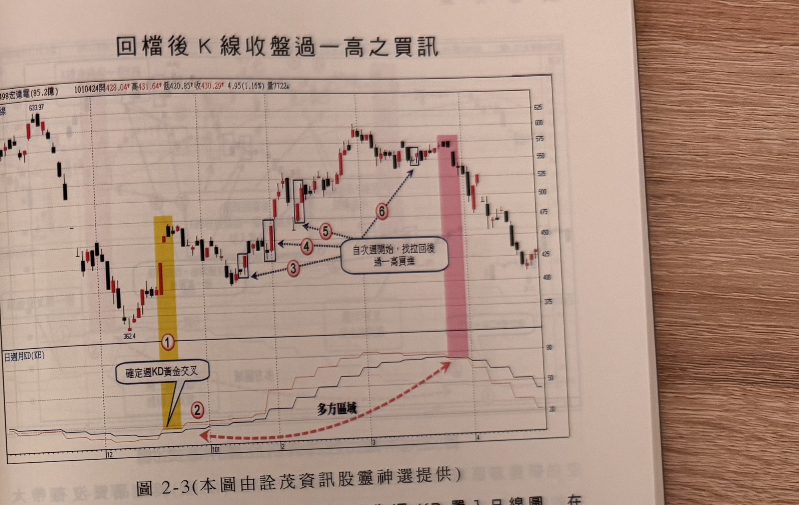

## p.76

週 KD 指標置入日線圖之運用原則

在運用週 KD 指標置入日線圖上，運用的原則：

1、　多方區域首要先確認週 KD 呈現黃金交叉，因此，在交叉當週只看不切入，因為未到當週結束，
難以斷定週 KD 值鐵定黃金交叉；自隔週開始，週 KD 已確定黃金交叉屬於多方區域，即可開始多頭
操作，利用各種方法來找切入買點。包括使用【1】K 線收盤過前一根 K 線最高點，【2】RSI 穿越
50 買點，【3】日 K 值 50 以下打勾。

2、　空方區域一樣先確認週 KD 呈現死亡交叉，死叉當週不必有任何操作，自確認死叉隔週起，開始
進行空頭操作，積極尋找放空點。使用【1】K 線收盤跌破前一根 K 線最低點，【2】RSI 跌破 50
空點，【3】爆量空點，【4】日 K 值在 50 以上作下彎空點。

為什麼要剔除黃金交叉或死亡交叉當週的介入機會，剛才提過當週決定週 KD 是否呈現金叉或死叉，
必須等到週五收盤才能一錘定音；再者走勢若出現金叉一週即轉死叉，或者短暫死叉次週馬上轉為
金叉，這種曇花一現的走勢，透過第二週開始操作，能有效避開，稍後例子再做說明。

## p.77

第二章　週 KD 運用在日線圖的買賣點解析

回檔後 K 線收盤過一高之買訊

**圖 2-3**（本圖由詮茂資訊股靈神選提供；**書中此圖與 p.74 圖說同樣標號「圖2-3」，經核對照片
確認為原書編號重複，非本次轉錄之誤，特此註記**）

> 圖說：宏達電(B2498宏達電(85.2億))日線圖，時間戳 1010424，開 428.04、高 431.64、低
> 420.85、收 430.29，4.95(1.16%)，量 7722，含 K 線與「日週月KD(KE)」副圖，圖上標題「回檔後 K
> 線收盤過一高之買訊」。低點 362.4，標示①（黃色網底區域）「確定週KD黃金交叉」，標示②，隨後
> 方框標示③④⑤依序為「自次週開始，找拉回後過一高買進」訊號點，末端標示⑥（粉紅色網底區域）
> 高點 633.97。

圖 2-3 為宏達電(2498)日線圖，下方為週 KD 置入日線圖，在 100 年 12 月中旬在標示 1 黃色區，出現
週 KD 黃金交叉，代表行情轉多，首週金叉旨在確認方向轉變，雖有大漲二根，但不是策略由空轉多，
從次週(標示 2)開始，尋找買進點，本例以拉回略下的切入位置，從次週開始，觀察 K 線收盤突破前一
根 K 線最高點，而且訊號 K 線為紅 K 線，如標示 3~6 皆是 K 線收盤過一高的買進位置，雖然期間有 4
個可供買進的點位，但實際上，取前二次交易即可，不管多方區域是反彈或回升行情，價格愈高，
訊號愈容易錯誤，多方區域結束在週 KD 出現死亡交叉，當結束同時，宜了解價格將進入較長時間
整理或回跌走勢，股票宜出場觀望。在行情推升快速，RSI 無法出現穿越 50 產生買訊時，可以使用
K 線過前一根 K 線最高點的方式，尋找買進機會。
