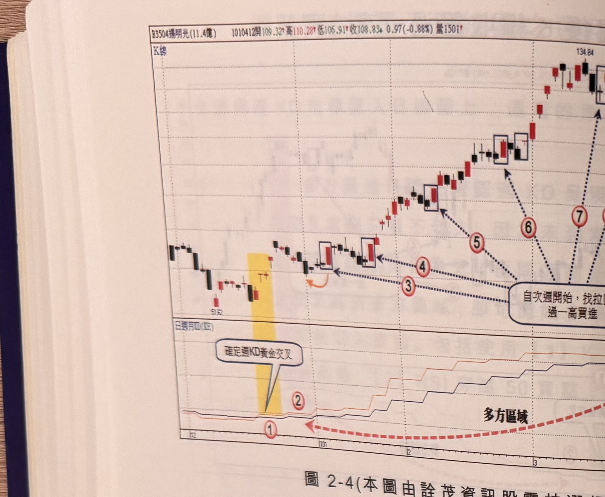
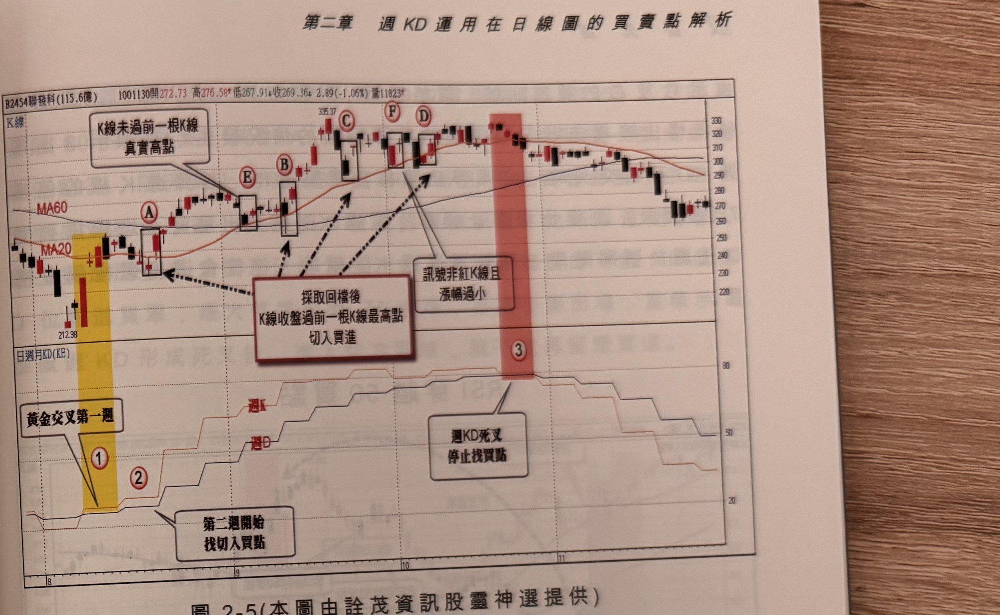

## p.78

**圖 2-4**（本圖由詮茂資訊股靈神選提供）

> 圖說：揚明光(B3504揚明光(11.4億))日線圖，時間戳 1010412，開 109.32、高 110.28、低
> 106.91、收 108.83，0.97(-0.88%)，量 1501，含 K 線與「日週月KD(KE)」副圖。低點 51.62 起漲，
> 標示①（黃色網底）「確定週KD黃金交叉」，標示②，隨後方框標示③④「自次週開始，找拉回後
> 過一高買進」訊號，標示⑤⑥⑦持續沿多方區域上攻，末端高點 134.84。

在多方區域尋找買點，先出現的訊號，只要 K 線品質沒有帶太長的上影線或者過小漲幅(小於 1%)，
或者小黑 K 線，都值得信賴，如果帶有瑕疵者，隔日若 K 線收盤越過瑕疵訊號 K 線最高點，那就
可以補票上車；另一個訊號品質檢定，必須留意訊號 K 線距離回檔最低點多少根數，如果回檔最低點
出現後，二天內產生買進訊號，這是最能接受的狀況，另一種狀況是回檔最低點後面接著數根 K 線
內震盪，的高低點都包含在最低點 K 線內震盪限制；圖 2-4 例子在標示 3 位置出現 K 線收盤過一高
的訊號，但離回檔最低點已經是第 4 根 K 線，品質上較有疑慮的，其它標示 4、5 及 6 的買進訊號都
符合距離最低點 2 根 K 線的要求，至於標示 7 訊號容易失靈，一個波段行情，訊號不可能存在永遠
能創造利潤出來，只要來到頭部區，任何買進動作，都存在停損的風險。

## p.79

第二章　週 KD 運用在日線圖的買賣點解析

**圖 2-5**（本圖由詮茂資訊股靈神選提供）

> 圖說：聯發科(B2454聯發科(115.6億))日線圖，時間戳 1001130，開 273.73、高 276.58、低
> 267.91、收 269.36，2.89(-1.06%)，量 11823，含 K 線、MA20、MA60 與「日週月KD(KE)」副圖，
> 文字框「K線未過前一根K線真實高點」「採取回檔後K線收盤過前一根K線最高點切入買進」
> 「訊號非紅K線且漲幅過小」。低點 212.98，標示Ⓐ（黃色網底）「黃金交叉第一週」，標示①②，
> 方框標示Ⓑ Ⓔ Ⓒ Ⓕ Ⓓ，末端Ⓒ Ⓕ Ⓓ 附近文字框「週KD死叉停止找買點」（粉紅網底），標示③，
> 高點 335.37。

圖 2-5 聯發科(2454)還權日線圖，在 100 年 8 月，聯發科的空頭走勢已經進行第 20 個月，最低為
221 元，還權最低為 212.98 元，此時均線排列仍呈現空頭，從週中旬開始出週 KD 指標黃金交叉，
此時均線排列仍呈現空頭，觀察第二週週 K 值仍大於週 D 值，顯然並不會只出現一週反彈行情，可以
開始尋找切入買點，我們採取回檔後，K 線收盤突破前一根 K 線最高點(簡稱過一高)方式，標示 A~D
皆是各個回檔後過一高的切入買進訊號，標示 A 過 MA20 且為跳空大漲 K 線，訊號品質良好，當價格
進一步穿過 MA60，對多頭攻勢更具有信心，當 MA20 穿 MA60 形成黃金交叉後，反彈格局是相當
樂觀的，在標示 B 是均線金叉後，第一個折返過一高的買點，標示 E 不算過一高的訊號，過一高的
定義在於過回過一高的買點，標示 E 前一根 K 線屬於跳低開盤，因此其真實高點應在前第二根 K 線
的收盤位置，因此不選擇在 E 位置切入，標示 C 及 D 的買進訊號，價格接近，只須取其一切入即可，
當切入後行情出現橫走狀況，須提防反彈到頂的情況發生，當標示 3 出現週 KD 死亡交叉時，必須
停止積極找買點動作，若買進 K 線的停損 7% 被觸及，則要出場停止操作，當週 KD 死叉出現時，
均線排列開口正處於張開階段，若無透過週 KD 輔助，往往會過度戀棧偏多格局。
