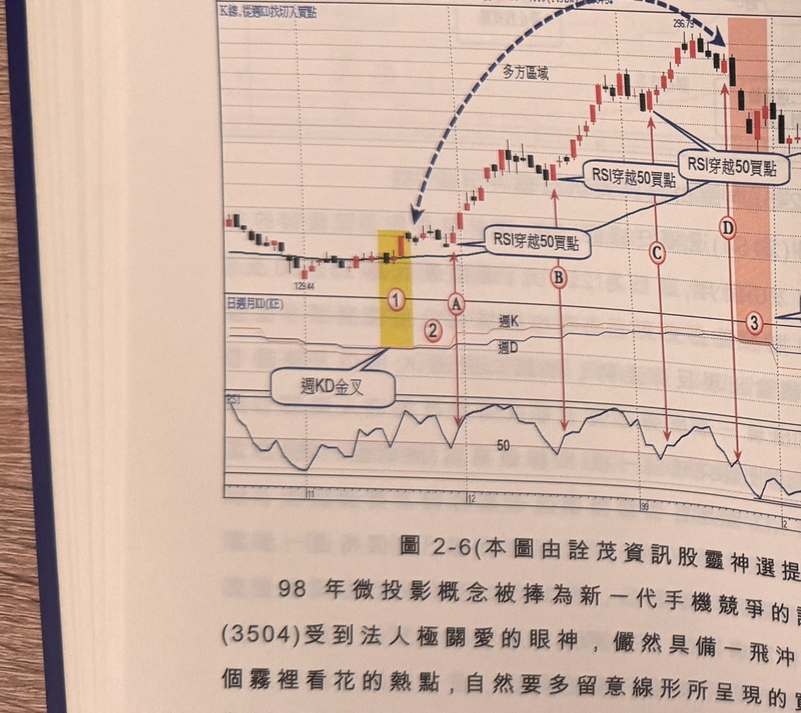
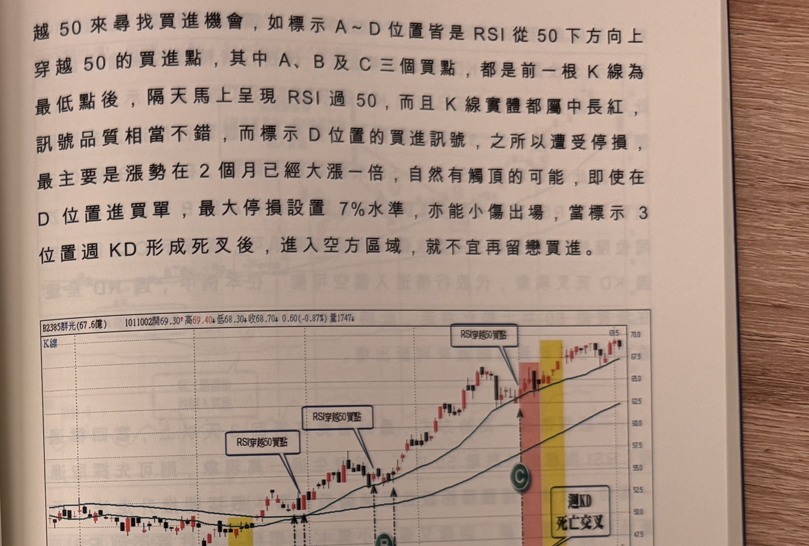

## p.80

RSI 穿越 50 買點

**圖 2-6**（本圖由詮茂資訊股靈神選提供）

> 圖說：揚明光(B3504揚明光(10.7億))日線圖，時間戳 990317，開 216.20、高 222.82、低
> 216.20、收 220.51，4.16(1.92%)，量（略），含 K 線／從週KD找切入買點與「日週月KD(KE)」
> 副圖，文字框「週KD金叉」「RSI穿越50買點」（兩處）「週KD死叉」。低點 129.44，標示①（黃色
> 網底）②Ⓐ，隨後Ⓑ「RSI穿越50買點」，Ⓒ「RSI穿越50買點」，標示③（粉紅網底）Ⓓ「週KD死叉」，
> 末端高點 296.79。

98 年微投影概念被捧為新一代手機競爭的話題，(3504)受到法人極關愛的眼神，儼然具備一飛沖天的
姿態，既然是一個霧裡看花的熱點，自然要多留意線形所呈現的買進機會，如圖 2-6 理的契機，在 98
年 11 月下旬週 KD 出現金叉(如標示 1 位置)，隔週開始(如標示 2)注意買進訊號，本例以 RSI 指標穿

## p.81

第二章　週 KD 運用在日線圖的買賣點解析

越 50 來尋找買進機會，如標示 A~D 位置皆是 RSI 從 50 下方向上穿越 50 的買進點，其中 A、B 及 C
三個買點，都是前一根 K 線為最低點後，隔天馬上呈現 RSI 過 50，而且 K 線實體都屬中長紅，訊號
品質相當不錯，而標示 D 位置的買進訊號，之所以遭受停損，最主要是漲勢在 2 個月已經大漲一倍，
自然有觸頂的可能，即使在 D 位置進買單，最大停損設置 7% 水準，亦能小傷出場，當標示 3 位置
週 KD 形成死叉後，進入空方區域，就不宜再留戀買進。

**圖 2-7**（本圖由詮茂資訊股靈神選提供）

> 圖說：群光(B2385群光(67.6億))日線圖，時間戳 1011002，開 69.30、高 69.40、低 68.30、收
> 68.70，0.60(-0.87%)，含 K 線與「日週月KD(KE)」副圖，文字框「RSI穿越50買點」（三處）「週KD
> 死亡交叉」。標示①②（黃色網底）Ⓐ，隨後Ⓑ「RSI穿越50買點」，末端Ⓒ（粉紅網底）「週KD死亡
> 交叉」附近高點 83.5。

當均線空排進入尾聲，往往可以從週 KD 金叉看出轉折的可能性多高，尤其價格進一步穿越季線，則
趨勢轉變成多頭市場的可靠度更高，這裡所指的均線空排，不見得是價格呈現大幅滑落，也可能是
初升段結束後進入二至三個月的盤跌走勢，例如在圖 2-7 群光(2385)在 101 年初從谷底推升第一段
漲勢，在 4 月中旬進行盤整走
