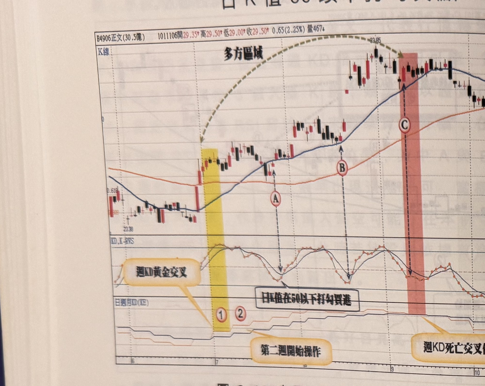
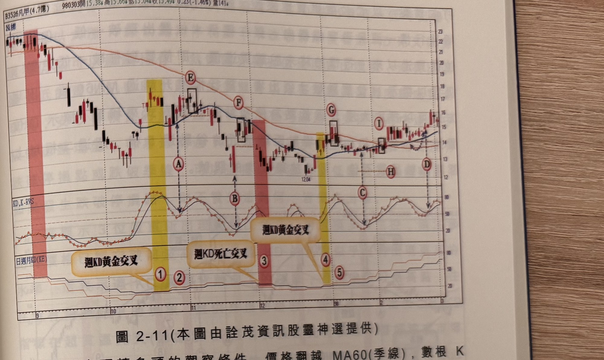

## p.84

日 K 值 50 以下打勾買點

**圖 2-10**（本圖由詮茂資訊股靈神選提供）

> 圖說：正文(B4906正文(30.5億))日線圖，時間戳 1011106，開 29.35、高 29.50、低 29.00、收
> 29.50，0.65(2.25%)，量 467，含 K 線／多方區域曲線與「KD,K-RVS」「日週月KD(KE)」副圖，
> 文字框「週KD黃金交叉」「日K值在50以下打勾買點」「第二週開始操作」「週KD死亡交叉停止買進」。
> 低點 23.38，標示①②（黃色網底）「週KD黃金交叉」，隨後Ⓐ Ⓑ「日K值在50以下打勾買點」，
> 標示Ⓒ（粉紅網底）「週KD死亡交叉停止買進」，末端高點 33.85。

當週 KD 指標出現黃金交叉，開始進入多方區域，尋找切入點另一種選擇是觀察日線 KD 指標的 K 值
在 50 以下出現打勾現象，可以不必等到日 KD 黃金交叉點，在拙作期技期招裡有詳細說明，此處不再
贅述，以圖 2-10 正文(4906)為例，在標示 1 位置週 KD 黃金交叉，自第二週標示 2 開始多方操作，
透過日 KD 指標的 K 值在 50 以下出現打勾現象做為買進訊號，如標示 A 及 B 位置屬於此種買訊，
注意訊號宜距離谷點不超過二根為佳，即當谷點產生後，二日內出現打勾買點，初始停損則設在進場
點下方 7% 位置；圖上標示 C 位置，仍視為進場買進，雖然當週的週 KD 開始出現死叉，但因為在 C
進場時為星期二，週 KD 死叉的確定是當週星期五收盤才確定，這種狀況切記嚴格遵守停損機制，
如果行情出現破一低走勢，要立刻出場，結束多方操作。

## p.85

第二章　週 KD 運用在日線圖的買賣點解析

**圖 2-11**（本圖由詮茂資訊股靈神選提供）

> 圖說：凡甲(B3526凡甲(4.7億))日線圖，時間戳 980303，開 15.38、高 15.66、低 15.04、收
> 15.49，0.23(-1.46%)，量 141，含 K 線與「KD,K-RVS」「日週月KD(KE)」副圖，文字框「週KD黃金
> 交叉」（兩處）「週KD死亡交叉」。標示①②（黃色網底）「週KD黃金交叉」，隨後Ⓔ Ⓕ 方框標示，
> 標示③（粉紅網底）「週KD死亡交叉」，標示④⑤（黃色網底）「週KD黃金交叉」，隨後Ⓖ方框、Ⓒ Ⓗ、
> 標示①（粉紅網底再現）、Ⓘ方框、Ⓓ。

通常空頭轉多頭的觀察條件，價格翻越 MA60(季線)，數根 K 線站上 MA60，這是第一的徵兆，但並
不構成大力翻多操作的條件，必須有更多的跡證來支持，週 KD 黃金交叉是輔助的重要跡證，能夠
產生 N 型結構才是強化翻多的最有利證據，如果週 KD 金叉，但隨後的反彈行情出現，卻總是在
MA60 附近，遭到壓盤回跌，那代表行情將呈現底部鋸齒震盪，例如在圖 2-11 凡甲(3526)在 98 年 10
月中旬，週 KD 在標示 1 位置出現黃金交叉，第二週開始以日 KD 指標的 K 值在 50 以下打勾進行買進
動作，如標示 A 及 B 位置，當行情靠近 MA60 時，若發生 K 線收盤跌破前一根 K 線低點，如標示
E 及 F 位置，這是一個反彈走勢結束的第一徵兆，因此必須在此處出場；隨後週 KD 出現死叉，便要
停止多方操作，直到標示 4 位置出現另一次週 KD 金叉，在標示 G 位置，行情突破季線一日行情，
即破一低轉下，在標示 C 及 D 找到日 KD 指標的 K 值在 50 以下後
