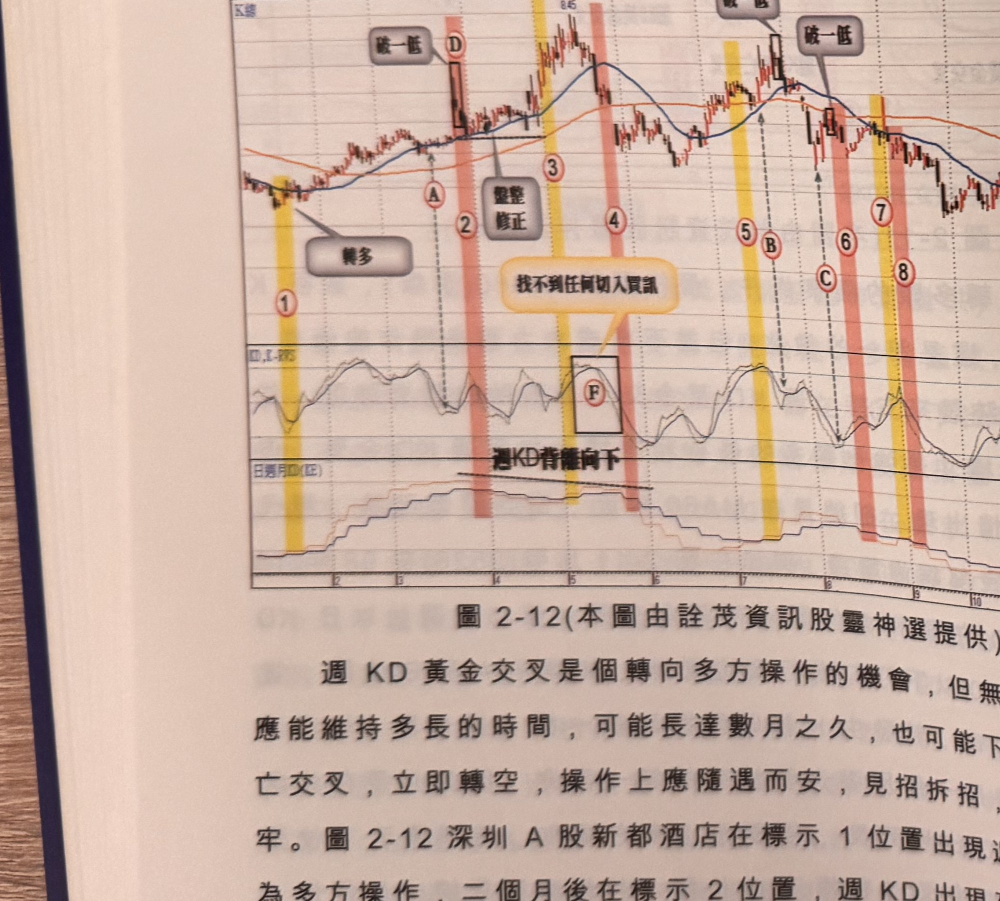

## p.86

打勾買點；以 C 位置進買單來說，初始停損點設在標示 H 位置，進場後行情一直呈現窄幅橫向，雖在
標示 I 位置出現破一低，但自 C 位置買進以來，行情始終未脫離買進價，即使看到有破一低走勢，
仍宜以標示 H 位置跌破才須出場，當行情推升越過 MA60 後，出場方式可以採取大漲 K 線低點為停利
點的設置方式來移動；標示 D 位置雖日 K 值打勾，但進場點距離最近的谷點達 5 根，超過二根以上
都屬訊號品質不佳，可以放棄該次的訊號。

**圖 2-12**（本圖由詮茂資訊股靈神選提供）

> 圖說：深圳 A 股新都酒店日線圖，時間戳 1001215，開 4.22、高 4.25、低（略）、收 4.01，
> 0.27(-6.31%)，量 59237，含 K 線與「KD,K-RVS」「日週月KD(KE)」副圖，文字框「轉多」「整理
> 修正」「破一低」（兩處）「找不到任何切入買訊」「週KD背離向下」。標示①（黃色網底）「轉多」，
> 標示②Ⓐ「破一低」，標示③（粉紅網底）「整理修正」，標示④，方框Ⓕ「找不到任何切入買訊」，
> 標示⑤Ⓑ⑥Ⓒ⑦（黃色／粉紅網底交替），標示Ⓓ「破一低」，標示⑧⑨⑩，KD副圖上標示「週KD背離
> 向下」斜線。

週 KD 黃金交叉是個轉向多方操作的機會，但無法確知偏多效應能維持多長的時間，可能長達數月之
久，也可能下週又轉變為死亡交叉，立即轉空，操作上應隨遇而安，見招拆招，才不會誤判套牢。
圖 2-12 深圳 A 股新都酒店在標示 1 位置出現週 KD 金叉，轉為多方操作，二個月後在標示 2 位置，
週 KD 出現死叉，在這段偏多環境中，在標示 A 位置出現日 KD 指標在 50 以下打勾買訊，持

## p.87

第二章　週 KD 運用在日線圖的買賣點解析

有過程遇到標示 2 週 KD 死叉，照說可以在 D 點出現破一低時出場，但如果以大漲 K 線低點為停利點，
未跌破前即使在週 KD 死叉偏空環境仍然可以繼續持有，就像臨界轉折值呈現賣出環境，沒有出現
破一低的賣出訊號時，原有的多單可以持有至轉折值再度轉成買進環境，安心看較長的波段走勢，
通常在均線呈現多排格局中途的中級修正整理盤，容易造成週 KD 死叉，呈現偏空環境，價格若沒有
跌破停損點或跌破季線，可以選擇以大漲 K 線低點來渡過盤整區，如果發生跌破停損點，則不管想法
為何，皆須先出場。

當標示 3 位置重新出現週 KD 金叉，再度換多方主控，請注意此時價格已經突破前波高點，但週 KD
的高度似乎沒有出現更高的水準，這表示週 KD 具有背離向下的跡象，行情的波段最高點，往往會有
背離向下的現象，提供見頂的跡證，當背離向下出現，日 KD 指標在超買區死叉(如標示 F)具有見頂
的先行表態，喜好追求市場頂點放空者，可能注意這種現象的操作機會，當然若發生價格翻過頂點
最高頂點，則要承認誤判，立即停損出場；標示 3 開始的多方區域，找不到任何日 KD 指標在 50 以下
打勾的現象，因此沒有買訊，有效避開頭部買進被停損可能性。

標示 5 出現週 KD 再次金叉，標示 B 及 C 為日 KD 指標在 50 以下打勾買訊應有的狀況，但 C 點買訊
明顯低於 B 點，這不是正常多頭走勢所發生的買訊，通常愈墊愈高，當 C 點低於 B 點甚多，表示多方
結構是不正常，尤其 C 點買訊發生在價格跌破季線之後不久，意謂翻空前的最後回眸，因此在出現
反彈被季線壓盤又發生價格破一低時，應立刻出場。隨後在標示 6 週 KD 死叉翻盤又發生價格破一低時，
顯示空方空及後來的標示 7 週 KD 金叉，次週標示 8 週 KD 死叉，顯示第二週開始主導行情下跌，標示
9 及標示 10 情況也是一樣，確定多空操作能有效規避不對的時空進場的風險。
