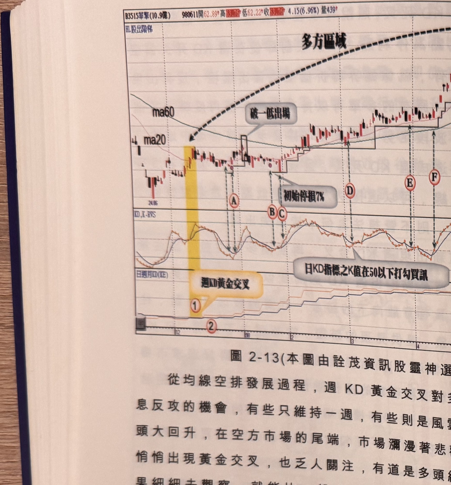

## p.88

**圖 2-13**（本圖由詮茂資訊股靈神選提供）

> 圖說：華擊(B3515華擊(10.9億))日線圖，時間戳 980611，開 62.89、高 63.76、低 62.22、收
> 63.76，4.15(6.96%)，量 439，含 K 線／以股出階梯、MA60、MA20 與「KD,K-RVS」「日週月KD
> (KE)」副圖，文字框「破一低出場」「初始停損7%」「日KD指標之K值在50以下打勾買訊」。低點
> 24.86，標示①（黃色網底）「週KD黃金交叉」，標示②，方框標示「破一低出場」，隨後Ⓐ Ⓑ Ⓒ Ⓓ
> Ⓔ Ⓕ，末端標示③（粉紅網底）「週KD死亡交叉停止買進」，右上高點 71.92。

從均線空排發展過程，週 KD 黃金交叉對多方而言，是一種喘息反攻的機會，有些只維持一週，有些
則是風雲際會，搞到變成多頭大回升，在空方市場的尾端，市場瀰漫著悲觀情緒，即使週 KD 悄悄
出現黃金交叉，也乏人關注，有道是多頭總誕生在絕望中，如果細細去觀察，就能比一般人早發現
可能的大底部買進機會。圖 2-13 華擊(3515)日線走勢，在 2008 年底受到金融風暴陰影所及，華擊
即使當年度獲利不差(EPS 為 6.15 元)，在 11 月中旬後，也遭受棄守，連壓帶滾數根跌停板慘狀，最低
來到 37.15 元(等於圖上還權價位 24.86 元)，12 月初在低迷氛圍中，週 KD 悄悄出現黃金交叉，此時
均線除了月線橫向游走，看不出任何大轉機來臨的前兆，但在週 K 大於週 D 值一直保持中，從金叉
次週的標示 2 開始，即可開始進行買進試水溫動作，標示 A 及 C 為日 KD 指標 50 以下打勾的買訊
(其中標示 B 為黑 K 線須忽略或隔日過一高再確認)，都位處

## p.89

第二章　週 KD 運用在日線圖的買賣點解析

季線以下，要特別謹慎處理停損位置，初始停損點設在進場點下方 7% 位置，並採取階梯出場機制
作為移動停利線(階梯出場機制請參閱交易訊號之直覺操作下冊)，標示 A 進場後，在季線下方，出現
破一低走勢，同時也跌破階梯停利線出場，而標示 C 位置買進後，歷經四個月，才在標示 H 位置出現
K 線收盤跌破階梯停利線，而未跌破階梯停利線過程，分別又出現標示 D~G 買進訊號，其中 E 及 F
屬同位階，可以取其一即可，這些買訊都可視為加碼買進的位置，加碼部位的停損點可以使用階梯
停利點，如果觸及則所有原始部位及各加碼部位皆一致出場。在標示 G 之後，雖在標示 3 出現週 KD
死叉必須停止買進動作，但在停利線未被觸及前，仍可繼續持有至標示 H 為止。

[本段文字下方版面另有一張極淡的灰階折線／K線走勢圖殘影，疑為背面透印或印刷淡化痕跡，非
本頁正面清晰可辨之內容，依規範不予轉錄]
