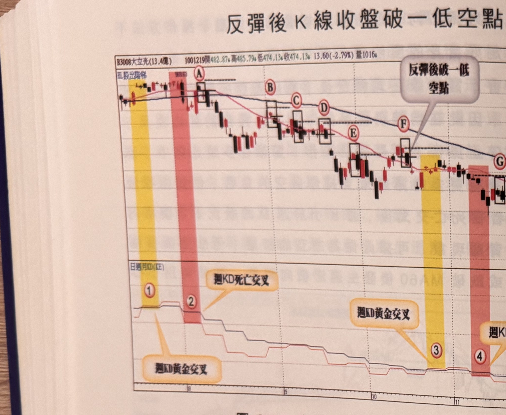
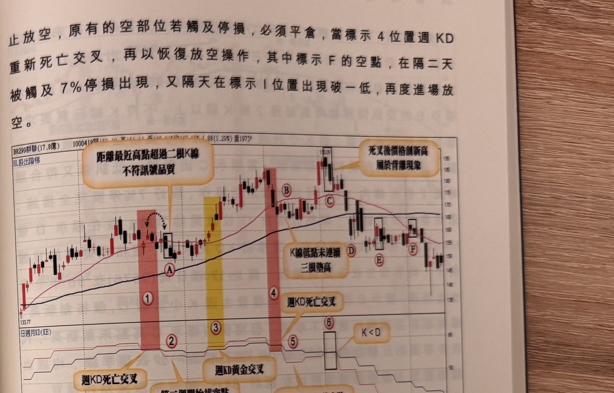

## p.92

反彈後 K 線收盤破一低空點

**圖 2-15**（本圖由詮茂資訊股靈神選提供）

> 圖說：大立光(B3008大立光(13.4億))日線圖，時間戳 1001219，開 482.87、高 485.79、低
> 474.13、收 474.13，13.60(-2.79%)，量 1016，含 K 線／以股出階梯與「日週月KD(KE)」副圖，
> 文字框「反彈後破一低空點」「7%停損位置」「停損」。標示①（黃色網底）「週KD黃金交叉」，
> 標示②（粉紅網底）「週KD死亡交叉」，方框標示Ⓐ Ⓑ Ⓒ Ⓓ Ⓔ Ⓕ，標示③（黃色網底）「週KD黃金
> 交叉」，標示④（粉紅網底）「週KD死亡交叉」，末端Ⓗ Ⓘ「停損」，低點約 452.75。

當週 KD 出現死亡交叉，價格跌破 MA60，就有可能發展成空頭市場，雖非百分百的把握，但絕對值得
嚐試，圖 2-15 大立光(3008)在 100 年 8 月初出現週 KD 死亡交叉(標示 2)，當週價格跌破 MA60(季線)，
這是有可能發展成空頭走勢，從隔週開始觀察反彈行情是否有出現 K 線收盤跌破前一根 K 線最低點的
認定須出現 K 線收盤突破前一根 K 線最低點(簡稱破一低)，反彈連續墊高三根以上(較嚴格的做法)；
在標示 A~I 位置均為反彈後，提供放空的訊號；其中標示 A 位置的空點，均線尚未形成死亡交叉，
的確對放空操作存在不確定性，但已發生價格跌破 MA60 的情形，設好 7% 停損的準備風險，是值得
嚐試的放空機會，標示 B~F 位置的破一低放空訊號，均線已經呈現空排朝下運行，放空的勝算提高
不少，標示 3 週 KD 出現金叉，代表停

## p.93

第二章　週 KD 運用在日線圖的買賣點解析

止放空，原有的空部位若觸及停損，必須平倉，當標示 4 位置週 KD 重新死亡交叉，再以恢復放空
操作，其中標示 F 的空點，在隔二天被觸及 7% 停損出現，又隔天在標示 I 位置出現破一低，再度進場
放空。

**圖 2-16**（本圖由詮茂資訊股靈神選提供）

> 圖說：群聯(B8299群聯(17.8億))日線圖，時間戳 1000412，開 150.10、高 151.12、低 145.01、收
> 147.05，1.88(1.29%)，量 1975，含 K 線／以股出階梯與「日週月KD(KE)」副圖，文字框「距離最近
> 高點超過二根K線 不符訊號品質」「死叉後價格創新高 屬於背離現象」「K線低點未連續三根墊高」
> 「週KD死亡交叉」（兩處）「週KD黃金交叉」「K<D」。標示①（粉紅網底）Ⓐ，標示②③（黃色網底）
> Ⓑ，標示④（粉紅網底），Ⓒ「死叉後價格創新高屬於背離現象」，標示Ⓓ Ⓔ Ⓕ，標示⑤⑥「K<D」，
> 高點 190.09，低點 133.77。

在均線多排週 KD 出現死亡交叉，如果指標沒有出現背離向下情形，放空的危險度偏高，因為行情
可能只是進行盤整區間，而非反形，放空的訊號離最近峰點保持在 2 根 K 線之內，放空後若出現 K 線
收盤過一高或者越過峰點的狀況，立刻出場不宜再戰，例如在圖 2-16 群聯(8299)在標示 1 位置狀況，
均線仍屬多排，開口沒有收斂現象，價格也未曾跌破 MA60，都說明多頭結構沒有任何鬆動，行情
應屬於盤整區間居多，如果仍行放空操作，要注意訊號品質是否符合靠近峰點，標示 A 雖為破一低
之訊號 K 線，但離峰點超過 2 根 K 線，不為合適之放空位置。
