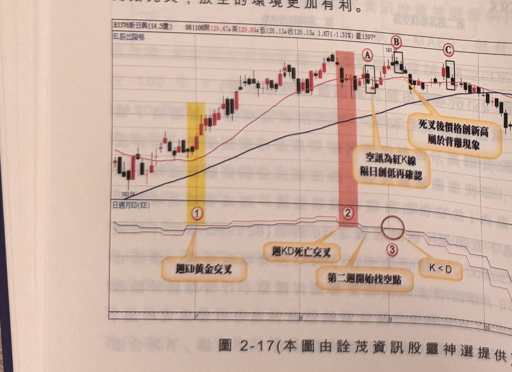
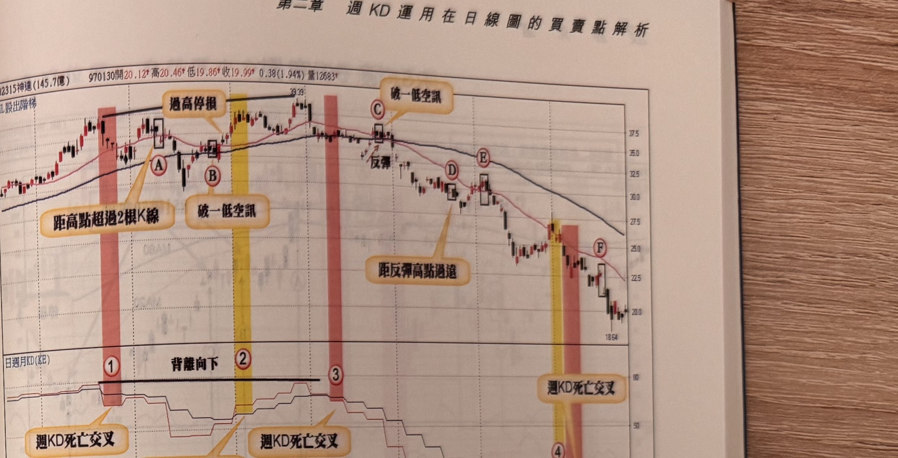

## p.94

之放空位置，隨後的標示 3 週 KD 再度黃金交叉，顯示多頭未結束，但週 K 大於週 D 的局面只維持
三週，在標示 4 重新出現死亡交叉，此時均線沒有任何下彎，價格也沒有跌破 MA60 的情形，因此，
在標示 B 的空訊同樣離峰點超過 2 根 K 線以上，不符 K 線品質要求，重點在標示 6 位置，週 K 小於
週 D 的情況下，價格居然突破前波高點，這是我們所稱的背離現象，當標示 C 出現破一低訊號又符合
離峰點 2 根 K 線內，所以可以嚐試放空操作，設好 7% 停損完全措施，這是最重要的動作，果然行情
自 C 位置開始下跌，並在標示 D 破 MA60，形勢開始有利空方。這種週 KD 死叉後，價格創新高的
背離例子，時常發生在多頭頂點區，圖 2-17 新日興(3576)在 98 年 9 月也出現過，標示 B 位置的空訊
一樣發生週 K 小於週 D，價格創新高，雖然並非立刻讓行情直下季線，但隨後的標示 C 高點未創新高，
代表多頭的反轉型態已然在進行，當行情進一步跌破季線，均線也開始死叉，放空的環境更加有利。

**圖 2-17**（本圖由詮茂資訊股靈神選提供）

> 圖說：新日興(B3376新日興(14.5億))日線圖，時間戳 981106，開 129.47、高 129.89、低
> 126.13、收 126.13，1.67(-1.31%)，量 1397，含 K 線／以股出階梯與「日週月KD(KE)」副圖，文字
> 框「空訊為紅K線 隔日創低再確認」「死叉後價格創新高屬於背離現象」。標示①（黃色網底）「週KD
> 黃金交叉」，方框標示Ⓐ Ⓑ Ⓒ，標示②（粉紅網底）「週KD死亡交叉」，標示③「第二週開始找空點」，
> K<D 圈選，低點 103.74，高點 161.2。

## p.95

第二章　週 KD 運用在日線圖的買賣點解析

**圖 2-18**（本圖由詮茂資訊股靈神選提供）

> 圖說：神達(B2315神達(145.7億))日線圖，時間戳 970130，開 20.12、高 20.46、低 19.86、收
> 19.99，0.38(1.94%)，量 12583，含 K 線／以股出階梯與「日週月KD(KE)」副圖，文字框「過高停損」
> 「破一低空訊」「距高點超過2根K線」「距反彈高點過遠」「週KD死亡交叉」（兩處）。標示①（粉紅
> 網底）「距高點超過2根K線」「背離向下」，方框Ⓐ「過高停損」，標示②（黃色網底）Ⓑ「破一低空訊」，
> 標示③（粉紅網底），標示「反彈」Ⓒ「破一低空訊」，Ⓓ Ⓔ「距反彈高點過遠」，標示④⑤（粉紅／
> 黃色網底），Ⓕ，末端「週KD死亡交叉」，低點 18.64，高點 39.39。

背離的狀況通常如圖 2-18 神達(2315)日線圖裡呈現的價格創新高，指標兩次金叉後的頂點遞降的情形，
這種背離的確認，必須在價創新高後，指標死亡交叉才能認定背離發生，放空的位置不如圖 2-15 及
圖 2-16 那樣能夠空在最高頂點。在標示 1 位置形成第一次週 KD 死亡交叉，稍後分別出現二個空訊，
標示 A 位置，距離反彈高點超過二根 K 線，在當下不符合 K 線品質，即使之後發生大跌，這都是事後
孔明，標示 B 的空訊，由於之前價格曾跌破 MA60，可以嚐試放空，但隨後價格又突破反彈高點，即
使未觸及 7% 停損，仍出場為宜，標示 3 週 KD 再度死叉，這是背離向下出現的死叉，因此可以選擇在
反彈出現後，K 線破一低去放空該股，標示 C 位置剛好是價格跌破 MA60 後，回測均線發生破一低的
空點，標示 D 之破一低訊號離反彈高點超過二根 K 線，不合條件，其餘 E 及 F 位置空點，都是不錯的
放空點。
