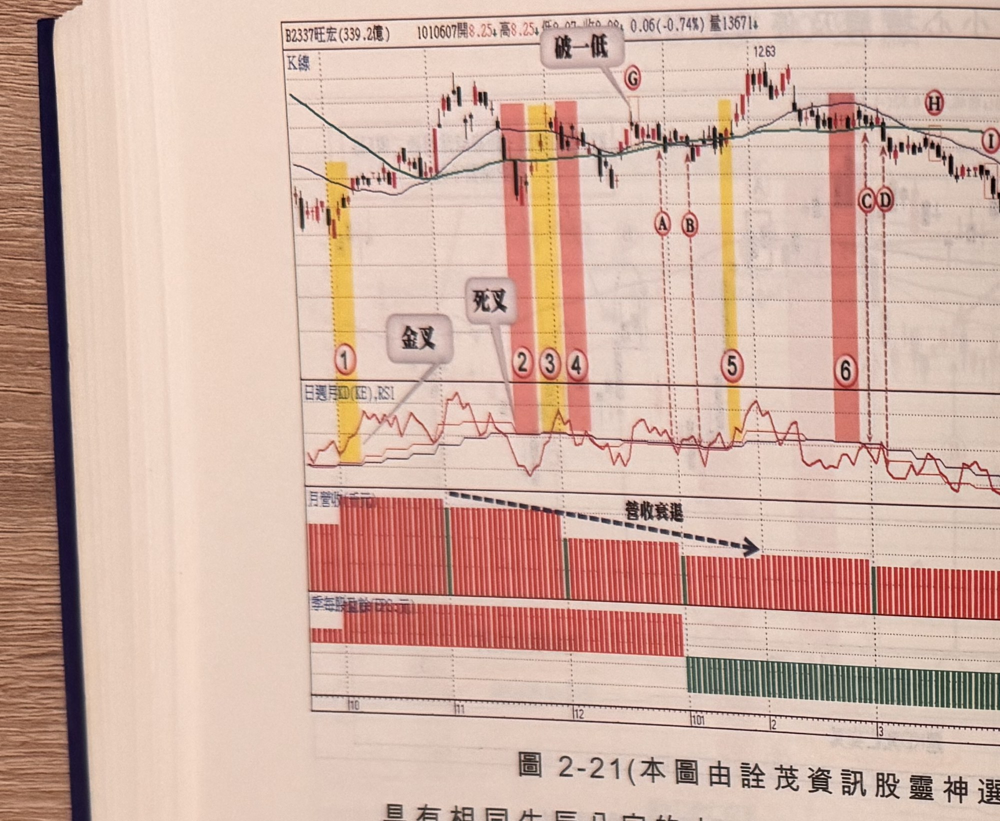
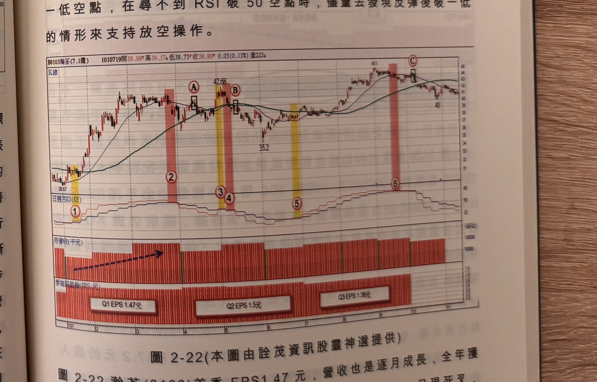

## p.98

線情形發生，標示 A 及 B 位置為 RSI 破 50 的空點，但離峰位都超過 2 根 K 線以上，不是合適的空點，
但標示 G 位置的破一低空點提前出現，即可在 G 點位置放空，由於旺宏在 100 年稅前 EPS 有一元
水準，因此在 11 元附近，不容易有大跌行情，因此放空討不到多大的便宜，但經過 101 年 1 及 2 月
營收持續衰退，價格夾處在 MA20 及 MA60 之間，在標示 6 週 KD 死叉，無疑對季線支撐產生劣勢，
標示 C 及 D 出現 RSI 破 50 的空點，其中 C 帶點賭價格跌破季線，因此停損必須嚴格控管，標示 E 及
F 位置的 RSI 破 50 空點，此時首季 EPS 證實轉負，放空更是順應趨勢，標示 H 及 I 位置為破一低空點，
在尋不到 RSI 破 50 空點時，儘量去發現反彈後破一低的情形來支持放空操作。

**圖 2-21**（本圖由詮茂資訊股靈神選提供）

> 圖說：旺宏(B2337旺宏(339.2億))日線圖，時間戳 1010607，開 8.25、高 8.25、低 8.07、收
> 8.08，0.06(-0.74%)，量 13671，含 K 線與「日週月KD(KE),RSI」、月營收（千元）、季每股盈餘
> (EPS:元) 副圖，文字框「破一低」（兩處）「金叉」「死叉」。標示①（黃色網底）「金叉」，標示
> ②③④「死叉」，標示⑤「破一低」，標示Ⓐ Ⓑ，標示⑥，標示Ⓒ Ⓓ，標示⑦「破一低」，末端高點
> 12.63；月營收副圖標示「營收衰退」箭頭走勢；季每股盈餘副圖後段轉為綠色（虧損）柱狀。

具有相同生辰八字的人，不代表有相同的命運，這得看後天環境因素及先天條件來綜合判斷；具有
相同的線形條件，同樣不代表就有相同的結果，線形有偏空的條件，體質及業績皆有傲人表現的個股，
不容易做快速的下跌，傾向區間整理代替跌勢，但業績乏善可陳，營收或獲利數字雙雙衰退，則會被
拿來當狙擊的目標，進行放空操作；在尋找操作標的過程，週 KD 死叉及均線開口小或逐漸收斂，再
配合價格跌破季線等條件，形成線形上的劣勢，再進一步尋找基本面不佳的攻擊點，營收衰退是最
容易發現的跡證，或者營收成長、獲利衰退所表示的毛利率大幅衰退，這兩種基本面的轉劣，都成為
線形轉差的條件下，最容易被狙擊的標的股，如圖 2-21 旺宏(2337)從 100 年 10 月後，營收衰退明顯，
101 年 1 月營收只剩高峰一半，2 月雖較 1 月成長，卻仍然低迷，則首季獲利不樂觀似乎成定局，在
標示 2~4 週 KD 金叉死叉交錯，價格也有兩次跌破季

## p.99

第二章　週 KD 運用在日線圖的買賣點解析

**圖 2-22**（本圖由詮茂資訊股靈神選提供）

> 圖說：瀚荃(B8103瀚荃(7.1億))日線圖，時間戳 1010719，開 38.98、高 39.17、低 38.75、收
> 38.80，0.05(0.13%)，量 225，含 K 線與「日週月KD(KE)」、月營收（千元）、季每股盈餘(EPS:元)
> 副圖，文字框無特別標註。低點 30.67，標示①（黃色網底），標示②（粉紅網底），標示③④（黃色
> 網底），標示⑤（黃色網底），標示⑥（粉紅網底）Ⓒ，Ⓐ Ⓑ 方框標示，高點 42.68、51、40；月營收
> 副圖持續墊高；季每股盈餘副圖標示 Q1 EPS 1.47元、Q2 EPS 1.5元、Q3 EPS 1.38元。

圖 2-22 瀚荃(8103)首季 EPS 1.47 元，營收也是逐月成長，全年獲利具有 5 元以上水準，在 101 年 5
月初見高點，週 KD 呈現死叉，價格也跌破季線，線形不利多頭，但本益比只有 8 倍水準，即使線
