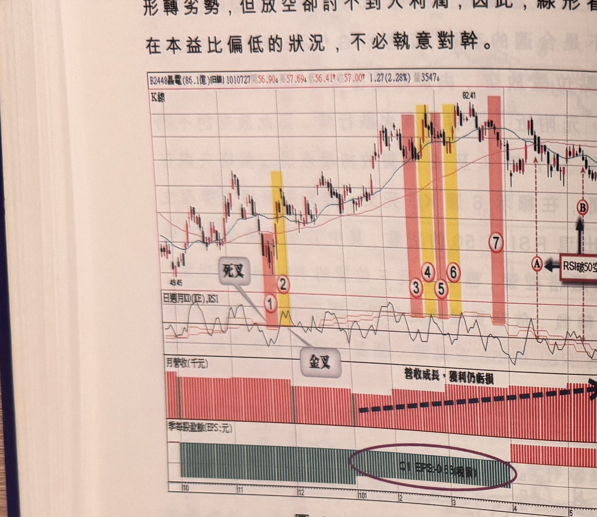

## p.100

形轉劣勢，但放空卻討不到大利潤，因此，線形看壞若基本面紮實，在本益比偏低的狀況，不必執意
對幹。

**圖 2-23**（本圖由詮茂資訊股靈神選提供）

> 圖說：晶電(B2448晶電(86.1億))(日線)日線圖，時間戳 1010727，開 56.90、高 57.69、低
> 56.41、收 57.00，1.27(2.28%)，量 3547，含 K 線與「日週月KD(KE),RSI」、月營收（千元）、季
> 每股盈餘(EPS:元) 副圖，文字框「死叉」「金叉」「營收成長，獲利仍虧損」「RSI破50空點」。低點
> 49.45，標示①（粉紅網底）「死叉」，標示②（黃色網底）「金叉」，標示③④⑤⑥（粉紅／黃色網底
> 交替），標示⑦（粉紅網底），標示Ⓐ「RSI破50空點」，標示Ⓑ，高點 82.41；季每股盈餘副圖以紫色
> 圈選標出「Q1 EPS -0.63(視衰)」段落。

圖 2-23 晶電(2448)則是營收成長，獲利衰退，毛利率大減，當 101 年首季營收逐月成長，即使 100 年
Q4 轉虧，全年 EPS 只剩 0.56 元，對於 LED 產業龍頭，市場仍給予追捧，標示 7 週 KD 死叉超過 1 星期
以上，且在 3 月底價格跌破季線，存疑表示，其後出現反彈行情，無異對首季獲利數字當標示 A 位置
RSI 破 50 空點，價格再一次跌破季線，試操作，4/26 日首季虧損消息見報，顯見產品毛利率因市場
競爭白熱化而大減，全年獲利數字將難以重回 99 年稅後 EPS 7.2 元的傲人水準，標示 B 位置的空點為
均線死叉後首次反彈結束的最佳空點位

## p.101

第二章　週 KD 運用在日線圖的買賣點解析

日 K 值 50 以上彎頭空點

當週 KD 呈現死亡交叉前，價格行情若曾經在峰位爆量，或者量群在高檔退潮，一些反轉型態如頭肩
頂或 M 頭或多尊頭等也在建構中，則死叉出現後，尋找放空點比較有機會獲利，放空後的價格出現
跌破 MA60，代表轉空趨勢的可能性增高；反之，若沒有跌破季線即反彈或者橫向整理，顯示行情極
可能只是進行中段整理，則要小心多方突圍的狀況出現。這些複雜的判斷全因均線排列未明顯死亡
交叉，造成判斷上的難度，如果均線已然空排，判斷上就容易多了，但放空的價格離頂點已有一段
距離。

放空切入的工具，我們介紹破一低的空點及 RSI 破 50 的空點，另外一種是利用日 KD 指標的 K 值在
50 以上彎頭來產生空訊，三種方法中，破一低是最容易尋找到空點，也最容易判斷，只要注意空點
不超過峰點 2 根 K 線以上，原則上都符合放空條件，但缺點是容易在三段式反彈格局中，被觸及停損，
例如在 A 波反彈結束出現破一低空訊，行情卻出現短暫 B 波下壓後，又啟動 C 波反彈，這種狀況在
A 波的空訊，會被軋到停損，必須重新在 C 波反彈結束時出現破一低時再重新放空；RSI 破 50 空點，
對於跌勢較平緩的個股，反彈幅度過小，造成 RSI 無法衝過 50 之上，也就無法產生破 50 的空訊，
因此我們強調何種工具先產生訊號，都值得進行操作。

日 KD 指標的 K 值在 50 以上彎頭所產生的空訊，比起採用日
