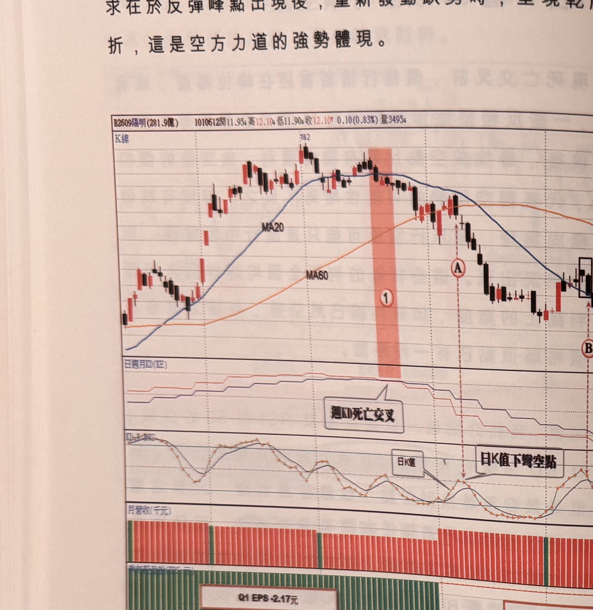

## p.102

求在於反彈峰點出現後，重新發動跌勢時，呈現乾脆俐落的尖頭轉折，這是空方力道的強勢體現。

**圖 2-24**（本圖由詮茂資訊股靈神選提供）

> 圖說：陽明(B2609陽明(281.9億))日線圖，時間戳 1010612，開 11.95、高 12.10、低 11.90、收
> 12.10，0.10(0.83%)，量 3495，含 K 線、MA20、MA60 與「日週月KD(KE)」、「KD,K-RVS」、
> 月營收（千元）、季每股盈餘(EPS:元) 副圖，文字框「週KD死亡交叉」「日K值」「日K值下彎空點」。
> 高點 18.2，標示①（粉紅網底）「週KD死亡交叉」，標示Ⓐ，標示Ⓑ「日K值下彎空點」，季每股盈餘
> 副圖標示「Q1 EPS -2.17元」「Q2 EPS 0.01元」。

100 年歐債危機開始漫延全球金融市場，歐盟各國進行各種搏節措施，整個消費市場掃過一陣陣寒流，
所有景氣循環股跟著披上一層寒霜，圖 2-24 陽明海運在油價仍掛高檔，景氣陡降的影響中，100 年
稅後 EPS 大虧 3.3 元，在 101 年 3 月營收已經是連續第 5 個月衰退，當標示 1 週 KD 呈現死叉前，線形
出現頭肩頂徵兆，死叉後正式跌破頸線 16.2 元，雖然均線尚未出現死亡交叉，但標示 A 位置均線已
呈現收斂閉合現象，因此當日 K 值在 50 上方彎頭向下

## p.103

第二章　週 KD 運用在日線圖的買賣點解析

時，產生放空訊號，訊號品質亦符合距離反彈峰點不超過 2 根 K 線的要求，4 月底新聞發佈陽明首季
稅前 EPS 虧損 2.17 元，稅後虧損 1.91 元，此時均線已經呈現空排走勢，利用反彈行情尾端，在標示 B
位置出現日 K 值在 50 之上彎頭向下，產生放空訊號，亦符合訊號品質要求，行情一路跌勢走到標示
C 位置的空訊，日 K 值也呈現 50 上方彎頭向下，但此空訊離反彈峰點超過 2 根 K 線以上，不符合訊號
品質要求，宜忽略，況且陽明股價跌到 11 元附近，已然貼近票面價格，它並非年年虧損的公司，要
跌到 10 元以下並不容易，也表示繼續放空討不到大便宜，宜休兵另找放空標的。

對於股價的合理價位，常常會用本益比的觀點來檢視，有些人常為自己買的股票本益比太低而叫屈，
也為某些股票享有超高本益比而不可思議，其實法人對於本益比的認定也是很主觀的，認養的個股就
享有高本益比而去合理化解釋，有成長性有夢想的個股，必須編造一些說詞來強化為什麼法人要追高
持有，所以重點就在成長性及有前景的夢想假設，這也是造成炒作的基礎。

股價位在多頭趨勢中，本益比過高或者本夢比吹得更高都無所謂，一旦趨勢反轉時，就得敏銳退出，
哪些是屬於見頂危險因子，不外乎爆量長黑二根、或者量群退潮、發佈利多消息衝高即折回、創新高
比前波頂點高出不到 5% 即大幅折回，或價格形成多尊頭或反轉型態，這些因子產生，配合週 KD 死叉
出現，都是要懂得撤退保守。

為什麼 10 倍的本益比對某些個股算是合理價位，其實是眾人的習慣推論，如果一檔個股年年獲利年年
配息率高，10 倍本益比是
