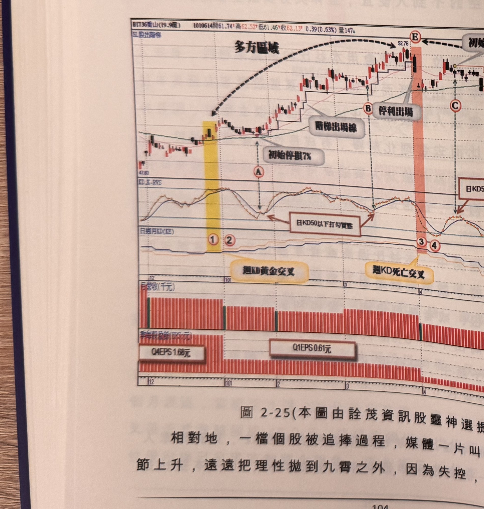

## p.104

可以開始承接的價位，但不表示它是最低的底部價格；例如每年 EPS 賺 4 元，配息 3 元，若以 30 元
買進，配息 10 年就表示完全回本，股票成本變成零元，重點是該檔個股真的年年獲利穩定，30 元
代表的本益比是 7.5 倍(30/4)，若以本息比來計算則為 10 倍，似乎更能表現股價的真正合理投資價格，
一般人認為 10 倍本益比的價位進場是合理價格，但股票在失去理智的跌勢尾端，常常被追殺到本益
比只有 6 倍，因此 10 倍本益比進場不能全數押注，應該分層承接較佳。

**圖 2-25**（本圖由詮茂資訊股靈神選提供）

> 圖說：喬山(B1736喬山(19.9億))日線圖，時間戳 1010614，開 61.74、高 62.52、低 61.46、收
> 62.13，0.39(0.63%)，量 147，含 K 線／以股出階梯、與「KD,K-RVS」「日週月KD(KE)」、月營收
> （千元）、季每股盈餘(EPS:元) 副圖，文字框「初始停損7%」（兩處）「階梯出場線」「停利出場」
> （兩處）「日KD50以下打勾買點」「日KD50以上彎空點」。低點 47.83，標示①②（黃色網底）「週KD
> 黃金交叉」，標示Ⓐ，標示Ⓑ「停利出場」，標示③④（粉紅網底）「週KD死亡交叉」，標示Ⓒ Ⓓ Ⓕ
> 「停利出場」，末端Ⓔ 高點 92.76；季每股盈餘副圖標示「Q4 EPS 1.68元」「Q1 EPS 0.61元」。

相對地，一檔個股被追捧過程，媒體一片叫好鼓動，本益比節節上升，遠遠把理性拋到九霄之外，
因為失控，才造成飆漲，操作

## p.105

第二章　週 KD 運用在日線圖的買賣點解析

者不必在一旁做正義使者，反而應該掌握機會做多獲利，但當週 KD 死叉出現時，做多心態要立刻
警覺，時時盯住停利動作，如果價格型態又出現反轉組合或者突然出現連續長黑壓盤，此時頂點形成
的可能性大大增加，則可利用日 K 值 50 以上彎頭向下來開始尋找空點。

圖 2-25 喬山(1736)在 100 年交出改造後亮麗成績，稅後 EPS 達 3.87 元，法人開始簇擁認養，沿著 50
元一路向上認養，算是 101 年首季市場強勢股，當標示 1 出現週 KD 黃金交叉，開始尋找切入買點，
可以在標示 A 置出現日 K 值在 50 下方呈現打勾買點，進場做多，並以階梯移動停利點，標示 B 位置
的打勾買點，訊號品質超過谷點 2 根 K 線以上，可以採取忽略，3 月底股價超過 90 元，當標示 E 點
觸及停利線，應出場觀望。

第一季營收的確比 100 年同期成長，但股票本益比照 100 年來計算，已經超過 20 倍，除非 101 年
獲利延續大幅成長，不然本夢比過高將禁不起現實的清算，當 4 月初在標示 3 位置，週 KD 出現死亡
交叉，價格突現二根大跌，這是漲勢結構中見頂的重要警訊；因此，隨後在季線位置的反彈行情尾端，
標示 C 位置出現日 K 值 50 以上彎頭向下，可以進行放空動作，並設好 7% 的停損位置，其後行情跌破
季線向下展開跌勢，在標示 D 位置出現另一次日 K 值空訊，但離反彈峰點超過 2 根 K 線，不符訊號
品質要求，宜忽略。從標示 C 開始的放空操作，採取階梯移動停利機制，可以持股至標示 F 位置才
獲利出場。
