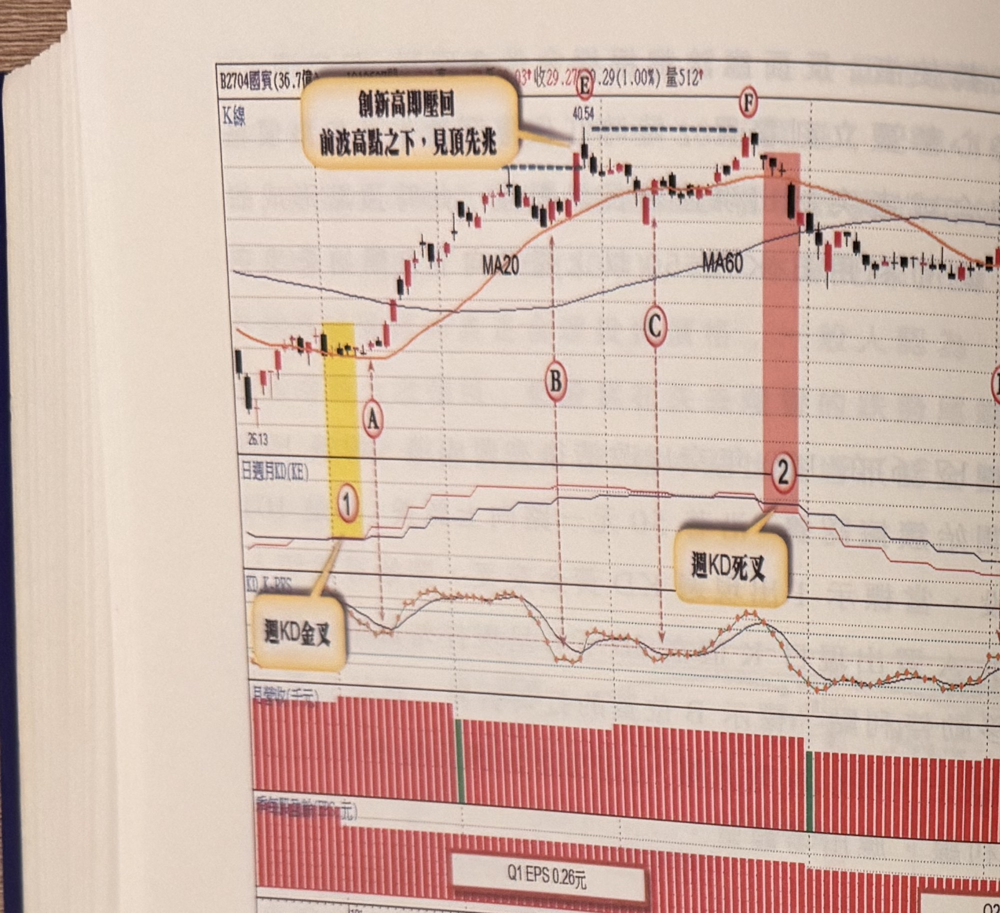

## p.106

**圖 2-26**（本圖由詮茂資訊股靈神選提供）

> 圖說：國賓(B2704國賓(36.7億))日線圖，收 29.27、0.29(1.00%)，量 512，含 K 線、MA20、
> MA60 與「日週月KD(KE)」、月營收（千元）、季每股盈餘(EPS:元) 副圖，文字框「創新高即壓回
> 前波高點之下，見頂先兆」「週KD金叉」「週KD死叉」。低點 26.13，標示①（黃色網底）「週KD
> 金叉」，標示Ⓐ，標示Ⓑ，高點 40.54，標示Ⓔ「創新高即壓回」，標示Ⓒ，標示②（粉紅網底）「週KD
> 死叉」，標示Ⓕ；季每股盈餘副圖標示「Q1 EPS 0.26元」「Q2 EPS 0.24元」。

開放陸客來台觀光，的確為飯店股注入一劑強心針，本益比紛紛被調高，但是否就能雨露均霑倒是
未必，題材夠嗆，獲利卻無法圖 2-26 國賓(2704)老牌飯店股，受到陸客來台觀光，股價因而時被貼上
概念股，受到青睞，但年度 EPS 始終浮沉在 1 元左右，沒有任何當紅炸子雞的爆發力；101 年初週 KD
出現黃金交叉，開一波上揚行情，可以在標示 A~C 位置出現日 K 值在 50 以下打勾買進，當標示 E 點
創新高卻立刻折回前波高點，見頂的先兆，標示 F 點高點止於前波 E 點下方即拉回，隱然有 M 頭
形成的疑慮，任何炒作題材最後目標就是將籌碼倒給散戶套牢在群峰之

## p.107

第二章　週 KD 運用在日線圖的買賣點解析

間，40 元的股價對上首季稅前 EPS 只有 0.26 元，100 年 EPS 稅後只有 1.2 元，這些數據在在顯示本益
比 30 倍絕對是風險，當標示 2 位置週 KD 呈現死亡交叉，更加強行情反轉的可能性，此時多方操作應
覺醒退場，當 F 點出現平行壓力破一低時，做多者要停利出場觀望；隨後行情跌破季線，橫走在 M 頭
頸線測試壓力，均線死叉讓它欲在頸線下做支撐的機會變得更渺茫，標示 D 位置日 K 值在 50 上方
彎頭向下，形成放空訊號。

總結來說，運用週 KD 的交叉，提供操作者操作的方向，即能在均線交叉之前做提早的判斷及切入，
再運用突破或跌破前一根 K 線高低點形成空訊，或利用 RSI 策略尋買賣點，及以日 K 值在 50 上下轉折
形成的訊號，做為切入點選擇，其中底部結構中，當週 KD 出現背離向上的情況，可據此買到底部
啟動的好時機，而頭部反轉過程，週 KD 死亡交叉後，價格卻創新高，週 K 卻小於週 D 值，也是一種
背離向下的情況，提供最高峰點放空的可靠機會。

至於在操作後，價格是否如願大漲或大跌，則要從基本面來著手考察，營收及盈餘的變化及本益比的
考量，以及法人的籌碼增減，要進一步分析，方能找出有利操作的標的股。目前市場有些軟體具有
篩選條件的功能，搜尋出來的個股，表示具有相同線形邏輯，代表著相同的生辰八字，但命運走勢
不會一致發展成強勢股或弱勢股，還是得從基本面背景因素去進一步篩出值得鎖定的標的股。

以下附圖請讀者自行參閱練習。

[本頁下方另有一行文字因跨頁裝訂處與淡淡背面透印重疊，模糊不可辨，略過不轉錄；本頁為第二章
正文最末頁，其後為練習附圖]
