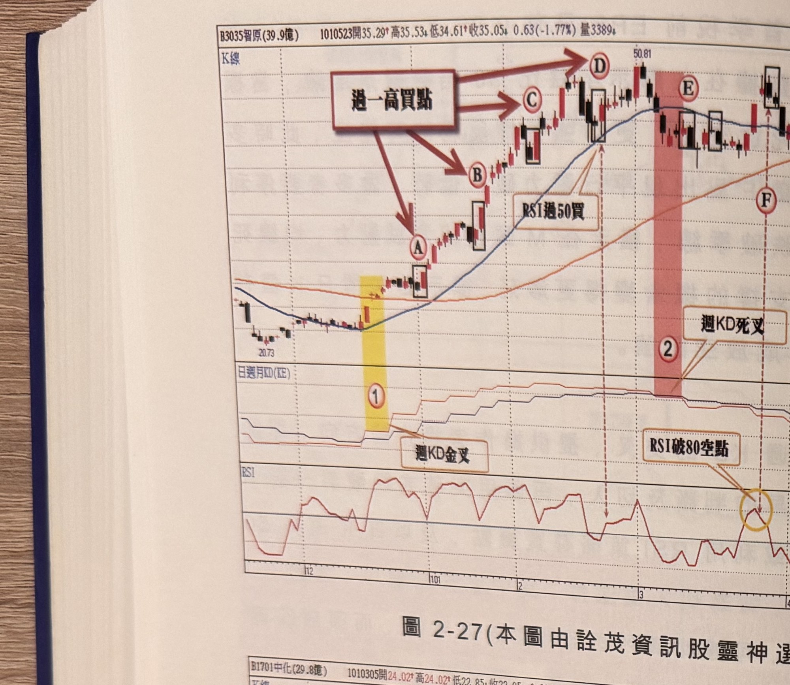
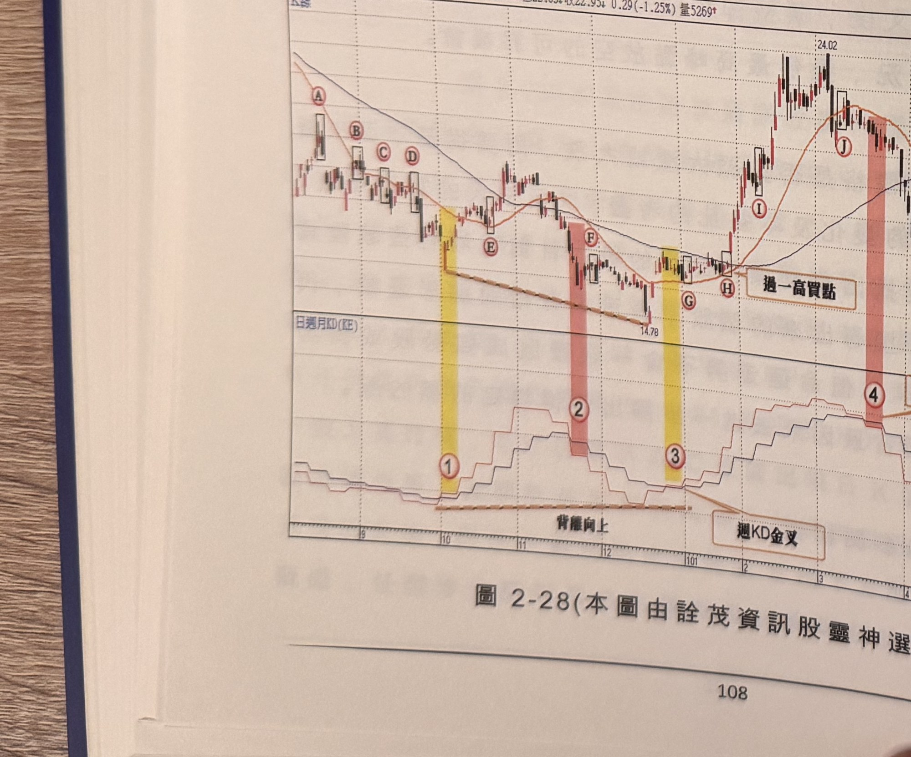
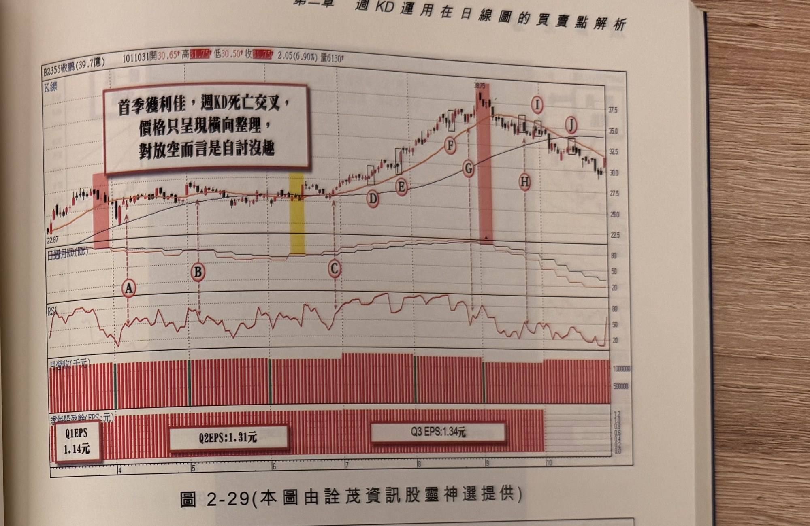
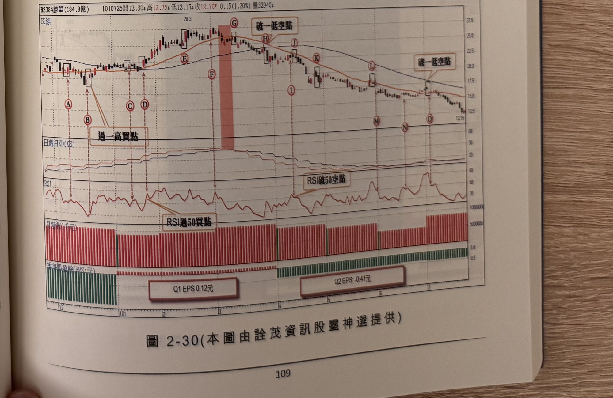

## p.108

（第二章末尾練習附圖，僅圖與圖說，讀者自行參閱練習，無獨立段落正文）

**圖 2-27**（本圖由詮茂資訊股靈神選提供）

> 圖說：智原(B3035智原(39.9億))日線圖，時間戳 1010523，開 35.29、高 35.53、低 34.61、收
> 35.05，0.63(-1.77%)，量 3389，含 K 線與「日週月KD(KE),RSI」副圖，文字框「過一高買點」
> （四箭頭分別指向 B、C、D）「RSI過50買」「週KD死叉」「RSI破80空點」「RSI破50空點」。低點
> 20.73，標示①（黃色網底）「週KD金叉」，標示Ⓐ Ⓑ Ⓒ Ⓓ「過一高買點」，高點 50.81，標示②
> （粉紅網底）「週KD死叉」，標示Ⓔ Ⓕ Ⓖ Ⓗ Ⓘ Ⓙ，RSI 副圖圈選「RSI破80空點」及「RSI破50空點」。

**圖 2-28**（本圖由詮茂資訊股靈神選提供）

> 圖說：中化(B1701中化(29.8億))日線圖，時間戳 1010305，開 24.02、高 24.02、低 22.85、收
> 22.95，0.29(-1.25%)，量 5269，含 K 線與「日週月KD(KE)」副圖，文字框「背離向上」「週KD金叉」
> 「過一高買點」「週KD死叉」。標示Ⓐ Ⓑ Ⓒ Ⓓ Ⓔ 依序下降，低點 14.78，標示①②③（黃色／粉紅
> 網底交替）「背離向上」，標示Ⓕ Ⓖ Ⓗ「過一高買點」，標示④（粉紅網底）「週KD死叉」，末端
> Ⓘ Ⓙ Ⓚ Ⓛ Ⓜ Ⓝ，高點 24.02。

## p.109

第二章　週 KD 運用在日線圖的買賣點解析

**圖 2-29**（本圖由詮茂資訊股靈神選提供）

> 圖說：敬鵬(B2355敬鵬(39.7億))日線圖，時間戳 1011031，開 30.65、高 31.75、低 30.50、收
> 31.75，2.05(6.90%)，量 6130，含 K 線與「日週月KD(KE)」、RSI、月營收（千元）、季每股盈餘
> (EPS:元) 副圖，文字框「首季獲利佳，週KD死亡交叉，價格只呈現橫向整理，對放空而言是自討沒
> 趣」。低點 22.87，標示Ⓐ Ⓑ Ⓒ，標示①（粉紅網底），標示②（黃色網底），標示③（粉紅網底），
> 標示Ⓓ Ⓔ Ⓕ Ⓖ Ⓗ Ⓘ Ⓙ，高點 38.75；季每股盈餘副圖標示「Q1 EPS 1.14元」「Q2 EPS 1.31元」
> 「Q3 EPS 1.34元」。

**圖 2-30**（本圖由詮茂資訊股靈神選提供）

> 圖說：橙蟬(B2384橙蟬(184.8億))日線圖，時間戳 1010725，開 12.30、高 12.75、低 12.15、收
> 12.70，0.15(1.20%)，量 32940，含 K 線與「日週月KD(KE)」、RSI 副圖，文字框「過一高買點」
> （兩處）「破一低空點」（兩處）「RSI過50買點」「RSI破50空點」。標示Ⓐ Ⓑ Ⓒ Ⓓ「過一高買點」，
> 標示Ⓔ，高點 28.3，標示Ⓕ Ⓖ「破一低空點」，標示Ⓗ Ⓘ Ⓙ Ⓚ Ⓛ Ⓜ Ⓝ Ⓞ「破一低空點」，末端
> 低點 12.15。
