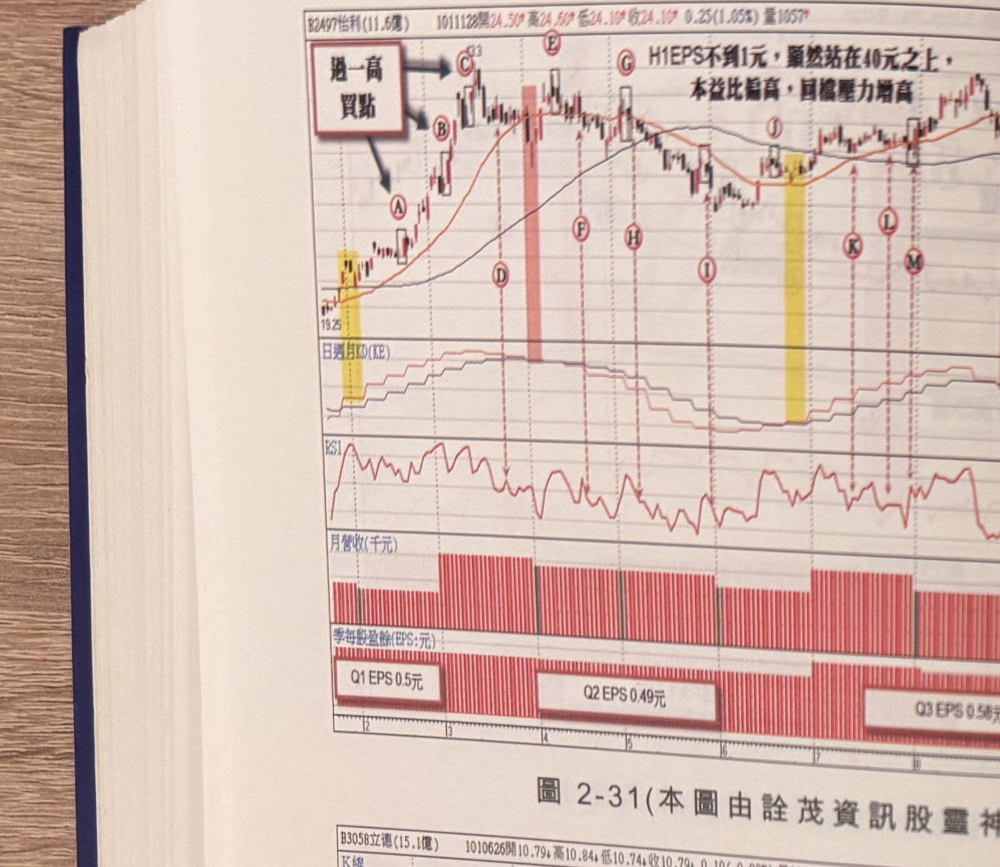
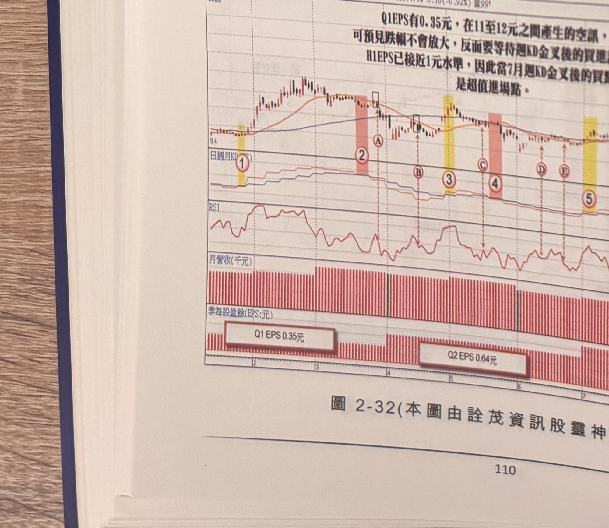
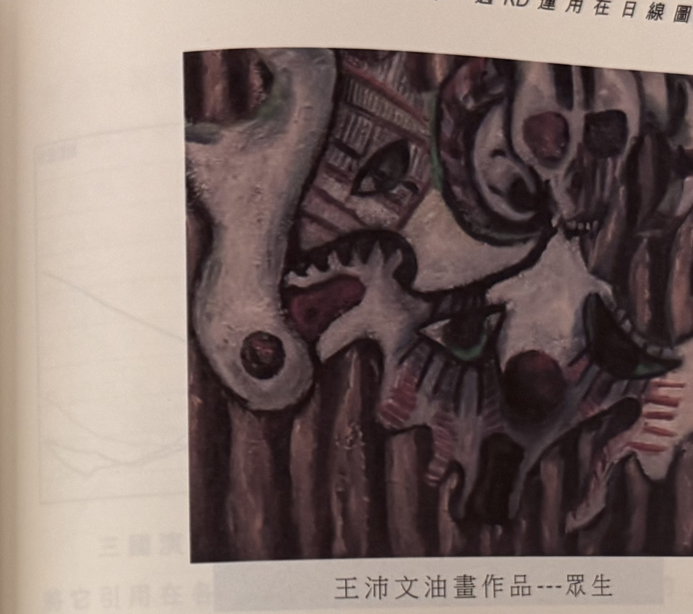

## p.110

（第二章末尾練習附圖，僅圖與圖說，讀者自行參閱練習，無獨立段落正文）

**圖 2-31**（本圖由詮茂資訊股靈神選提供）

> 圖說：怡利(B2497怡利(11.6億))日線圖，時間戳 1011128，開 24.50、高 24.50、低 24.10、收
> 24.10，0.25(1.05%)，量 1057，含 K 線與「日週月KD(KE)」、RSI、月營收（千元）、季每股盈餘
> (EPS:元) 副圖，文字框「過一高買點」（三箭頭指向 A、B、C）「H1EPS不到1元，顯然站在40元
> 之上，本益比偏高，目標壓力增高」。低點 19.25，標示Ⓐ Ⓑ Ⓒ Ⓓ Ⓔ Ⓕ Ⓖ Ⓗ Ⓘ Ⓙ Ⓚ Ⓛ Ⓜ，高點
> 50.81；季每股盈餘副圖標示「Q1 EPS 0.5元」「Q2 EPS 0.49元」「Q3 EPS 0.58元」。

**圖 2-32**（本圖由詮茂資訊股靈神選提供）

> 圖說：立德(B3058立德(15.1億))日線圖，時間戳 1010626，開 10.79、高 10.84、低 10.74、收
> 10.79，0.10(-0.92%)，量 99，含 K 線與「日週月KD(KE)」、RSI、月營收（千元）、季每股盈餘
> (EPS:元) 副圖，文字框「Q1EPS有0.35元，在11至12元之間產生的空訊，可預見跌幅不會放大，
> 反而要等待週KD金叉後的買進訊號，H1EPS已接近1元水準，因此當7月週KD金叉後的買進，是超值
> 進場點」。標示①（黃色網底），標示②（粉紅網底），標示Ⓐ，標示③④（黃色／粉紅網底），
> 標示Ⓑ Ⓒ Ⓓ Ⓔ Ⓕ Ⓖ，標示⑤（黃色網底）；季每股盈餘副圖標示「Q1 EPS 0.35元」「Q2 EPS
> 0.64元」「Q3 EPS 0.9元」。

## p.111

第二章　週 KD 運用在日線圖的買賣點解析

**王沛文油畫作品---眾生**（無圖號，書中插頁彩色油畫複製圖，非 K 線圖或示意圖，依原樣裁切
保留為 jpg）

> 圖說：抽象／立體派風格油畫，畫面以骷髏、骨骼、鎖鏈等元素交錯堆疊構成，色調以灰白、暗紅、
> 深褐為主，背景為直條紋理，呈現眾多面容／頭骨交疊、糾結的意象，標題「眾生」。

**王沛文油畫作品---自畫像**（無圖號，書中插頁彩色油畫複製圖，非 K 線圖或示意圖，依原樣裁切
保留為 jpg）

> 圖說：寫實風格自畫像，畫中人物短髮、深色衣領，面容朝右前方，背景為暗紅褐色，標題「自畫像」。

[本頁下方另有淡淡背面透印文字殘影，非本頁正面內容，不轉錄]
