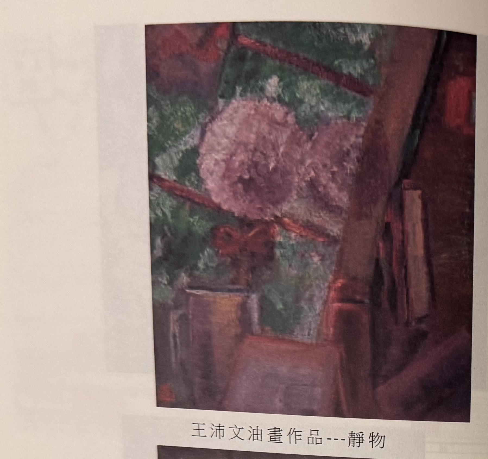
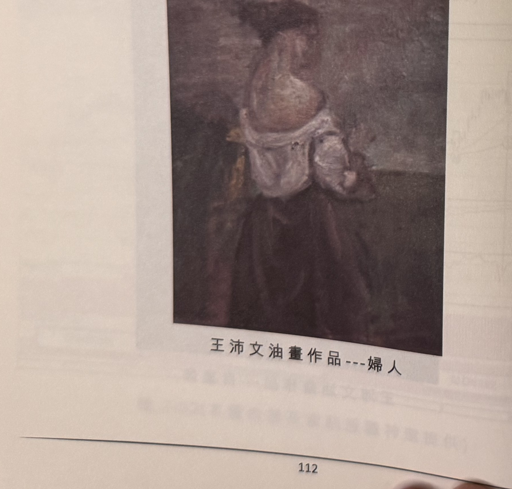
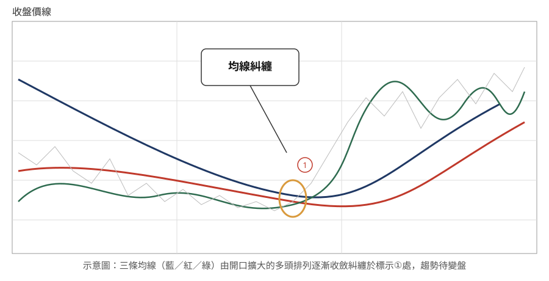

## p.112

**王沛文油畫作品---靜物**（無圖號，書中插頁彩色油畫複製圖，非 K 線圖或示意圖，依原樣裁切
保留為 jpg）

> 圖說：靜物油畫，畫面呈現一叢盛開的粉紫色花朵插於容器中，背景為綠色枝葉與紅褐色斜置木條
> 交錯，前景為桌面上的陶罐／木箱，色調濃郁，標題「靜物」。

**王沛文油畫作品---婦人**（無圖號，書中插頁彩色油畫複製圖，非 K 線圖或示意圖，依原樣裁切
保留為 jpg）

> 圖說：寫實風格人物畫，畫中婦人側身、頭戴深色頭飾，身著淺色圍裙與深色裙裝，背景為灰褐色
> 素面牆，標題「婦人」。

[本頁上方另有淡淡背面透印文字殘影，非本頁正面內容，不轉錄]

## p.113

第三章　均線糾纏—變盤

**均線糾纏示意圖**（無圖號，原始照片見 `股勝先選-p113-diagram.orig.jpg`）

> 圖說：概念示意圖，非真實個股 K 線截圖。畫面為「收盤價線」座標軸上三條不同天期均線（藍、
> 紅、綠）疊加走勢：均線原本呈現開口擴大的排列（多頭排列），隨行情橫向整理，三條均線逐漸
> 向彼此靠攏收斂，在圖中央標示①處以橙色圓圈圈出「均線糾纏」發生的位置（並有文字框指向），
> 其後三條均線再度開口擴大向上發散，象徵糾纏後多頭排列重新展開。

三國演義開場第一句話：「天下大勢，分久必合，合久必分」，將它引用在各天期均線排列的現象，
可謂一擊中的，各天期均線的運行在漲勢推展揭幕，均線開口逐漸擴大，當價格推升至某一極限值，
開始後繼無力，買氣紛亂無法集結，攻勢停頓，均線運動速率隨之變緩，長短均線距離逐漸收斂，如果
價格持續橫向不攻，均線將收斂糾纏，趨勢的轉折將進入關鍵時刻。

價格維持在某一區間到底游走是扮豬吃老虎，誘殺空方呢？還是買氣早已退潮，只剩紙老虎，不堪空軍
掃射呢？均線糾纏代表行情走向即將對往上往下做出明確的抉擇，往上續攻則會均線排列再次歸隊往上
開口擴張，若往下跌破，均線轉為空頭排列，往下開口擴張，各均線的助跌效果開始追擊價格下檔支撐。

均線糾纏的內涵表現出買賣力道相上下，造成價格陷入區間震盪，短線帽客對於區間震盪愈愈窄感到
不耐，操作不順，紛紛退場，造成成交量逐步萎縮，多空達到恐怖平衡狀態，區間的高低界限宛如天堂
地獄窗口，哪一邊窗口被打破，就會形成破窗效應，
