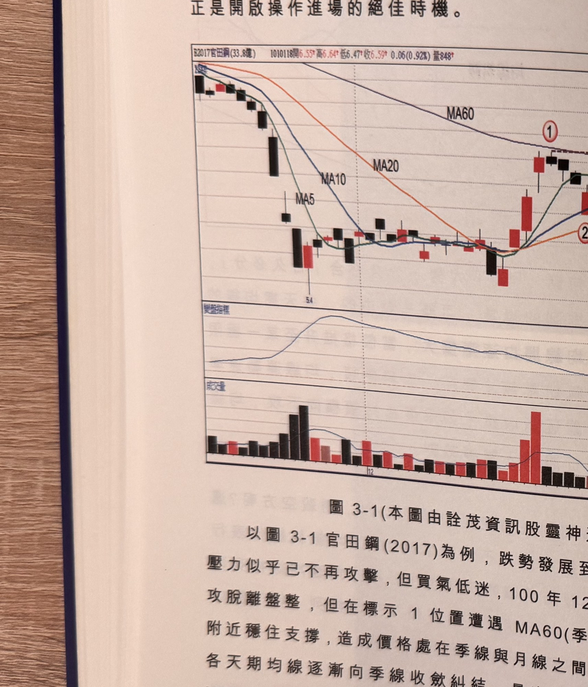

## p.114

買賣力道將蜂湧跟進，趨勢運動又重新展開，均線也由糾纏狀態轉為分開發散，大行情的推動常常
由此發生，觀察均線糾纏後的走向，正是開啟操作進場的絕佳時機。

**圖 3-1**（本圖由詮茂資訊股靈神選提供）

> 圖說：官田鋼(B2017官田鋼(33.8億))日線圖，時間戳 1010118，開 6.55、高 6.64、低 6.47、收
> 6.59，0.06(0.92%)，量 848，含 K 線、MA5、MA10、MA20、MA60 與「變盤指標」、成交量副圖。
> 低點 5.4 起，MA5/MA10/MA20 三條短中期均線於標示①處收斂糾纏（MA60 季線仍在上方下彎），
> 標示①上方有紅色雙箭頭指向「上界」水平虛線，下方指向「下界」水平虛線，文字框「均線收斂
> 小於2%」指向「變盤指標」副圖對應糾纏區間的低點（低於 2% 水平線），隨後標示②價格向上突破，
> 均線重新發散上揚；成交量副圖顯示糾纏期間量縮，突破後放量。

以圖 3-1 官田鋼(2017)為例，跌勢發展到底部建構階段，空方壓力似乎已不再攻擊，但買氣低迷，
100 年 12 月底多方發動一波急攻脫離盤整，但在標示 1 位置遭遇 MA60(季線)壓力附近穩住支撐，
造成價格處在季線與月線之間震盪近 18 個交易日，各天期均線逐漸向季線收斂糾結，MA10，兩者
距離不到 2%，最高均線為 MA60，最低均線攪殺的長黑 K 線將使得多方集結為之挫敗，反之，出現
一根向上突破標示 1 區間上界，多頭將享受撒網捕魚的樂趣，告別跌勢的打壓。

## p.115

第三章　均線糾纏——變盤

這裡我們採取四條均線的收斂情況，為什麼不增加半年線(MA120)或者年線(MA240)，甚至把季線
(MA60)剔除，只留三條均線比較呢？通常在判斷行情多空方向，季線的上揚或下跌是最重要的指標，
不宜將之剔除，而加入半年線或年線則過於嚴苛，因此取樣的均線分別為 MA5(代表一週)、MA10(半月
線)、MA20(月線)及 MA60(季線)，這是一般投資人習慣常用，不須採取奇怪天期，重點在於觀察均線
糾纏的程度，必須有量化的數據，才不致於因為 K 線圖畫面的放大或縮小，造成視覺上的誤判，各天期
均線收斂的量化，稱之為均線離差：

**((最高均線值-最低均線值)/最高均線值)×100**

最高均線值減去最低均線值的差距，再除以最高均線值，再乘以 100，得出均線離差值的百分比，同時
界定均線離差值在 2% 以下，代表均線進入糾纏的臨界區域，行情將準備變盤，所以均線離差值也稱作
變盤指標，變盤的意義在於多空力道進入攤牌階段，若要向上突破形成漲勢，必須 K 線收盤突破最近的
波峰頂點，若要向下跌破形成跌勢，則 K 線收盤先跌破最近的波谷低點。

均線離差值，是方便檢定均線糾纏的程度，如果用目視觀察要如何界定呢？用最簡單的判斷方式，
股價在 10~20 元，高低均線差距在 0.2 元~0.4 元之間，股價在 20~30 元之間，均線差距在 0.4 元
~0.6 元，依此類推，就能快速看出均線差距是否收斂至 2% 以下，例如 50 元的股票，其高低均線差距
在 1 元以內，代表均線糾纏一定小於 2%。
