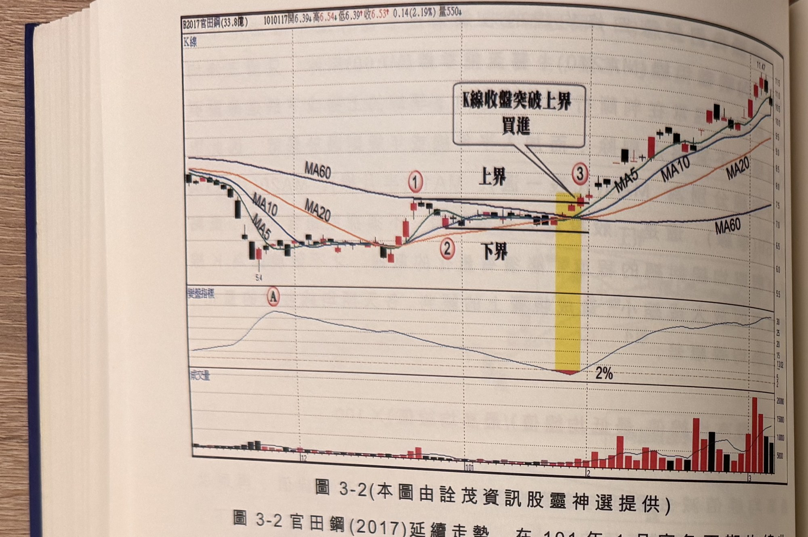

## p.116

**圖 3-2** (本圖由詮茂資訊股靈神選提供)

> 圖說（figure notes）：官田鋼(2017) K 線圖，左上角報價列標示「B2017官田鋼(33.8億) 1010117開6.39↓高6.54↓低6.39↑收6.53↑0.14(2.19%)量550↓」。K 線圖中疊加 MA5、MA10、MA20、MA60 均線，左側價格由高點下跌至低點（5.4），標示紅色圓圈數字「①」（均線收斂處）、「②」（下界位置）；均線於中段糾纏走平，標示水平線「上界」「下界」，於標示「③」處（黃色色塊標示）K 線收盤向上突破上界，文字方塊「K線收盤突破上界 買進」以箭頭指向該處；其後價格沿 MA5 持續上升，K 線右側收在 11.47 附近。下方「乖離指標」子圖，標示紅色圓圈「Ⓐ」於左側高峰，隨後逐步下滑至標示「③」對應處觸及水平線「2%」，其後回升。最下方為成交量柱狀圖，紅黑柱交錯，右側柱量明顯放大。

圖 3-2 官田鋼(2017)延續走勢，在 101 年 1 月底各天期均線收斂糾纏，高低均線離差小於 2%，原先從 100 年 11 月底標示 A 位置均線離差超過 20%，逐漸收縮，當離差值小於 2%，多空力道即將攤牌表態，標示 3 位置的 K 線收盤突破標示 1 上界所代表的區間波峰頂點，趨勢方向為之由跌反漲，進入回升行情，操作者可在標示 3 位置進場買進，並設好 7% 停損位置，以防行情再度變卦，如果行情不是突破上界，而是跌破下界(標示 2 位置)，則跌勢再起。當勢往上發展，價格一直沿著 MA5 上升，這表示它會呈現如同第一章出軌現象，變成強勢推升的個股，一個月時間即上漲超過 6 成，操作者也許會中途耐不住獲利而下車，但可以再利用過一高或 RSI 過 50 等切入方式，尋得再買進的時機。

## p.117

### 跌勢末端的翻轉架構

跌勢觸底後，均線開口離差由最大值，逐步收斂過程，也正是主力進行鴨子划水，暗裡吸納籌碼的時機，運用窄幅上下震盪，逼出耐性不足的浮額，等到各均線糾纏到 2% 以下，線形就形成一付萬佛朝宗，只要輕輕一推，佛光普照，價格從此渡過萬重山；價格翻多的第一徵兆是穿越 MA60 季線，而過季線生死門將呈現二種形式，一種是做關前整理，另一種是做關後蹲跳。

關前整理的形式，價格會卡在季線下方游走，對空方在季線的防衛做試水溫的動作，等待季線由下跌轉為平緩，也帶動較短天期均線逐步靠攏季線，由此形成均線糾纏，再臨門一腳踢過區間高點，突破季線，將趨勢扭轉為多頭走勢。

第二種關後蹲跳形式，是季線仍向下運行，扣抵價格仍高於目前行情甚多，換言之，先前必有一段快速下挫行情曾經發生，時間點可能落在 30 天前，底部建構過程沒有採取橫向擴延，可能只是 W 底或 V 型加短期平台整理，隨後攻過季線，但因為從底部最低點攻到過季線，漲幅有些甚至超過 30%，過季線正好引來獲利下車的賣壓出籠，因此穿越季線後不久即進行拉回整理，整理過程價格有時重新跌落季線之下，但沒有引發空方打壓，價格呈現浮沉在季線上下之間，當季線扣抵價格已經降到底部價格區，季線開始走平，而短天期均線 MA5 及 MA10 則由季線上方重新回跌接近季線，同樣形成均線糾纏現象，價格 K 線在整理結束後，向上再突破早先穿越季線的波峰頂點，轉為一波較強的主升上漲行情。
