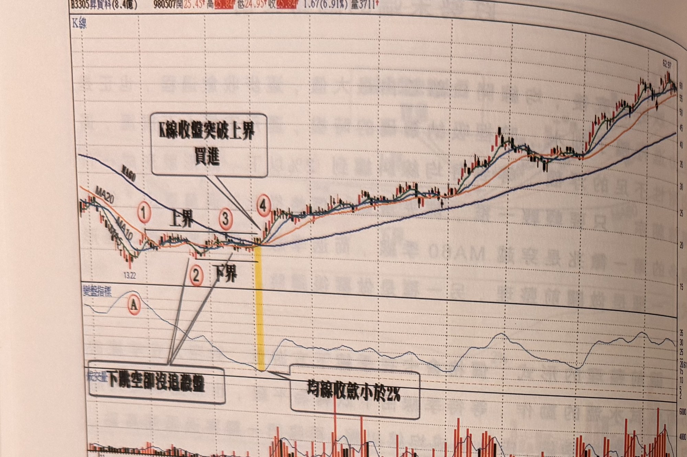
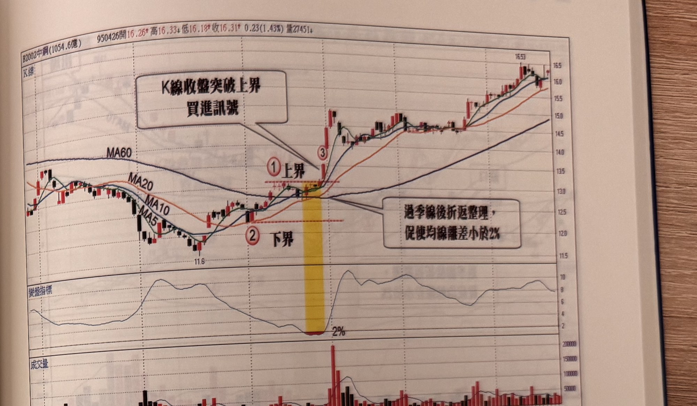

## p.118

**圖 3-3** (本圖由詮茂資訊股靈神選提供)

> 圖說（figure notes）：昇貿(3305) K 線圖，左上角報價列標示「B3305昇貿(8.4億) 980507開25.45↑高25.84↑低24.95↑收25.84↑1.67(6.91%)量3711↑」。K 線圖中疊加 MA5、MA10、MA20、MA60，價格自左側高點下跌至低點（13.22），標示紅色圓圈數字「①」（上界起點）「②」（下界，文字方塊「下跌空卻沒追殺盤」以箭頭指向①②連線處）；中段窄幅盤整，標示「③」，於標示「④」處（黃色色塊標示）K 線收盤向上突破，文字方塊「K線收盤突破上界 買進」以箭頭指向④；下方文字方塊「均線收斂小於2%」指向黃色色塊底部。K 線右側持續上漲，收在 62.97 附近。下方「變盤指標」子圖，標示紅色圓圈「Ⓐ」於左側高峰後下滑至標示④對應處觸底，其後回升震盪。最下方為成交量柱狀圖，右側柱量放大。

圖 3-3 為昇貿(3305)在 2008 金融危機中，價格被打到 13 元(還原權)附近，標示 A 位置代表最高均線 MA60 及最低均線 MA5 之間的均線離差值達到 40%，顯示行情處在急跌中，而當均線開口到達一定水準，空方獲利回補，造成價格快速拉至 MA20，如標示 1 位置，開始長達 2 個月的橫向盤整，期間兩度發生向下跳空卻沒引來追殺盤，顯示空方力道無意在此戀戰，此時季線的扣抵價格高出目前價位甚高，跌角仍陡，但經過二個月盤整，扣抵價格已降至最低谷點附近，到了 98 年 2 月初均線收斂至離差值在 2% 以下，已經到了多空攤牌時刻，在標示 4 位置出現 K 線收盤突破標示 1 代表的區間最高點，由於在季線下方的關前整理夠久，因此，買進訊號出現後行情即竄出數根長紅 K 線，將均線排列轉為多頭排列，大漲行情自此揭開序幕。

## p.119

**圖 3-4** (本圖由詮茂資訊股靈神選提供)

> 圖說（figure notes）：中鋼(2002) K 線圖，左上角報價列標示「B2002中鋼(1054.6億) 950426開16.26↑高16.33↓低16.18↑收16.31↑0.23(1.43%)量27451↓」。K 線圖疊加 MA5、MA10、MA20、MA60，價格下跌至低點（11.6）後回升，標示紅色圓圈數字「①上界」「②下界」（黃色色塊區間），標示「③」處一根長紅 K 線向上突破，文字方塊「K線收盤突破上界 買進訊號」以箭頭指向③；另一文字方塊「過季線後折返整理，促使均線離差小於2%」以箭頭指向①②之間的糾纏區。K 線右側持續上漲，收在 16.53 附近。下方「變盤指標」子圖於黃色色塊區間觸及低點「2%」後回升震盪走高。最下方為成交量柱狀圖，於標示③附近出現最大量紅柱。

圖 3-4 中鋼(2002)表現另一種跌勢翻轉結構，先穿越季線再做平台整理，促使短天期均突破季線後再向季線折回靠攏，達到均線收斂至離差小於 2% 的期間有四天，隨即在標示 3 位置一根長紅 K 線收盤，突破標示 1 所代表的上界關卡，造成買氣湧入大漲。

當我們在搜尋這類個股時，凡是均線離差小於 2%，逐日加以追蹤，並且開始了解基本面的優劣，將具有營收及盈餘成長者，集中聚焦以便突破時刻來臨時，從容買進。而發生均線離差小於 2% 的位置，可區分為在 1、季線之下的跌勢末端，2、漲勢的中段整理的位置，3、具有反轉型態建構中的頭部區域，4、跌勢進行的中級階段，反彈。雖然均線收斂小於 2% 代表變盤，向上向下發展皆有可能，但出現的位置在哪一階段，有利於我們預判因應策略如何佈局。
