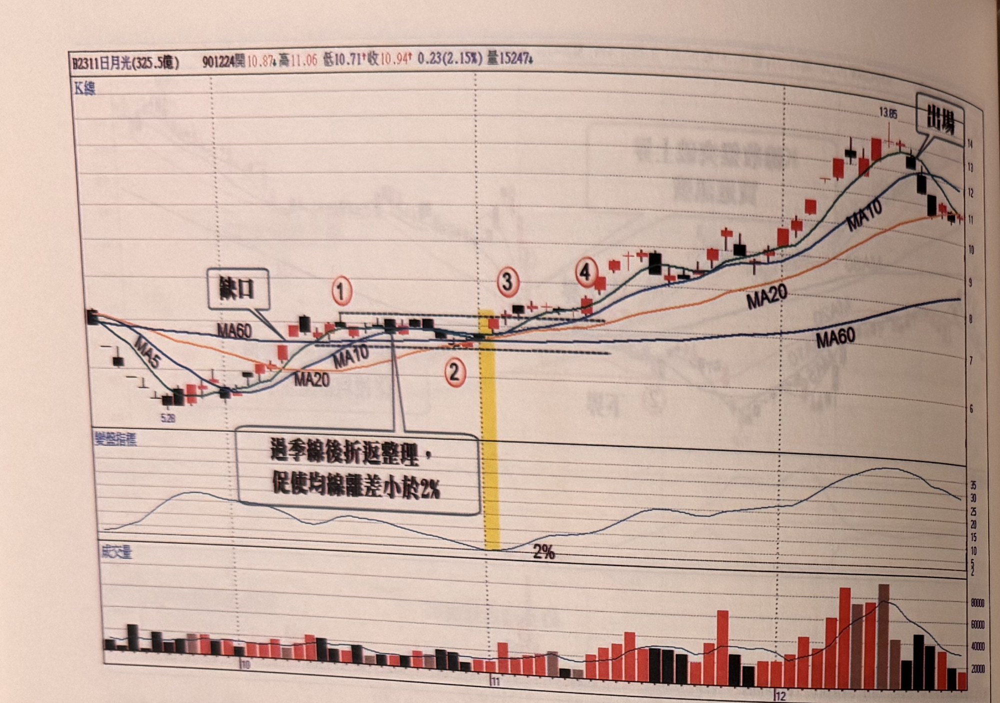
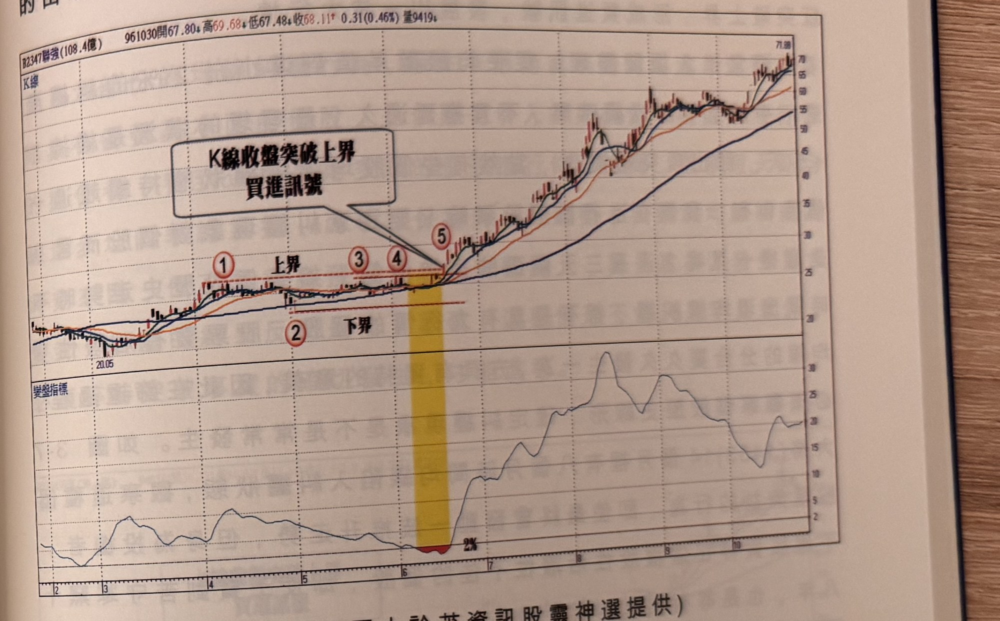

## p.120

過季線折返整理，再尋求進一步突破新高的結構，也是一種 N 型結構的運用，而突破動作應該具備一呼百應的姿態，以長紅 K 線於突破前高的姿態最能引來共襄盛舉的買盤跟隨，如果突破 K 線是屬於小星線或黑 K 線或者上影線過長，都是疵瑕訊號，必須等待中紅或長紅 K 線來補強訊號品質，如圖 3-5 日月光(2311)在 90 年 9 月連續重挫，築底期只待 7 個交易日，即向上快攻穿越季線，隨後小於 2%，進入糾纏狀態，標示 1 為上界壓撐，也是先前在攻季線中途曾出現跳空缺口，正好也是平台整理的下限，當標示 3 出現突破新高，但突破 K 線是漲幅小的星線，訊號品質有疵瑕，最好等待到標示 4 出現中長紅 K 線來補強買訊，而停損位置設為 7%，其後行情持續上漲，當出現連續快速上漲，一直以紅 K 線推升，且一直保持在 MA5 上方，可以根據第一章所提到

**圖 3-5** (本圖由詮茂資訊股靈神選提供)

> 圖說（figure notes）：日月光(2311) K 線圖，左上角報價列標示「B2311日月光(325.5億) 901224開10.87↓高11.06 低10.71↑收10.94↑0.23(2.15%)量15247↓」。K 線圖疊加 MA5、MA10、MA20、MA60，價格自左側低點（5.28）回升，文字方塊「缺口」標示一處跳空。標示紅色圓圈數字「①上界」「②下界」（虛線標示區間），「③」處小幅突破新高（星形小紅K），「④」處出現中長紅 K 線再次突破。K 線右側持續上漲至高點（13.85），文字方塊「出場」標示於高點回落處。下方「變盤指標」子圖，文字方塊「過季線後折返整理，促使均線離差小於2%」以箭頭指向①②間糾纏區，指標於黃色色塊區間觸及「2%」後回升震盪走高。最下方為成交量柱狀圖，右側柱量放大。

## p.121

的出場機制，以連續紅遇首黑出場，或以跌破 MA5 出場均可。

**圖 3-6** (本圖由詮茂資訊股靈神選提供)

> 圖說（figure notes）：聯強(2347) K 線圖，左上角報價列標示「B2347聯強(108.4億) 961030開67.80↓高69.68↑低67.48↓收68.11↑0.31(0.46%)量9419↓」。K 線圖疊加 MA5、MA10、MA20、MA60，價格自左側低點（20.05）緩步上升，標示紅色圓圈數字「①上界」「②下界」（虛線標示區間），「③」「④」處再度貼近上界，於標示「⑤」處（黃色色塊標示）K 線收盤向上突破，文字方塊「K線收盤突破上界 買進訊號」以箭頭指向⑤。K 線右側持續上漲，收在 71 附近。下方「變盤指標」子圖於黃色色塊區間觸及低點「2%」後回升，其後呈波段起伏走高。

當均線糾纏小於 2% 出現時，開始界定區間上下界的位置，以便觀察突破或跌破的買賣時機點，上界取最近的峰點，大致以一個月內的高點位置做為上界較為合適，如果價格陷入區間盤整時間拉長到兩個月以上，只取 20 天(約一個月)區間的高點即可，如果二個月的高點與一個月高點差距不大，則取兩個月高點；取下界的方式也是採取近期 1 個月的低點，而區間擺盪幅度宜在 10% 的範圍內，如果擺盪過大，成交量必然起伏，反而容易在突破新高後，離差值小於 2% 持續 10 天，聯強在 96 年 6 月中旬均線呈現糾纏，由於標示 3 及 4 同價位代表近一個月的區間高點，但與標示 1 代表的兩個月高點，差距甚小，因此取標示 1 為上界濾網，而下界也同樣發生一個月低點與兩個月低點
