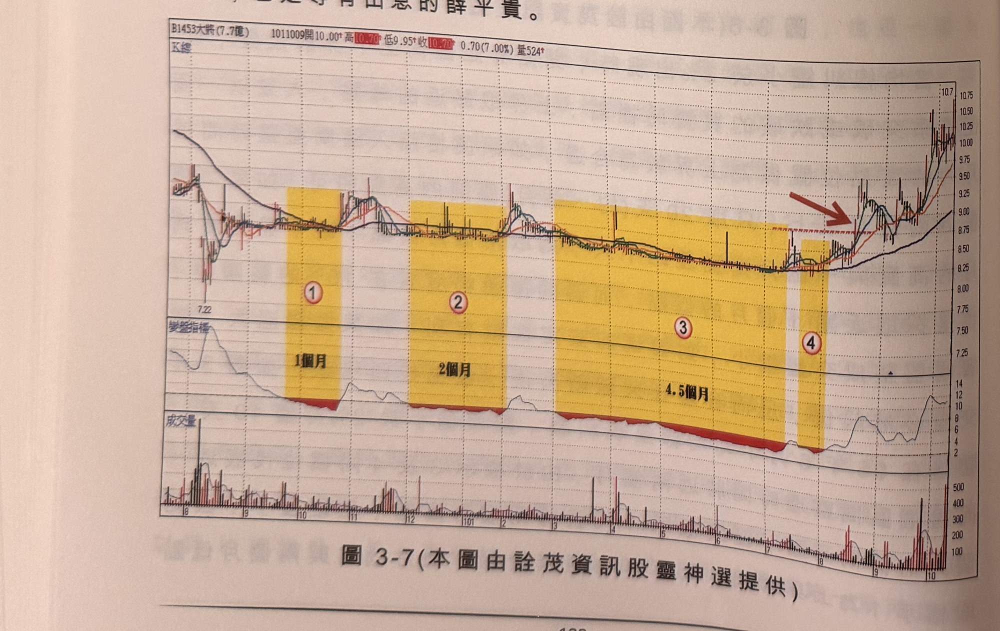
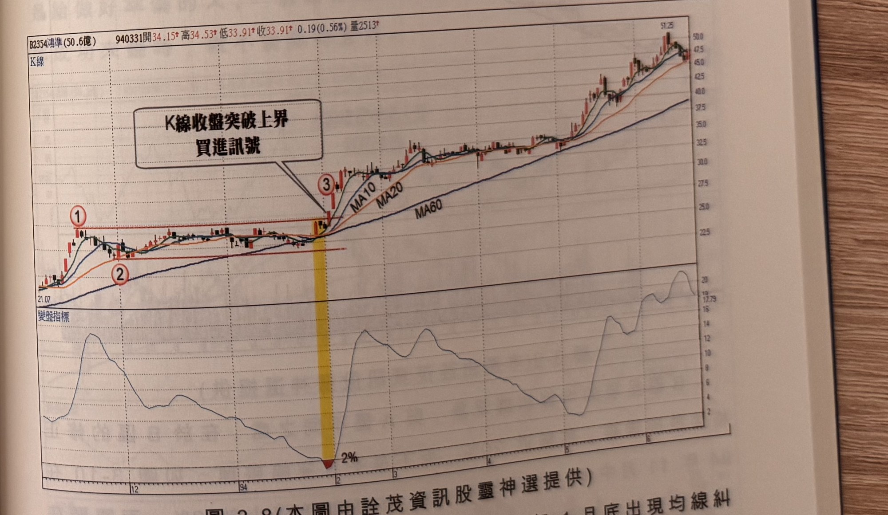

## p.122

差距無幾，取標示 2 位置為下界濾網，其後，在標示 5 位置以中長紅突破上界，形成買進訊號，發展出一波大行情。

通常進入區間整理，促使均線離差值到達小於 2% 的糾纏產生，小於 2% 的延續時間，不宜拖延過久，最理想的狀況是維持 1～5 天，即出現突破動作，當然有些個股均線糾纏狀態持續超過一個月也有；我們在進行篩選股票時，要注意糾纏現象對個股而言，是難得一見呢？還是三天兩頭的家常便飯！如果個股歷史走勢時不時就出現均線糾纏，都不是具有大行情的個股，股票要有活潑性，均線的分合要久久發生一次，方具有獨特的意義，因此在篩選過程，必須觀察個股歷史線形，確定糾纏現象是不是常常發生。如圖 3-7 大將(1453)14 個月裡有八個月時間均線陷入糾纏狀態，觀察這種個股是無益的行為，即使最終曾發動一波推升走勢，但身為投機者，不應該費神在這種股性活潑性不佳的個股，即使王寶釧苦守寒窯十八年，也是等有出息的薛平貴。

**圖 3-7** (本圖由詮茂資訊股靈神選提供)

> 圖說（figure notes）：大將(1453) K 線圖，左上角報價列標示「B1453大將(7.7億) 1011009開10.00↑高10.70↑低9.95↑收10.70↑0.70(7.00%)量524↑」。K 線圖中價格自左側低點（7.22）盤整走平，以四個黃色色塊分別標示均線糾纏區段：標示「①1個月」「②2個月」「③4.5個月」「④」（較短區間），期間均線持續糾纏於窄幅區間；末端以紅色箭頭標示價格開始向上突破糾纏區並持續上漲。下方「變盤指標」子圖於各糾纏區段對應處持續貼近低檔，末端回升。最下方為成交量柱狀圖，末端量能放大。

## p.123

### 漲勢中途均線糾纏

大部份的均線糾纏行為，發生在漲勢或跌勢的中途，這對於長期具有優勢基本面的個股，是個難得切入的好機會，錯過起漲行情的操作者，看到這類長期多頭的個股進行修正格局，觀察短天期均線逐步地向季線靠攏，而季線保持向上的趨勢，要聚焦均線糾纏的時刻來臨，但不能衝動預設它必然突破向上，萬一基本面發生重大變卦，糾纏的結果反而是向下跌破，這種情形不會只是罕見意外，必須等待突破事實的確切發生，才能進場。

**圖 3-8** (本圖由詮茂資訊股靈神選提供)

> 圖說（figure notes）：鴻準(2354) K 線圖，左上角報價列標示「B2354鴻準(50.6億) 940331開34.15↑高34.53↑低33.91↑收33.91↑0.19(0.56%)量2513↑」。K 線圖疊加 MA10、MA20、MA60，價格自左側低點（21.07）上升，標示紅色圓圈數字「①」（高點，水平虛線延伸）「②」（回檔低點），中段沿虛線窄幅盤整，於標示「③」處（黃色色塊標示）K 線收盤向上突破，文字方塊「K線收盤突破上界 買進訊號」以箭頭指向③。K 線右側持續上漲，收在 51.25 附近。下方「變盤指標」子圖於黃色色塊區間觸及低點「2%」後回升，其後呈波段起伏走高。

圖 3-8 為鴻準(2354)除權還原走勢在 94 年 1 月底出現均線糾
