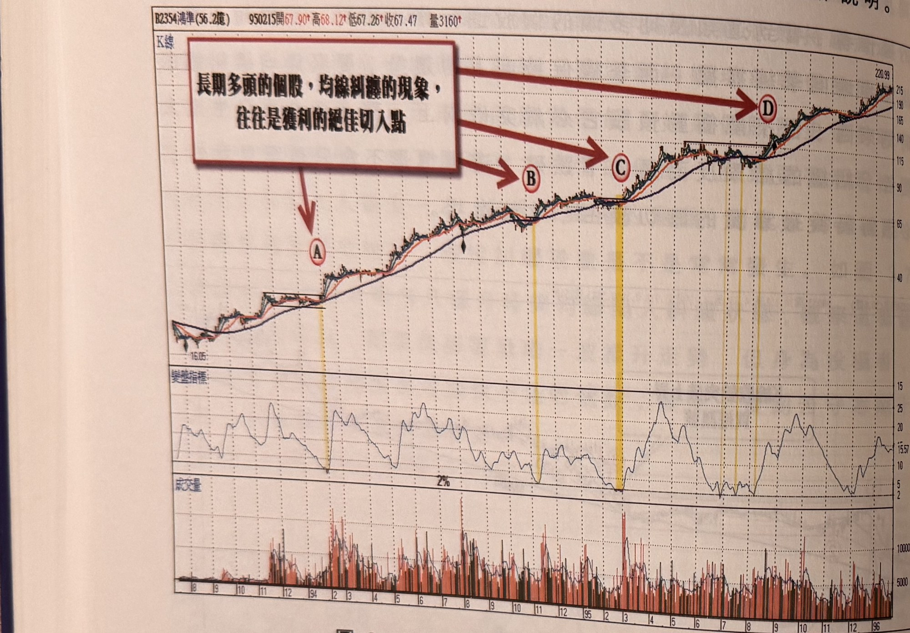
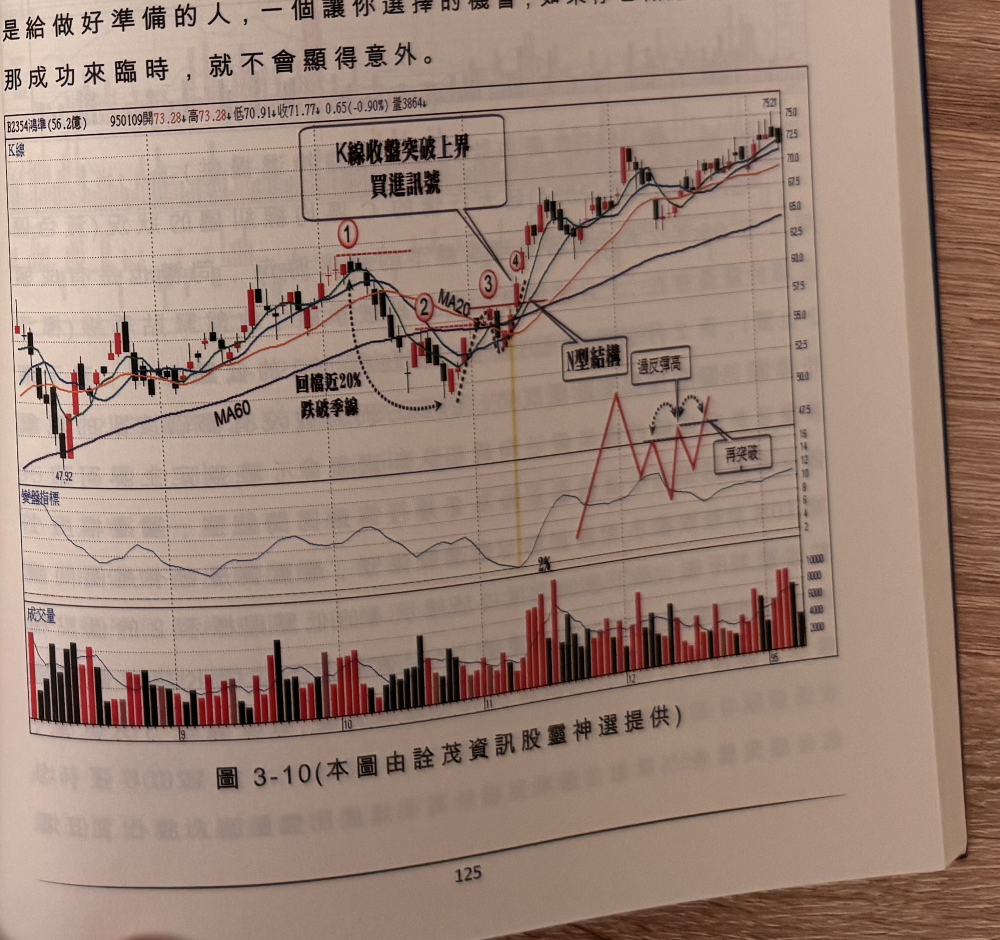

## p.124

底出現均線糾纏，並在數日後標示 3 位置 K 線收盤突破新高，展開主升行情；請看圖 3-9 鴻準 94 年到 96 年整個大推升行情，漲幅高達 1500%，圖 3-8 的糾纏現象，只是主升段中標示 A 區域的切入情形，圖 3-10 到圖 3-12 分別為標示 B 區到 D 區的切入操作說明。

**圖 3-9** (本圖由詮茂資訊股靈神選提供)

> 圖說（figure notes）：鴻準(2354) K 線圖，左上角報價列標示「B2354鴻準(56.2億) 950215開67.90↑高68.12↑低67.25↑收67.47 量3160↑」。K 線圖疊加均線，價格自左下角持續走高，紅色大箭頭與文字方塊「長期多頭的個股，均線糾纏的現象，往往是獲利的絕佳切入點」分別指向標示紅色圓圈「A」「B」「C」「D」四個糾纏區（各以黃色縱帶標示），每個糾纏區後價格皆持續向上推升。K 線右側收在 220.99 附近。下方「變盤指標」子圖於各標示對應處觸及低點「2%」附近。最下方為成交量柱狀圖。

## p.125

行情的判斷重點，在於行情有無穿越修正走勢的反彈高點(即標示 2 位置)，顯然在鴻準的例子裡，標示 3 的峰點高於標示 2，因此自標示 3 出現，發生折返 2 天，接著出現均線糾纏，且標示 4 位置的大漲 K 線收盤突破標示 3 的峰點，形成 N 型結構買點，不用等到突破標示 1 峰點。當然價格在漲勢修正過程，跌破季線雖免引來行情結束的質疑，如果標示 4 買訊出現後的推升高點，沒有突破標示 1 的峰點，則有頭部形成的可能性，而當下進場買進的行為，不能去懷疑後市無法創高的可能性，做好停損準備才是重點，未來的走勢難以預料，但風險的控制權永遠屬於操作者可控制的，常言道：成功是給做好準備的人，一個讓你選擇的機會，如果你也做好災難控管，那成功來臨時，就不會顯得意外。

**圖 3-10** (本圖由詮茂資訊股靈神選提供)

> 圖說（figure notes）：鴻準(2354) K 線圖，左上角報價列標示「B2354鴻準(56.2億) 950109開73.28↓高73.28↓低70.91↓收71.77↓0.65(-0.90%)量3864↓」。K 線圖疊加 MA20、MA60，價格自左側低點（47.92）上升至標示「①」高點，虛線圓弧標示「回檔近20% 跌破季線」向下修正至標示「②」，隨後於標示「③」「④」處再度突破，文字方塊「K線收盤突破上界 買進訊號」以箭頭指向④；文字方塊「N型結構」標示於③④之間的型態。右側另繪一組紅色鋸齒示意線，配合文字方塊「過反彈高」「再突破」說明後續型態。K 線右側持續上漲，收在 75.21 附近。下方「變盤指標」子圖於標示②③間觸及低點「2%」後回升震盪走高。最下方為成交量柱狀圖，右側柱量放大。
