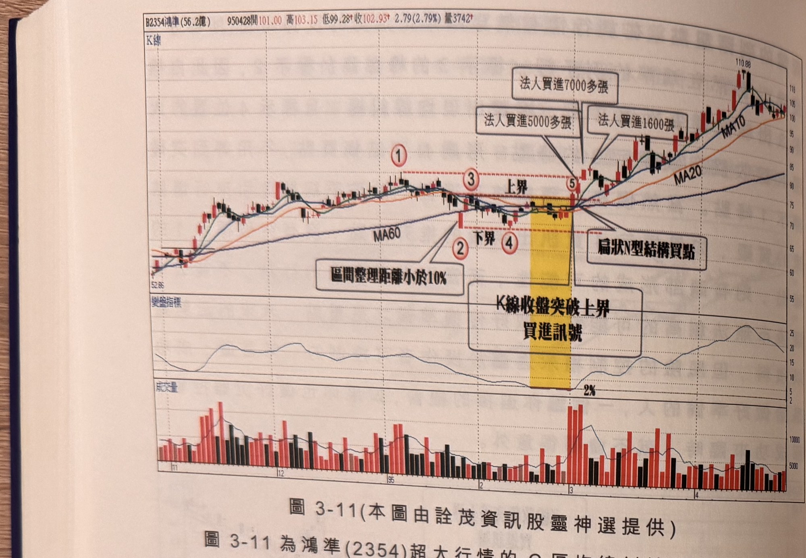
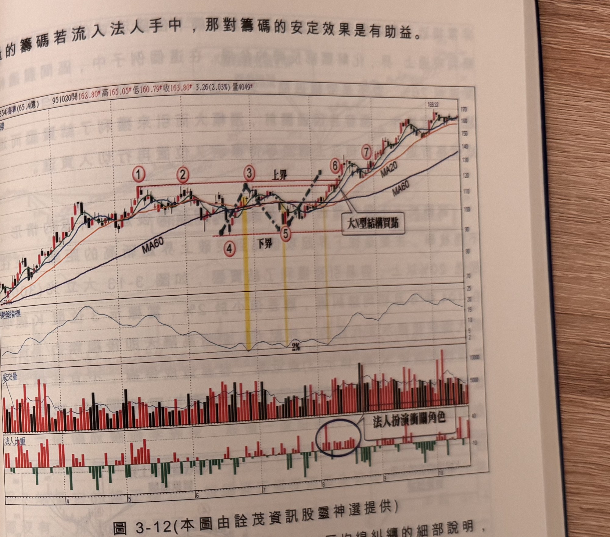

## p.126

**圖 3-11** (本圖由詮茂資訊股靈神選提供)

> 圖說（figure notes）：鴻準(2354) K 線圖，左上角報價列標示「B2354鴻準(56.2億) 950428開101.00 高103.15 低99.28↑收102.93↑2.79(2.79%)量3742↑」。K 線圖疊加 MA20、MA60、MA10，價格自左側低點（52.86）上升，標示紅色圓圈數字「①」「③」（水平虛線「上界」）、「②」「④」（下界），文字方塊「區間整理距離小於10%」以箭頭指向②附近；於標示「⑤」處（黃色色塊標示）K 線收盤向上突破，文字方塊「K線收盤突破上界 買進訊號」及「扁狀N型結構買點」分別標示；上方另有三個文字方塊「法人買進5000多張」「法人買進7000多張」「法人買進1600多張」以箭頭指向突破後上漲段的紅 K 柱。K 線右側持續上漲，收在 110.89 附近。下方「變盤指標」子圖於黃色色塊區間觸及低點「2%」後回升震盪走高。最下方為成交量柱狀圖，於標示⑤附近出現大量紅柱。

圖 3-11 為鴻準(2354)超大行情的 C 區均線糾纏的狀況(黃色區域)，在 95 年 2 月走勢皆呈現季線下的橫向游走，同樣也是有成頭反轉的隱憂存在，1 月底曾發生開盤跌破季線，收盤緊貼季線(標示 2 位置)，而 2 月在季線下方盤整，皆在標示 2 的低點之上，表示價格雖弱，但沒有發生跟隨跌勢，對多方而言並沒有籌碼凌亂的現象發生；2 月走勢的後半段，均線陷入糾纏現象，個股的高點如標示 3 位置，因為 2 月行情走區間盤整，震盪幅度小整的壓力所在，而下界的選擇由於標示 4 的低點與標示 2 的低點相近，因此取標示 2 做為下界濾網，而且當標示 5 位置 K 線收盤突破標示 3 的區間上界，也形成扁狀 N 型結構買點，成交量連 3 天大量，佔日成交量 45% 以上，通常突破新高不爆量比爆量讓人放心，但爆

## p.127

量的籌碼若流入法人手中，那對籌碼的安定效果是有助益。

**圖 3-12** (本圖由詮茂資訊股靈神選提供)

> 圖說（figure notes）：鴻準(2354) K 線圖，左上角報價列標示「B2354鴻準(65.4億) 951020開162.80↑高165.05↑低160.79↑收163.80↑3.26(2.03%)量4049↑」。K 線圖疊加 MA20、MA60，價格持續上升，標示紅色圓圈數字「①」「②」（水平虛線「上界」）、「③」（上界峰點）、「④」「⑤」（下界，虛線鋸齒示意折返），於標示「⑥」「⑦」處續創新高，文字方塊「大N型結構買點」以箭頭指向⑥附近。下方「變盤指標」子圖於標示④⑤間觸及低點「2%」後回升走高。下方「成交量」柱狀圖與「法人比重」子圖（紅色為買超、綠色為賣超），文字方塊「法人扮演關鍵角色」以圓圈標示一段法人比重由賣轉買的區域。K 線右側持續上漲，收在 169.32 附近。

圖 3-12 為鴻準(2354)超級多頭漲勢的 D 區均線糾纏的細部說明，95 年 5 月中旬在標示 1 創新高後，行情即進入近 3 個月的整理盤，在 6 月中旬一度跌破季線來到標示 4 位置的低點，已經跌破前波低點，狀似頭部反轉型態，但卻出現跌破逆轉行情，彈升至標示 3 位點，離差值小置，幾乎回到峰點區，在標示 3 及 4 之間出現均線糾纏，並沒有做出突破動作，即遭於 2%，但此時上界位在標示 1 位置，平行壓力，重新標示 5 位置尋求支撐，重新返回季線之上，此時下界在標示 4 位置，也沒有做出跌破動作，重新標示 5 位置與標示 3 位置與標示 1 第三度出現均線糾纏現象，由於一個月的峰點標示 3 位置與標示 1
