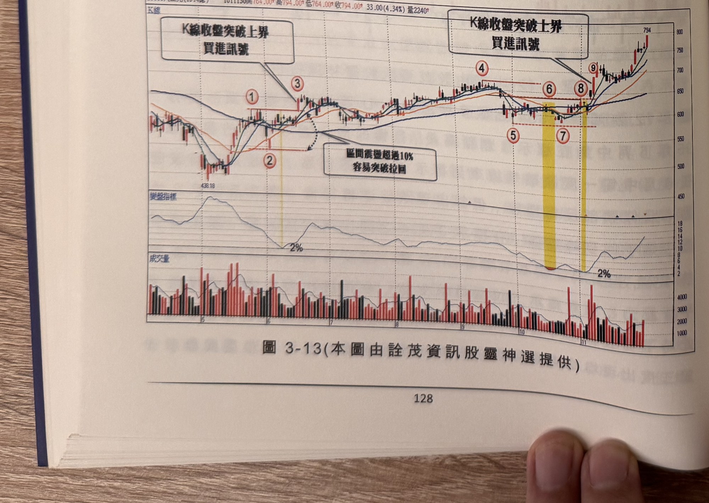
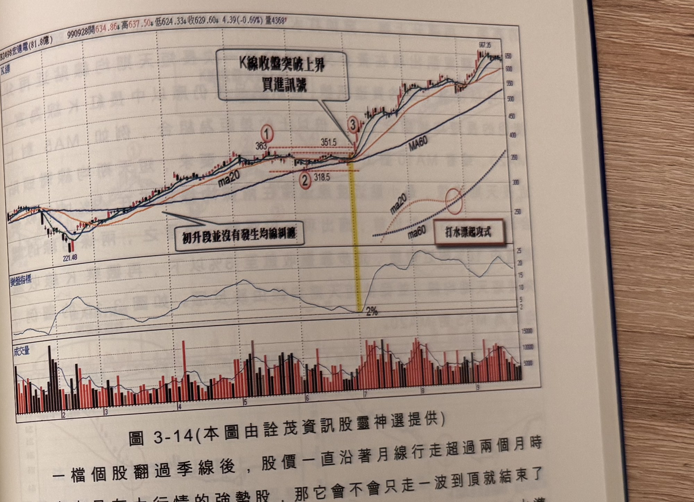

## p.128

非常接近，仍以標示 1 峰點做為上界濾網，在標示 6 位置 K 線收盤順利攻過上界，化解頭部反轉的危機，在這個例子中，區間震盪幅度達到 20%，並不是窄幅區間，若不是法人在衝關前後，均用力買超，不宜操作，極容易因過關前，漲幅大而引來獲利了結賣壓而造成價格折返，通常做法上應該等待標示 7 位置再行切入買進。

當區間上下震盪超過 10% 甚多，突破新高後產生折返的情形，不勝枚舉，主要是從下界起攻低點到突破上界創新高的距離，往往超過 20% 以上，容易引發獲利了結賣壓，如圖 3-13 大立光(3008)在 101 年 6 月初均線糾纏，離差值小於 2%，當標示 3 位置 K 線收盤大漲突破標示 1 代表的上界壓力，創新高隔天即後繼無力，逐步拉回跌破突破 K 線(標示 3)最低點，容易造成停損，不宜在標示 3 位置買進，可以等待行情壓回區間整理範圍，再利用 RSI 或過一高方式承接。

**圖 3-13** (本圖由詮茂資訊股靈神選提供)

> 圖說（figure notes）：大立光(3008) K 線圖，左上角報價列標示「B3008大立光(13.4億) 1011130開764.00↑高794.00↑低764.00↑收794.00↑33.00(4.34%)量2240↑」。K 線圖疊加均線，價格自左側低點（438.18）上升，標示紅色圓圈數字「①」「③」（水平虛線「上界」）、「②」（下界，虛線弧線與文字方塊「區間震盪超過10%容易突破拉回」），中段續於「④」處再度接近上界，標示「⑤」「⑦」（下界）、「⑥」「⑧」（黃色色塊，K線收盤突破上界買進訊號），標示「⑨」續創新高。K 線右側收在 794 附近。下方「變盤指標」子圖分別於標示②及⑤⑦間觸及低點「2%」後回升。最下方為成交量柱狀圖。

## p.129

一檔個股翻過季線後，股價一直沿著月線行走超過兩個月時間，肯定是有大行情的強勢股，那它會不會只走一波到頂就結束了呢？端看它的修正模式，如果修正幅度連黃金切割率的 0.382 水準都沒有，那未來突破再走一大波的機會就有加分效果，如圖 3-14 都沒有，那未來突破再走一大波的機會就有加分效果，如圖 3-14 宏達電(2498)在 99 年 2 月展開的多頭大行情裡，穿過季線反壓後，沿著 MA20 不斷挺升，5 月初見高，才進入為期兩個月的橫向整理，在 6 月底短兩個月最高為 363 元(還權)，最低為 318.5 元(還權)，價格同樣沒有收盤跌破季線之下，6 均線貼近季線，但不破季線，價格同樣沒有收盤跌破季線之下，6 均線貼近季線，但不破季線，區間震盪幅度正好為 10%，均線月整月最高點為 351.5 元(還權)，區間震盪幅度正好為 10%，均線月整月最高點為 351.5 元(還權)，糾纏 2% 以下只停留 2 天，即產生標示 3 突破 6 月上界及 5 月最高峰點，形成另一大波行情的起漲位置。

請注意短天期均線逼近季線，卻不跌破季線，再重新上揚，這是一種重要的均線結構，四條均線中，MA20 拉回輕輕的掃過 MA60

**圖 3-14** (本圖由詮茂資訊股靈神選提供)

> 圖說（figure notes）：宏達電(2498) K 線圖，左上角報價列標示「B2498宏達電(81.8億) 990928開634.86↓高637.50↓低624.33↓收629.60↓4.39(-0.69%)量4368↑」。K 線圖疊加 MA20、MA60，價格自左側低點（221.48）上升，文字方塊「初升段並沒有發生均線糾纏」以箭頭指向該段；標示紅色圓圈數字「①363」「②318.5」（水平虛線標示區間），於標示「③」處（黃色色塊標示）K 線收盤向上突破，文字方塊「K線收盤突破上界 買進訊號」以箭頭指向③；右側另繪一組虛線示意 ma20／ma60 交叉走勢，文字方塊「打水漂起攻式」標示於該處。K 線右側持續上漲，收在 567.35 附近。下方「變盤指標」子圖於黃色色塊區間觸及低點「2%」後回升震盪走高。最下方為成交量柱狀圖。
