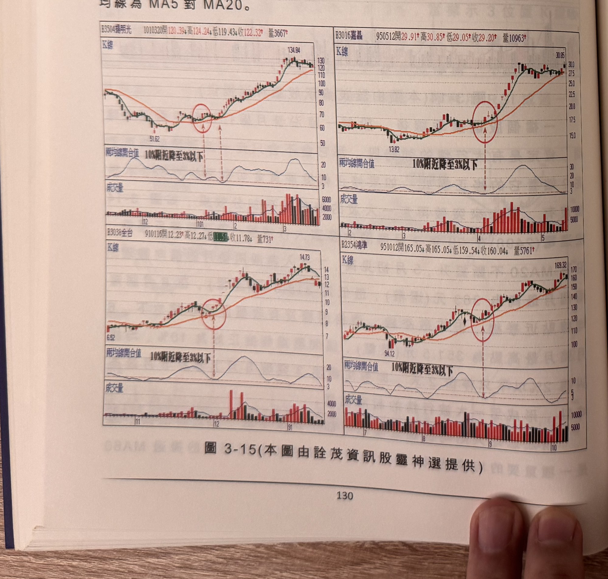
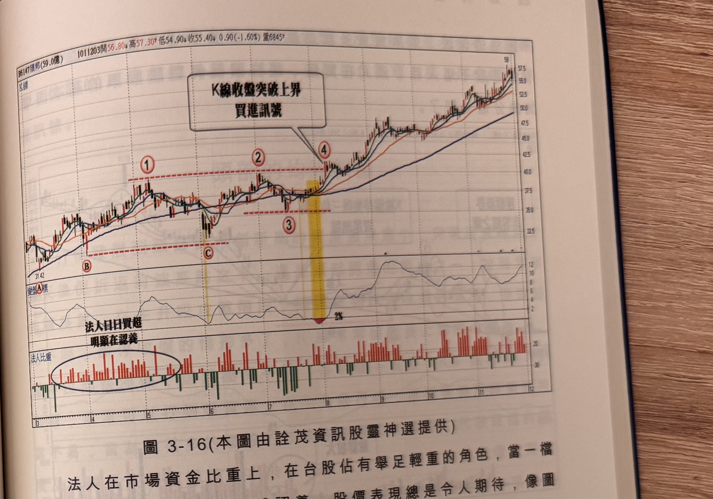

## p.130

的表面，再彈升上揚，宛如打水漂，石頭掠過水面重新彈跳飛躍，通常這種買訊出現在黃金交叉後的第一次長短天期均線貼近再分開，可以視為不錯的買進訊號，但訊號品質仍應以中長紅 K 線為宜，使用的長短均線組合，以三倍以上的差距為組合，例如 MA5 對上 MA20，或者 MA10 對上 MA60，而外觀上要求，短天期均線彎頭貼近長天期均線，最小貼近度應選擇在兩條均線差距在 3% 以內較為合適，而且均線貼近前，應出現一段漲勢，換言之，兩條均線的離差值由 10% 附近彎頭，逐步靠攏收斂至 3% 以下，再觀察 K 線收盤突破短天期均線，並促使短天期均線由跌反漲。如圖 3-15 的圖例，均線為 MA5 對 MA20。

**圖 3-15** (本圖由詮茂資訊股靈神選提供)

> 圖說（figure notes）：2×2 排列的四張個股 K 線圖範例，皆標示「兩均線開合值 10%附近降至3%以下」與紅色圓圈標示均線貼近點：左上「B3504揚明光 1010320開120.39↑高124.24↑低119.43↑收122.32↑量3667↑」，低點51.62 後貼近點附近上漲至134.84；右上「B3016嘉晶 950512開29.91↑高30.85↑低29.05↑收29.20↑量10963↑」，低點13.82 後上漲至30.85；左下「B3038全台 910116開12.23↑高12.27↑低11.51↓收11.78↓量731↑」，低點6.52 後上漲至14.73；右下「B2354鴻準 951012開165.05↓高165.05↓低159.54↓收160.04↓量5761↑」，低點94.12 後上漲至169.32。各圖下方均附「兩均線開合值」子圖顯示離差值由10%附近收斂至3%以下，及成交量柱狀圖。

## p.131

量的籌碼若流入法人手中，那對籌碼的安定效果是有助益。

**圖 3-16** (本圖由詮茂資訊股靈神選提供)

> 圖說（figure notes）：頎邦(6147) K 線圖，左上角報價列標示「B6147頎邦(59.0億) 1011203開56.80↓高57.30↑低54.90↓收55.40↓0.90(-1.60%)量6845↑」。K 線圖疊加均線，價格自左側低點（31.42）上升，標示紅色圓圈數字「①」「②」（水平虛線）、「B」「C」（低點），於標示「③」「④」處（黃色色塊標示）K 線收盤向上突破，文字方塊「K線收盤突破上界 買進訊號」以箭頭指向④。K 線右側持續上漲，收在59附近。下方「變盤指標」子圖於標示②③間觸及低點「2%」後回升震盪走高。最下方「法人比重」子圖（紅色買超、綠色賣超），文字方塊「法人日日買超 明顯在認養」以圓圈標示左側一段持續買超區。

法人在市場資金比重上，在台股佔有舉足輕重的角色，當一檔個股受到法人青睞進行集體認養，股價表現總是令人期待，像圖
