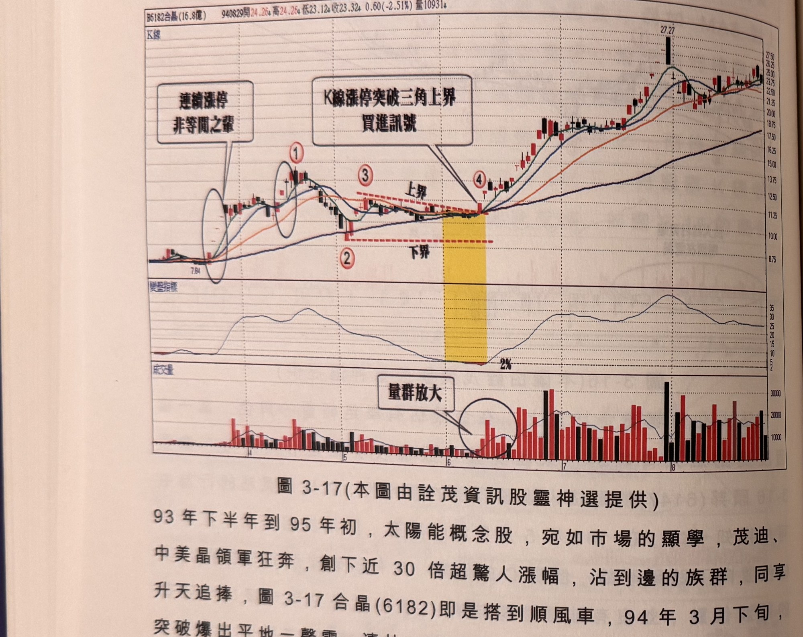

## p.132

非鐵漲的保證，如果資金多就是贏家，那麼市場多檔基金的淨值就不會那般不堪入目，法人在買超，或許讓我們對該股票的基本面增加幾分信心罷了。

**圖 3-17** (本圖由詮茂資訊股靈神選提供)

> 圖說（figure notes）：合晶(6182) K 線圖，左上角報價列標示「B6182合晶(16.8億) 940829開24.26↓高24.26↓低23.12↓收23.32↓0.60(-2.51%)量10931↓」。K 線圖疊加均線，文字方塊「連續漲停 非等閒之輩」以圓圈標示兩段連續漲停區，標示紅色圓圈數字「①」「③」（水平虛線「上界」）、「②」（下界），於標示「④」處（黃色色塊標示）文字方塊「K線漲停突破三角上界 買進訊號」以箭頭指向④。K 線右側持續上漲，收在27.27附近後回落整理於23附近。下方「變盤指標」子圖於標示②③間觸及低點「2%」後回升。最下方為成交量柱狀圖，文字方塊「量群放大」以圓圈標示標示④附近的放大量群。

93 年下半年到 95 年初，太陽能概念股，宛如市場的顯學，茂迪、中美晶領軍狂奔，創下近 30 倍超驚人漲幅，沾到邊的族群，同享升天追捧，圖 3-17 合晶(6182)即是搭到順風車，94 年 3 月下旬，突破爆出平地一聲雷，連拉 4 根漲停，第一波到達標示 1 位置才進入修正，由於基本面不如茂迪或中美晶般紮實，修正走勢也比較大，但都保持在季線上方，6 月上旬整個整理型態發展成三角形，震盪上下界愈趨收斂，均線也同步糾纏小於 2% 水準，這時候若取標示 1 為上界，離現價太高，無視技術分析的彈性講求，若取標示 3 位置為上界，則不能體現三角整理突破的要義，因此上界須採取下降趨勢線來做為上界濾網，但下界仍宜以標示 2 位置做為下界，因此若

## p.133

價格跌破季線，卻未跌破標示 2 之低點，漲勢結構並未破壞。當標示 4 位置的 K 線收盤以漲停之姿，突破三角整理上界，形成絕佳買進訊號。

### 頭部的均線糾纏

行情發展到頭部區，創新高的幅度愈來愈小，突破前波峰點，幾天後便折返前波高點之下，這是頭部認定的徵兆之一；拉回常常伴隨長黑，在主升段攻擊階段，難得看到跌停收盤的情況，但頭部則不同，跌停收盤的情形多了，K 線常常留超長上影線也變多了，盤中拉到快漲停，居然壓回平盤，甚至盤下收盤；KD 指標或 RSI 指標，常常可以打到超賣區，在主升段行情，指標要觸及超賣區相當不易，當為數甚多的個股的技術指標觸及超賣區，代表回檔的深度及時間長度都明顯不同大於以往；成交量明顯無法呈現價量齊揚的配合狀況，即使出現爆量交易日 K 線往往留長上影線，或者大陰覆蓋線及陰線吞噬不斷掛在峰點位置；紡錘線；K 線戰法中的反轉組合，執帶、吊首線，倒 T 線、夜星、指標出現的買進訊號，常常發生一日行情，甚至隔天即倒頭栽，操作的不順，逐漸漫延到週遭的投資朋友；漸漸的，要越過震盪區間的高點，變得困難，在在提供漲勢已經走到盡頭的跡證。

『百足之蟲，死而不僵』這句話在說明頭部不是一天就反轉直下，頭部時間會拖一段時間，讓人誤以為這是中段大整理盤，不斷地讓利多消息失靈，當該買想買的投資人，都進場握著股票，就換空頭粉墨登場表演，其中一齣戲碼就叫均線糾纏，不同於底部或漲勢中段休
