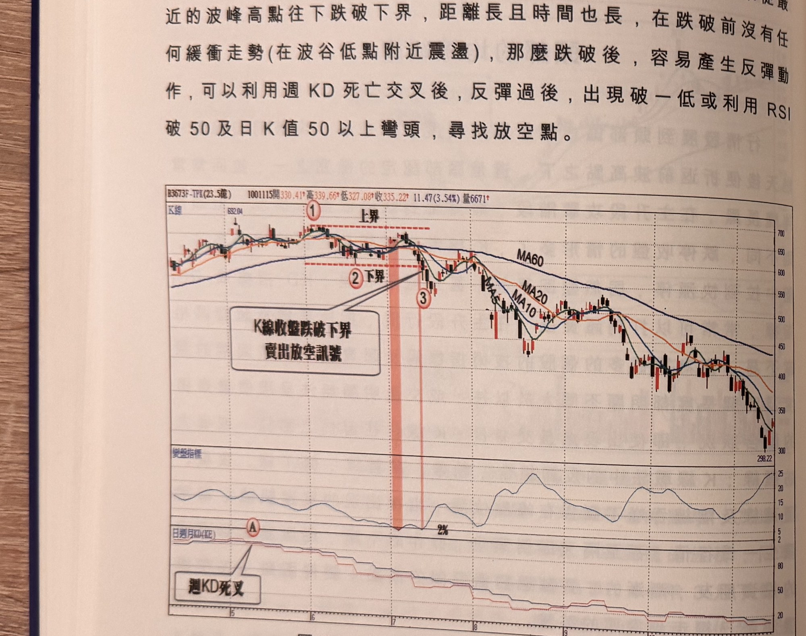
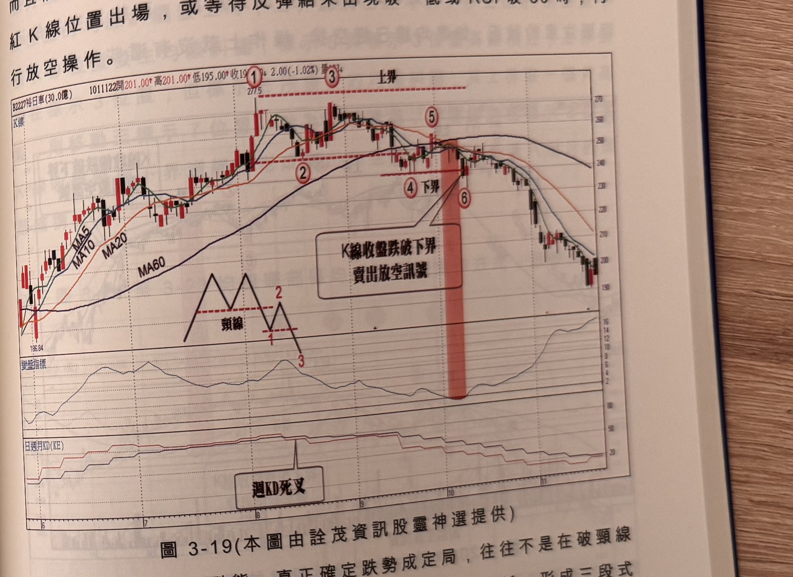

## p.134

息整理格局，頭部區間的震盪幅度小於 10% 不多，成交量也不會有秩序的縮放，當均線離差值出現小於 2%，同時向下跌破最近一個月或兩個月重要的波谷低點(下界)，就是賣出放空訊號，如果從最近的波峰高點往下跌破下界，距離長且時間也長，在跌破前沒有任何緩衝走勢(在波谷低點附近震盪)，那麼跌破後，容易產生反彈動作，可以利用週 KD 死亡交叉後，反彈過後，出現破一低或利用 RSI 破 50 及日 K 值 50 以上彎頭，尋找放空點。

**圖 3-18** (本圖由詮茂資訊股靈神選提供)

> 圖說（figure notes）：F-TPK(3673) K 線圖，左上角報價列標示「B3673F-TPK(23.5億) 1001115開330.41↑高339.66↑低327.08↑收335.22↑11.47(3.54%)量6671↑」。K 線圖疊加 MA5、MA10、MA20、MA60，標示紅色圓圈數字「①」（水平虛線「上界」）、「②」（下界）、「③」，文字方塊「K線收盤跌破下界 賣出放空訊號」以箭頭指向②③間的紅色縱帶區。K 線右側持續下跌，收在298.22附近。下方「變盤指標」子圖於標示②③附近觸及低點「2%」。最下方「日週月KD(KE)」子圖，文字方塊「週KD死叉」以箭頭指向標示「A」附近的死叉位置。

例如圖 3-18F-TPK(3673)在 100 年 5 月到 7 月，價格呈現三尊頭型態，7 月初出現均線糾纏，均線離差值小於 2%，並沒有往上突破標示 1 位置的上界壓力，反而連續黑 K 線壓盤，直下跌破標示 2 位置的下界兩個月低點，當標示 3 位置 K 線收盤跌破下界，形成賣出放空訊號；由於連續黑 K 跌幅超過 20% 且中途沒有任何休息停

## p.135

頓，容易發生跌破折返走勢，當連續黑 K 線超過 5 根以上，遇到紅 K 線便是慣性受到破壞，將止跌反彈，本例中黑 K 線連續出現 8 根，而且幅度大，對放空在標示 3 位置較為不利，因此可以選擇在出現紅 K 線位置出場，或等待反彈結束出現破一低或 RSI 破 50 時，再行放空操作。

**圖 3-19** (本圖由詮茂資訊股靈神選提供)

> 圖說（figure notes）：裕日車(2227) K 線圖，左上角報價列標示「B2227裕日車(30.0億) 1011122開201.00↑高201.00↑低195.00↓收196.00↓2.00(-1.02%)量▲03↓」。K 線圖疊加 MA5、MA10、MA20、MA60，低點186.84 後上升，標示紅色圓圈數字「①277.5」「③」（水平虛線「上界」）、「②」「④下界」，於標示「⑥」處（紅色縱帶標示）文字方塊「K線收盤跌破下界 賣出放空訊號」以箭頭指向；下方另繪一組頭肩型態示意線，標示「頸線」及數字「1」「2」「3」對應M頭走勢。K 線右側持續下跌，收在210附近。最下方「日週月KD(KE)」子圖，文字方塊「週KD死叉」標示於中段死叉區。

價格出現反轉型態，真正確定跌勢成定局，往往不是在破頸線位置放空，而是在跌破頸線後，反彈結束，再破新低，形成三段式下跌，若均線已蓋頭成空排，則跌勢發展的可靠度就提高不少；若頸線被攪拌回抗空方進逼，而後頸線被貼近發生橫向盤整，企圖抵抗空方進逼，而後頸線被價格在貼近頸線發生橫向盤整，企圖抵抗空方進逼，而後頸線被攻破，以圖 3-19 裕日車突破，進場放空就不容易出現反彈回測頸線之上。以圖 3-19 裕日車(2227)為例，標示 1～3 位置形成M頭型態，此時均線出現糾纏位置，出現反彈走勢，反彈高點在標示 5 位置，此時均線出現糾纏現象，均線離差值小於 2%，標示 4 位置為最近一個月的波谷低點，
