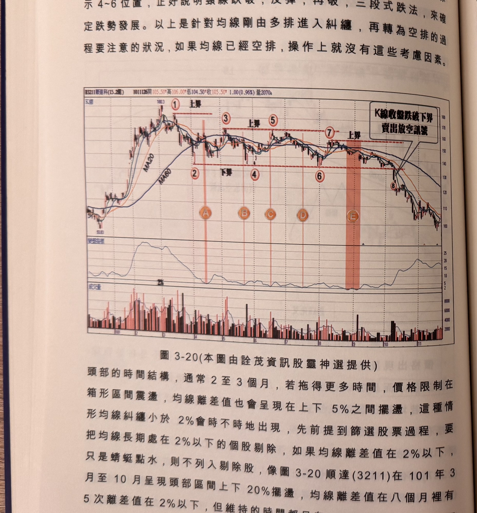
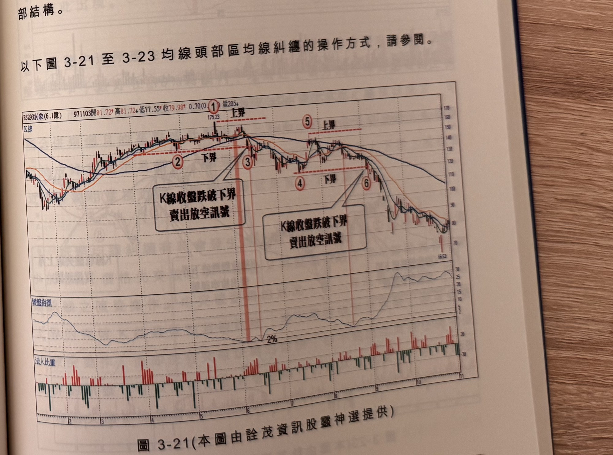

## p.136

做為下界濾網，當標示 6 位置 K 線收盤跌破下界，形成賣出放空訊號，並設 7% 停損，雖然隔天出現反彈，但無法觸及停損位置；標示 4~6 位置，正好說明頸線跌破，反彈，再破，三段式跌法，來確定跌勢發展。以上是針對均線剛由多排進入糾纏，再轉為空排的過程要注意的狀況，如果均線已經空排，操作上就沒有這些考慮因素。

**圖 3-20** (本圖由詮茂資訊股靈神選提供)

> 圖說（figure notes）：新達科(3211) K 線圖，左上角報價列標示「B3211新達科(15.2億) 1011126開105.50↑高106.00↑低104.50↑收105.50↑1.00(0.96%)量2070↓」。K 線圖疊加 MA20、MA60，高點180.3後標示紅色圓圈數字「①上界」「②下界」「③」「④」「⑤」「⑥」「⑦」（多段水平虛線上下界），對應橙色圓圈「A」「B」「C」「D」「E」標示各次均線糾纏發生的時間點；於「⑦」右側（黃色縱帶）文字方塊「K線收盤跌破下界 賣出放空訊號」以箭頭指向。K 線右側持續下跌至100附近後略回升。下方「變盤指標」子圖於A~E各點觸及低點「2%」附近。最下方為成交量柱狀圖。

頭部的時間結構，通常 2 至 3 個月，若拖得更多時間，價格限制在箱形區間震盪，均線離差值也會呈現在上下 5% 之間擺盪，這種情形均線糾纏小於 2% 會時不時地出現，先前提到篩選股票過程，要把均線長期處在 2% 以下的個股剔除，如果均線離差值在 2% 以下，只是蜻蜓點水，則不列入剔除股，像圖 3-20 順達(3211)在 101 年 3 月至 10 月呈現頭部區間上下 20% 擺盪，均線離差值在八個月裡有 5 次離差值在 2% 以下，但維持的時間都只有一、二天，除了標示 E

## p.137

位置，停留 9 天外，在標示 A 位置出現均線糾纏時，上界取標示 1 位置，停留 9 天外，在標示 A 位置出現均線糾纏時，上界取標示 1 位置為一個月高點，下界取標示 2 位置也是一個月的低點，其後六個月震盪的低點均貼近標示 2 低點，因此下界始終不移動，當標示 B 位置的均線糾纏發生時，上界濾網已經可以下移至標示 3 位置，標示 D 位置發生均線糾纏，標示 5 與標示 3 位置高點相近，上界保持在標示 3 位置，但標示 E 所發生的均線糾纏，其上界取一個月高點，則移動至標示 7 位置，做為突破濾網，行情終於在標示 8 位置 K 線收盤跌破下界濾網，形成賣出放空訊號，結束長達八個月的頭部結構。

以下圖 3-21 至 3-23 均線頭部區均線糾纏的操作方式，請參閱。

**圖 3-21** (本圖由詮茂資訊股靈神選提供)

> 圖說（figure notes）：拓象(3293) K 線圖，左上角報價列標示「B3293拓象(6.1億) 971103開81.72↑高81.72↓低77.55↑收79.98↑0.70(0.…)量205↓」。K 線圖疊加均線，高點175.23，標示紅色圓圈數字「①上界」「②下界」「③」（黃色縱帶，文字方塊「K線收盤跌破下界 賣出放空訊號」）；後續「④下界」「⑤上界」「⑥」（黃色縱帶，另一文字方塊「K線收盤跌破下界 賣出放空訊號」）。K 線右側持續下跌，收在66.63附近。下方「變盤指標」子圖於標示②③及④⑥間觸及低點「2%」。最下方「法人比重」子圖，紅色買超、綠色賣超交錯。
