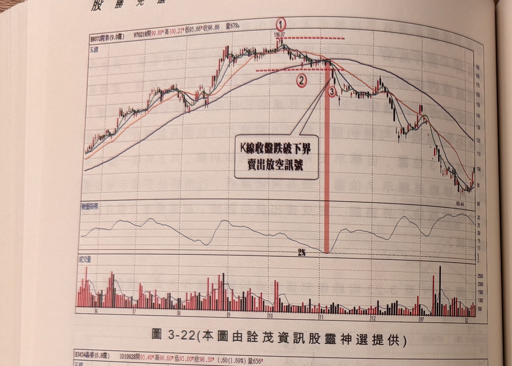
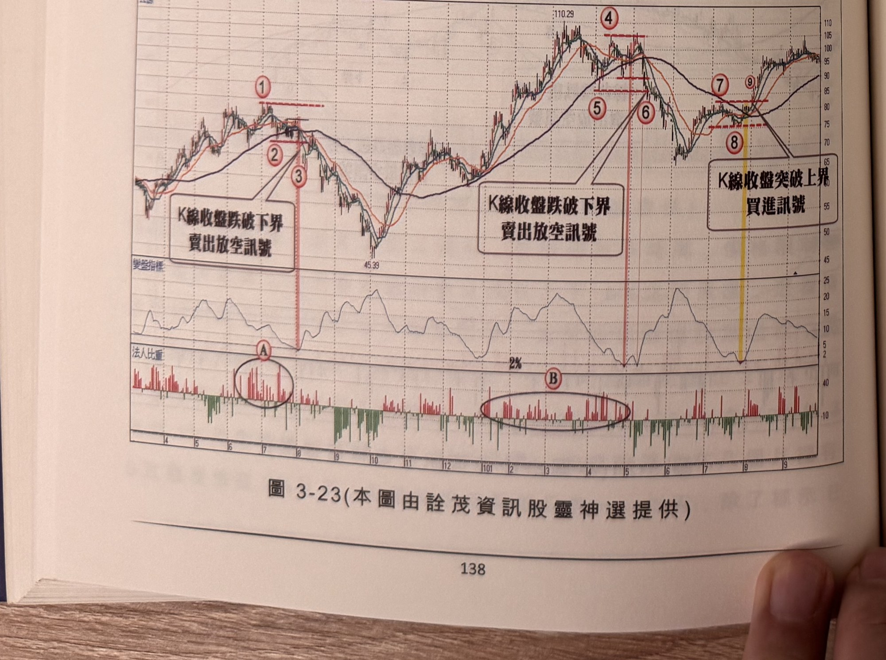

## p.138

**圖 3-22** (本圖由詮茂資訊股靈神選提供)

> 圖說（figure notes）：壁泰(8072) K 線圖，左上角報價列標示「B8072壁泰(9.0億) 970218開99.88↑高100.21↑低95.86↑收96.86 量678↓」。K 線圖疊加均線，高點196.07，標示紅色圓圈數字「①」（水平虛線）、「②」（下界水平虛線）、「③」（紅色縱帶），文字方塊「K線收盤跌破下界 賣出放空訊號」以箭頭指向③。K 線右側持續下跌，收在80.44附近後小幅反彈。下方「變盤指標」子圖於標示③附近觸及低點「2%」。最下方為成交量柱狀圖。

**圖 3-23** (本圖由詮茂資訊股靈神選提供)

> 圖說（figure notes）：嘉泰(3454) K 線圖，左上角報價列標示「B3454嘉泰(6.9億) 1010928開95.40↑高96.60↑低95.00↑收96.30↑1.60(1.69%)量656↑」。K 線圖疊加均線，高點110.29，標示紅色圓圈數字「①」「②」「③」（紅色縱帶，文字方塊「K線收盤跌破下界 賣出放空訊號」）；低點45.39後回升至「④」，續標示「⑤」「⑥」（紅色縱帶，另一文字方塊「K線收盤跌破下界 賣出放空訊號」）；其後「⑦」「⑧」「⑨」（黃色縱帶，文字方塊「K線收盤突破上界 買進訊號」）。下方「變盤指標」子圖分別於②③、⑤⑥、⑦⑨附近觸及低點「2%」。最下方「法人比重」子圖，紅色買超、綠色賣超，文字方塊圓圈標示「A」「B」兩段持續買超區。

頭部的時間結構。通常 2 至 3 個月，若拖得更多時間，價格限制在箱形區間震盪，均線離差值也會呈現在上下 5% 之間擺盪，這種情形均線糾纏小於 2% 會時不時地出現，把均線長期處在 2% 以下的個股剔除。

## p.139

### 跌勢中途均線糾纏

跌勢運行的中途，均線張口大到某一程度，最高均線值與最低均線值的乖離可能達 15% 以上，分久必合的循環規則下，短天期均線開始靠攏季線，展開反彈行情，當短均線接近季線時，價格似乎也開始在季線上下擺盪，市場對於後市的看法分歧，有認為季線附近整理後，只須一根長紅即可扭轉空頭，充滿期待，有認為跌勢不變，但隨著在季線游走愈久，看空者也變得心虛小聲，均線糾纏通常也在此出現。

跌勢中途所產生的均線糾纏，如同漲勢中途的要求一樣，區間整理要窄，最好在 10% 範圍內，以最近一個月的波峰高點做為上界濾網，而以最近一個月的波谷低點做為下界濾網，特殊狀況下，可以能合併兩個月的高點或低點做為上下界，通常是價格呈現毛毛蟲游行造成峰谷點不易辨認，須擴延以兩個月峰谷點做上下界，或者遠近峰谷點相當接近時，取最高最低來當上下界濾網。

跌勢均線糾纏有時會發生虛上實下的意外走勢，當均線離差值出現小於 2%，價格先突破上界，隨後又再回頭跌破下界，如同拙作『交易訊號之直覺操作』中突破逆轉的狀況一樣，有這種情形時，突破上界的突破 K 線最低點若被跌破，則不需等待下界跌破，即可做賣出放空動作，而即使有突破逆轉的案例，卻不能因此而對任何突破出放空動作，仍應以買訊視之，杯弓蛇影上界的訊號，皆以為會形成突破逆轉，往往錯失操作的機會。
