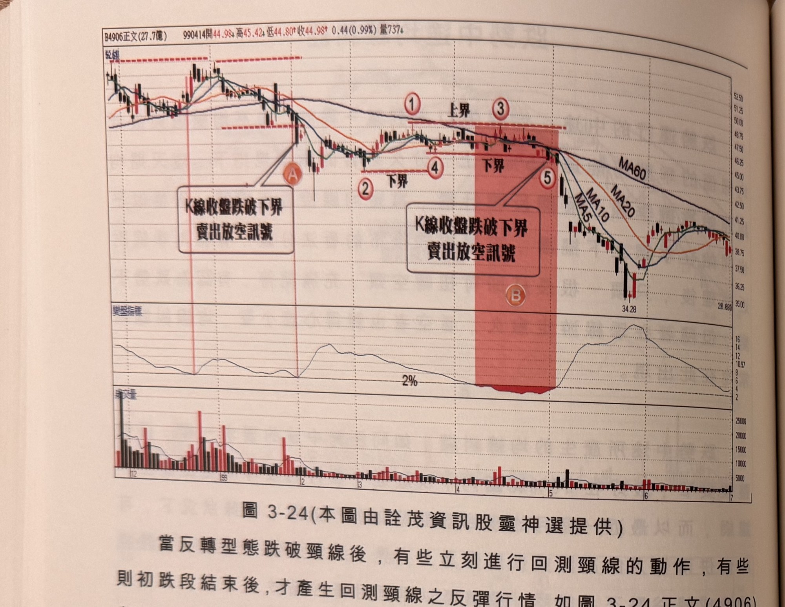
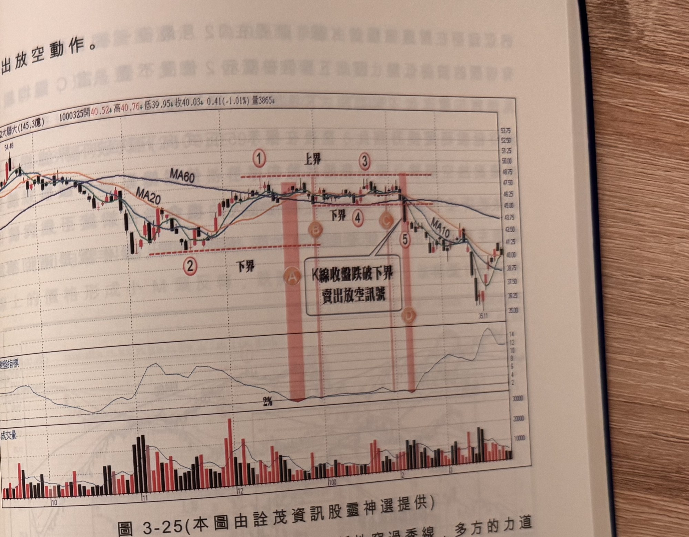

## p.140

賣出放空動作。

**圖 3-24** (本圖由詮茂資訊股靈神選提供)

> 圖說（figure notes）：正文(4906) K 線圖，左上角報價列標示「B4906正文(27.7億) 990414開44.98↓高45.42↓低44.80↑收44.98↑0.44(0.99%)量737↓」。K 線圖疊加均線，標示紅色圓圈「A」（K線收盤跌破下界 賣出放空訊號，紅色縱線），其後標示「①上界」「②下界」「③」「④下界」，再度標示「⑤」（紅色縱帶，另一文字方塊「K線收盤跌破下界 賣出放空訊號」，圓圈「B」）。K 線右側持續下跌，收在28.68附近（低點34.28）。下方「變盤指標」子圖於A及⑤附近觸及低點「2%」。最下方為成交量柱狀圖。

當反轉型態跌破頸線後，有些立刻進行回測頸線的動作，有些則初跌段結束後，才產生回測頸線之反彈行情，如圖 3-24 正文(4906)在 99 年 1 月下旬，價格跌破頸線並在標示 A 區均線離差值小於 2%，隔天即跌破下界，形成賣出放空訊號，2 月開紅盤後，展開一波回測頸線行情，反彈至標示 1 位置，為 M 頭型態的頸線，價格正好抵達季線，開始呈現反覆測試季線動作，持續到 5 月初，仍未見多方陣營進一步做向上突破，這種近關情怯，躊躇不前的行為，造成均線糾纏在 2% 以下，維持將近一個月時間，當 4 月初在標示 B 區均線離差值小於 2% 時，先取標示 2 位置一個月低點為下界濾網，但拖到 5 月初時，下界提升至標示 4 位置，更顯窄幅區間盤整，上界的選擇上，標示 1 及標示 3 的高點並無差別，取標示 1 位置峰點為上界濾網，如果行情往上突破上界走法，仍應依訊號行事，當標示 5 向下跌破下界濾網，自然應執行

## p.141

賣出放空動作。

**圖 3-25** (本圖由詮茂資訊股靈神選提供)

> 圖說（figure notes）：大聯大(3702) K 線圖，左上角報價列標示「B3702大聯大(145.3億) 1000325開40.52↓高40.76↓低39.95↓收40.03↓0.41(-1.01%)量3865↓」。K 線圖疊加 MA20、MA60、MA10，高點54.48後下跌，標示紅色圓圈數字「①上界」「②下界」「③」「④下界」，圓圈「A」「B」「C」「D」標示各次均線糾纏發生點，於標示「⑤」（紅色縱帶）文字方塊「K線收盤跌破下界 賣出放空訊號」以箭頭指向；低點35.11。下方「變盤指標」子圖於A、B、C、D各點觸及低點「2%」。最下方為成交量柱狀圖。

在圖 3-24 的例子裡，短均線只短暫性穿過季線，多方的力道並非底氣十足，若短均線穿越季線後，一直保持在季線之上，就無法判斷多頭底細，因為一旦均線糾纏，鹿死誰手未可知，端視有無那臨門一腳。圖 3-25 大聯大(3702)在 99 年 10 月下旬展開的跌勢，短天期均線結束在標示 2 的波谷低點，11 月中旬再產生反彈行情，那臨門一腳。圖 3-25 大聯大(3702)在 99 年 10 月下旬展開的跌勢，短天期均線不管 MA5、MA10 或 MA20，均穿越季線，這段時間產生 4 次均線離差值小於 2%，其中在標示 A 區，當下設定在標示 2 位置，價格似乎離差值小於 2%，其中在標示 A 區，當下設定在標示 2 位置，價格似乎離波谷低點可供選擇，因此下界必須設在標示 2 位置，但沒有突破動作便不宜亂下預言，上界較近，突破的機會似乎較大，但沒有突破動作便不宜亂下預言，因為一個月B 區第二次進入 2% 以下，下界仍以標示 2 位置為準，因為一個月
