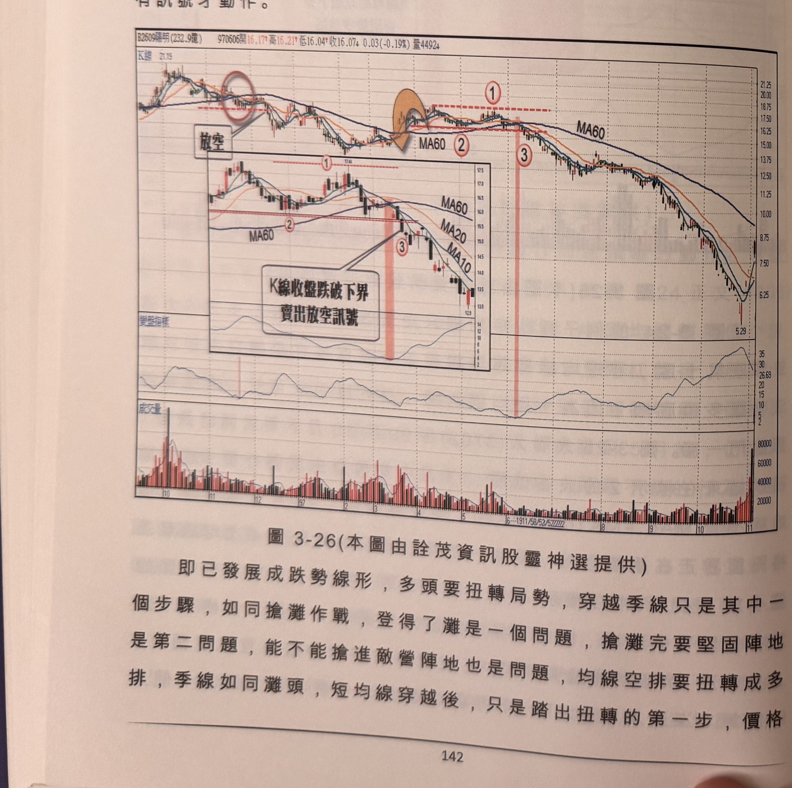
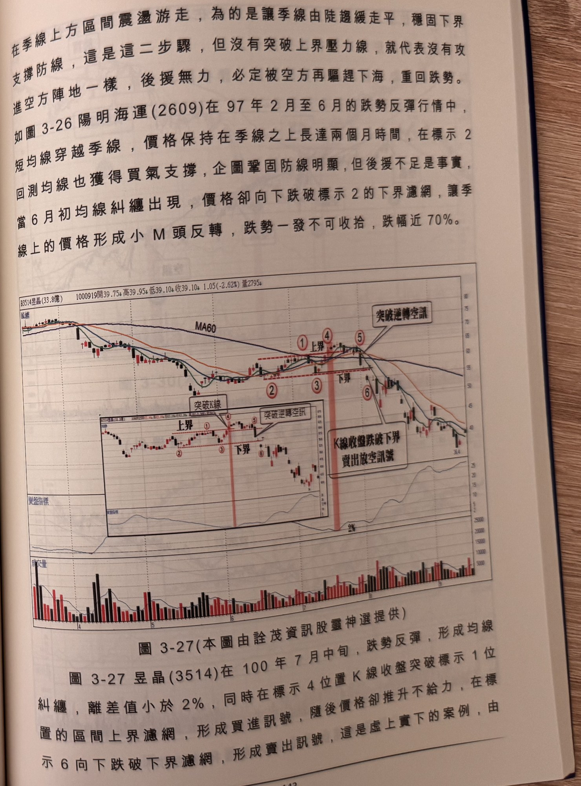

## p.142

在季線上方區間震盪游走，為的是讓季線由陡趨緩走平，穩固下界支撐防線，這是這二步驟，但沒有突破上界壓力線，就代表沒有攻進空方陣地一樣，後援無力，必定被空方再驅趕下海，重回跌勢。如圖 3-26 陽明海運(2609)在 97 年 2 月至 6 月的跌勢反彈行情中，短均線穿越季線，價格保持在季線之上長達兩個月時間，在標示 2 回測均線也獲得買氣支撐，企圖鞏固防線明顯，但後援不足是事實，當 6 月初均線糾纏出現，價格卻向下跌破標示 2 的下界濾網，讓季線上的價格形成小 M 頭反轉，跌勢一發不可收拾，跌幅近 70%。

**圖 3-26** (本圖由詮茂資訊股靈神選提供)

> 圖說（figure notes）：陽明海運(2609) K 線圖，左上角報價列標示「B2609陽明(232.9億) 970506開16.17↑高16.21↑低16.04↑收16.07↓0.03(-0.19%)量4492↓」。K 線圖疊加均線，高點21.19，文字方塊「放空」標示於左側高點圓圈處；標示「①」（水平虛線）、「②MA60」「③」（紅色縱帶）；內嵌放大子圖重複標示「①」「②」「③」與文字方塊「K線收盤跌破下界 賣出放空訊號」。K 線右側持續下跌，低點5.29後小幅反彈。下方為變盤指標子圖與成交量柱狀圖。

即已發展成跌勢線形，多頭要扭轉局勢，穿越季線只是其中一個步驟，如同搶灘作戰，登得了灘是一個問題，搶灘完要堅固陣地是第二問題，能不能搶進敵營陣地也是問題，均線空排要扭轉成多排，季線如同灘頭，短均線穿越後，只是踏出扭轉的第一步，價格

## p.143

在季線上方區間震盪游走，為的是讓季線由陡趨緩走平，穩固下界支撐防線，這是這二步驟，但沒有突破上界壓力線，就代表沒有攻進空方陣地一樣，後援無力，必定被空方再驅趕下海，重回跌勢。如圖 3-26 陽明海運(2609)在 97 年 2 月至 6 月的跌勢反彈行情中，短均線穿越季線，價格保持在季線之上長達兩個月時間，在標示 2 回測均線也獲得買氣支撐，企圖鞏固防線明顯，但後援不足是事實，當 6 月初均線糾纏出現，價格卻向下跌破標示 2 的下界濾網，讓季線上的價格形成小 M 頭反轉，跌勢一發不可收拾，跌幅近 70%。

**圖 3-27** (本圖由詮茂資訊股靈神選提供)

> 圖說（figure notes）：昱晶(3514) K 線圖，左上角報價列標示「B3514昱晶(33.8億) 1000919開39.75↓高39.95↓低39.10↓收39.10↓1.05(-2.62%)量2795↓」。K 線圖疊加 MA60，標示紅色圓圈數字「①上界」「②」「③下界」「④」「⑤」（文字方塊「突破K線」「突破逆轉空訊」），「⑥」（紅色縱帶，文字方塊「K線收盤跌破下界 賣出放空訊號」）；內嵌放大子圖重複同組標示。K 線右側持續下跌，收在38.4附近。下方為變盤指標子圖與成交量柱狀圖。

圖 3-27 昱晶(3514)在 100 年 7 月中旬，跌勢反彈，形成均線糾纏，離差值小於 2%，同時在標示 4 位置 K 線收盤突破標示 1 位置的區間上界濾網，形成買進訊號，隨後價格卻推升不給力，在標示 6 向下跌破下界濾網，形成賣出訊號，這是虛上實下的案例，由
