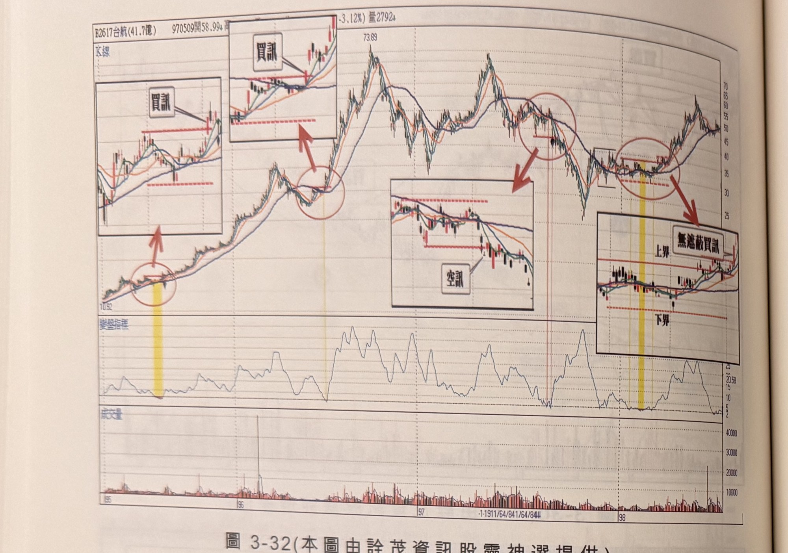
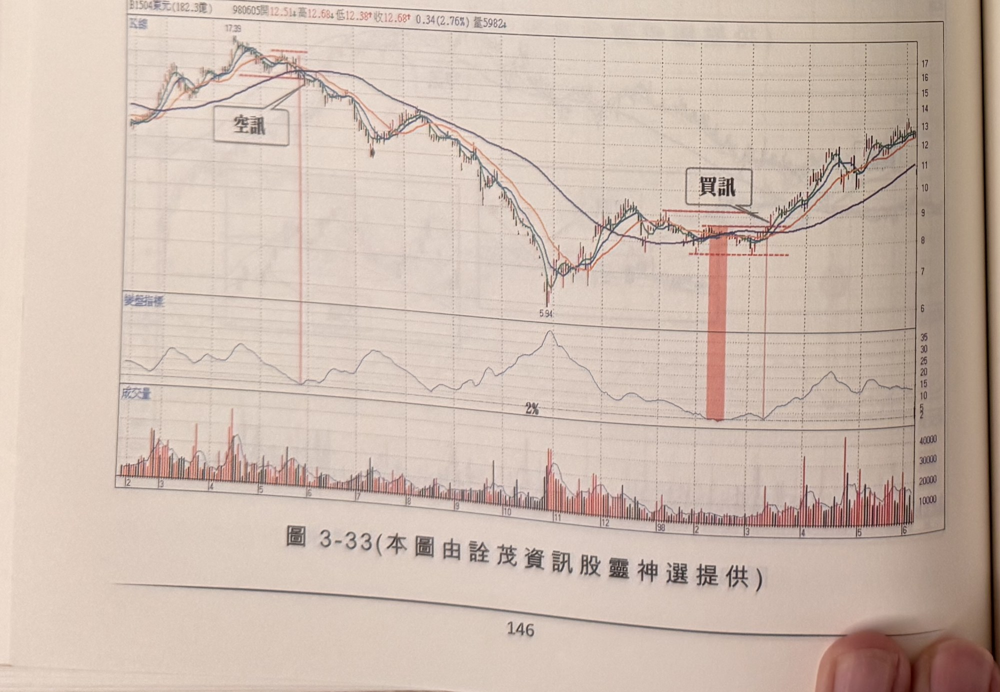
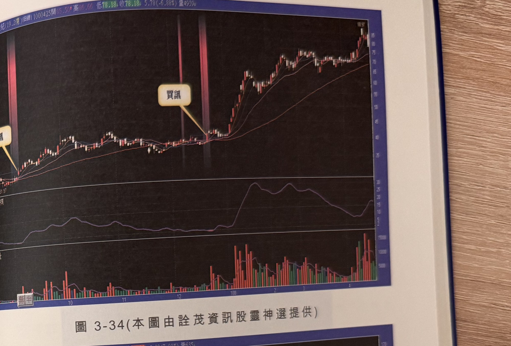
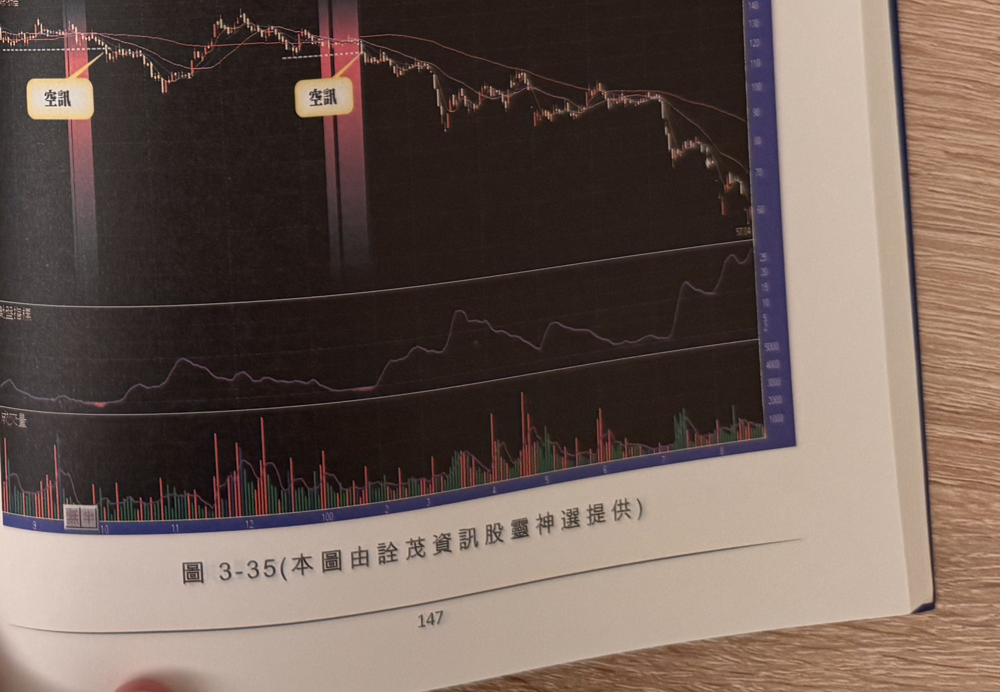

## p.146

**圖 3-32** (本圖由詮茂資訊股靈神選提供)

> 圖說（figure notes）：台航(2617) K 線圖，左上角報價列標示「B2617台航(41.7億) 970509開58.99↑…(-3.12%)量2792↑」。K 線圖中價格自左下角低點(10.92)持續走高至高點73.89，沿途以四個內嵌放大子圖依序呈現不同階段的訊號細節：左側兩個子圖皆標示「買訊」（紅色圓圈與箭頭指向低點突破處）；中段一個子圖標示「空訊」（價格跌破均線處）；右側子圖標示「上界」「下界」與「無遮蔽買訊」，並以黃色縱帶及紅色粗箭頭連接主圖對應時間點。下方為變盤指標子圖與成交量柱狀圖。

**圖 3-33** (本圖由詮茂資訊股靈神選提供)

> 圖說（figure notes）：東元(1504) K 線圖，左上角報價列標示「B1504東元(182.3億) 980605開12.514↑高12.684↓低12.389↑收12.68↑0.34(2.76%)量5982↑」。K 線圖疊加均線，左側高點文字方塊「空訊」（紅色縱線標示下跌起點），價格持續下跌至低點5.94，其後緩步回升，於右側文字方塊「買訊」（紅色縱帶標示突破均線糾纏處）。下方為變盤指標子圖（觸及低點「2%」）與成交量柱狀圖。

## p.147

**圖 3-34** (本圖由詮茂資訊股靈神選提供)

> 圖說（figure notes）：新世紀(19.2億) K 線圖（黑底配色），報價列標示「日線 1000425開85.50↑高86.66↓低78.18↑收78.18 5.78(-6.88%)量4939↓」。K 線圖疊加均線，價格自左側緩步走高，於兩道紅色縱帶（均線糾纏區）後，文字方塊「買訊」標示於突破點，隨後價格快速上漲至高點附近。下方為變盤指標子圖（於買訊後出現雙峰）與成交量柱狀圖（紅漲綠跌配色）。

**圖 3-35** (本圖由詮茂資訊股靈神選提供)

> 圖說（figure notes）：嘉澤(3533) K 線圖（黑底配色），報價列標示「B3533嘉澤(9.3億) 日線1000823開59.94↑高61.04↓低58.78↑收61.04 4.00(7.01%)量635」。K 線圖疊加均線，價格自左側高點附近，兩處均線糾纏分別標示文字方塊「空訊」（紅色縱帶），其後價格持續下跌。下方為變盤指標子圖與成交量柱狀圖（紅漲綠跌配色）。
